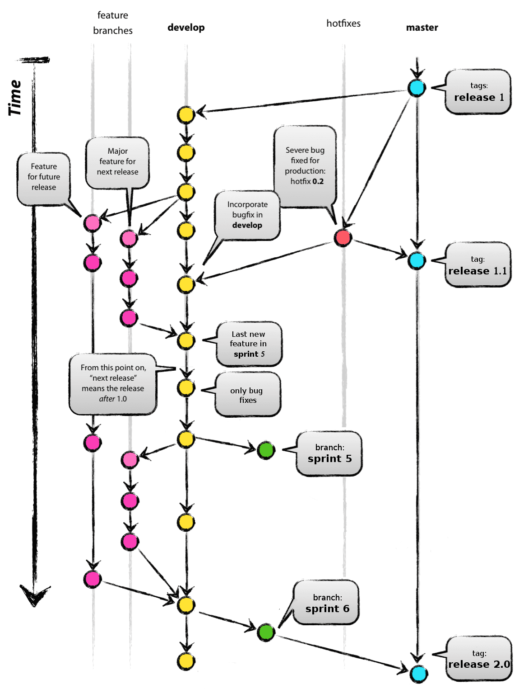

# Gestion des branches GIT dans le cadre du projet GINCO.

Le principe de gestion des branches du projet SINP est basé sur GitFlow (http://www.occitech.fr/blog/2014/12/un-modele-de-branches-git-efficace/).

## Les dépôts concernés.
Le projet SINP utilise quatre dépôts:
* Le dépôt du projet [OGAM](http://gitlab.dockerforge.ign.fr/ogam/ogam) qui a sa propre gestion des branches (cf le cookbook du projet). Nous n'en parlerons donc pas ici.
* Le dépôt [demo-sinp](http://gitlab.dockerforge.ign.fr/sinp/demo-sinp) du projet basé sur OGAM (zend 1).
* Le dépôt [configurateur](http://gitlab.dockerforge.ign.fr/sinp/configurateur) pour le composant de configuration sous sf2.
* Le dépôt [installeur](http://gitlab.dockerforge.ign.fr/sinp/installeur_sinp) pour les configurations et les scripts de déploiement.

Le dépôt de l'installeur est un cas particulier parce que c'est un dépôt privé et qu'il ne nécessite pas pour le moment d'avoir plus d'une seule branche. Nous n'aborderons donc ici que le cas des dépôts publics `demo-sinp` et `configurateur`.

## Principes de base
Git permettant de manipuler assez simplement les branches il est possible de les utiliser pour structurer efficacement les évolutions du projet.


Nous fonctionnerons comme le propose gitFlow pour les branches suivantes:
* Les releases (livraison de sprint et releases de production) sont des tags de la branche `master`.
* Les développements terminés, à faire valider par le product owner sont sur la branche `develop`. Attention, la branche `develop` est dite **incassable**. Elle est buildée, testée et déployée tout les jours par l'intégration continue et testable sur l'instance http://ogam-sinp.ign.fr. Il est de la responsabilité des développeurs que tous les tests passent et que l'instance fonctionne correctement.
* Les fonctionnalités en cours de développement ne sont donc pas sur `develop` mais dans une branche dite `feature` possèdant un nom permettant d'identifier le développement en cours. Il ne faut développer qu'une seule fonctionnalité par branche `feature`. Dans le cas contraire il devient rapidement difficile de merger sur `develop`, parce qu'il y a plus de modifications et parce qu'on peut se trouver dans la situation où il y a toujours un morceau de code qui n'est pas terminé.

## WorkFlow pendant le développement.
* On récupère la dernière version de la branche develop.
`git checkout develop;git pull`.
* On choisit un ticket sur lequel travailler.
* On crée une branche pour cette nouvelle fonctionnalité. `git checkout -b mabranche`.
* On developpe la fonctionnalité et on la teste sur le poste local.

_si on n'utilise pas le merge request_:
* On met à jour sa branche develop avant de merger notre nouvelle fonctionalité desssus.`git checkout develop; git pull; git merge mabranche;`
* On pousse notre branche develop sur le dépôt principal. `git push`

_si on utilise le merge request_:
* On met a jour sa branche sur le dépôt central (gitlab)
* On demande à quelqu'un de merger sur `develop` en faisant un merge request dans gitlab.

## WorkFlow de fin de sprint.
Avant la fin du sprint lorsqu'on considère qu'aucune nouvelle fonctionnalité ne pourra être livrée dans l'itération, on cesse de merger sur develop et on s'attache à y corriger tous les défauts résiduels.

Lorsque develop est stable on crée une nouvelle branche pour le sprint. Dans le cas du projet `demo-sinp` et on modifie le fichier des dépendances `dependencies.ppts` pour indiquer que les version des dépendances qui correspondent (OGAM et configurateur).

A la fin du sprint 6, par exemple :
On créé une nouvelle branche sprint6 sur le configurateur :
```bash
git checkout develop
git pull
git checkout -b sprint6
git push --set-upstream origin sprint6
```
et sur ogam :
```bash
git checkout sinp
git pull
git checkout -b sinp_sprint6
git push --set-upstream origin sinp_sprint6
```
sur demo-sinp :
```bash
git checkout develop
git pull
git checkout -b sprint6
```
On édite le fichier dependencies.ppts
  ogam         : sinp_sprint6
  configurator : sprint6`

```bash
git add dependencies.ppts
git commit -m "mise à jour des dépendances du sprint6"
git push --set-upstream origin sprint6
```

Enfin sur l'installeur:
```bash
git checkout develop
git pull
git checkout -b sprint6
git push --set-upstream origin sprint6
```
On fait aussi une branche sur l'installeur parce que la branche develop n'est 
progressivement plus compatible avec les anciennes versions des projets. Il est 
donc nécessaire de "tagger" l'installeur pour être certain de pouvoir déployer 
les anciennes versions.


Si c'est un sprint de release, on merge la branche de sprint sur master et on tagge master.

Ce fonctionnement est peu différent de celui proposé par GitFlow. GitFlow préconise de créer une branche `release` à stabiliser pendant que sur la branche `develop` les livraisons se poursuivent. Dans le contexte du projet GINCO, avec une toute petite équipe, l'utilisation d'une branche `release` nous a semblé inutilement compliquée. Cependant pour pouvoir gérer correctement les versions des dépendances on fait tout de même une branche de sprint et pas seulement un tag.



#### Conclusion:
* Un peu avant la fin du sprint l'équipe décide de stabiliser la branche `develop` et n'y ajoute plus de nouvelles fonctionnalités.
* Lorsque la branche est stabilisée elle est tagguée `sprint N`.
  * **Attention:** les dépendances (ici configurateur et OGAM) doivent être traitées avant le projet principal (demo-sinp).
  * **Attention:** Dans le projet demo-sinp, le fichier dependencies.ppts doit être mis à jour lors du merge pour utiliser les version taggées des dépendances et plus leur branche develop.
* Si ce sprint correspond à une release, la branche develop est mergée sur master et on ajoute un tag `release R`.


## Intervention sur le code en production.
### hotfix
Lorsque l'application sera en production il sera parfois nécessaire de corriger des défauts sans attendre la prochaine release.

**Par exemple:** la release 1 retourne une erreur 500 dès qu'on se loggue (qui n'a pas fait de test?). On fait alors une branche de "bugfix" `bug_logging` en partant de la branche `release 1`. Puis, une fois le bug corrigé on remerge sur `master`et on crée un nouveau tag `release 1.1`.

On prendra garde de bien répercuter la correction également dans la branche `develop` si c'est utile.

### Maintenance des anciennes versions
La question s'est posée de savoir ce qu'il fallait faire lorsqu'on a un bug sur la `release 1` alors qu'on a déjà une version plus avancée sur master, par exemple la `release 2`.

Corriger la `release 1` alors que la `release 2` est déjà publiée peut se justifier quand tous les utilisateurs ne veulent pas passer à la nouvelle version. Ce peut être pour des questions de coût de migration ou diverses considérations de production. Par exemple, c'est systématiquement le cas pour les systèmes d'exploitation ou les languages de programmation (python 2.7 vs 3.x). Dans le cas de GINCO, la maintenance de plusieurs versions ne se justifie pas et la taille de l'équipe ne le permet pas.

La dernière version de la branche `master` est donc toujours la version à déployer en production.

**Note 1:** Avec le fonctionnement actuel du projet, le résultat d'un sprint n'est pas toujours déployable en production. C'est pour cette raison que seul les sprints de release sont mergé sur `master`.

**Note 2:** Il n'est pas impossible que tous les sprints passent en production dans l'avenir. Cela donne davantage de vitalité au produit, mais les risques liés notamment à la sécurité des données sont un frein.

## Quelle version est déployée où?
* La dernière version de `develop` est déployée tous les jours sur l'instance dailybuild (http://ogam-sinp.ign.fr)
* Les branches `sprint N` sont publiées en qualification.
* Les tags `release N` sont publiés en production.
