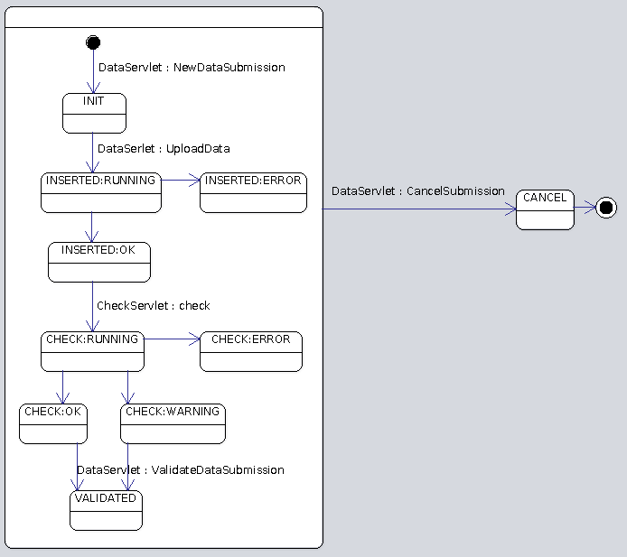

# Documentation du service d'intégration d'OGAM

Le service d'intégration propose 3 servlets:

* `MetadataServlet`: fournit les informations sur la structure des données attendue lors de l'import.
* `DataServlet`: Permet l'import des données proprement dit.
* `CheckServlet`: permet de lancer les contrôles métiers.


Les étapes de l'intégration sont les suivantes:

* `INIT` : La livraison a été déclarée mais rien n'a encore commencé.
* `INSERT` : Import des données CSV en base.
* `CHECK` : Passage des contrôles métiers.
* `VALIDAT` : Validation de la livraison.
* `CANCEL`: Annulation de la livraison et suppression des données. 

Chacune de ces étapes pouvant durer un certain temps, le processus est qualifié par un statut:

* `RUNNING` : processus en cours.
* `OK` : Le processus s'est terminé sans erreur.
* `WARNING` : des warnings mais pas d'erreur.
* `ERROR` : Le processus a rencontré des erreurs dues aux données.
* `CRASH` : Le processus n'a pas pu être mené à bien pour des raisons inconnues.

**Remarque:**

Malgré leur nom, les étapes ne sont pas des statuts mais bien des processus qui peuvent être en cours d'exécution ou même plantés. `CHECK`+`ERROR` indique que les données ne sont pas valides!

Ci dessous le diagramme d'état d'une livraison. Les transitions provoquées par l'utilisateur sont indiquées sous la forme `<servlet> : <action>`.



# Servlet Metadata:

## Action: GetRequestFiles
Retourne la liste des fichiers attendus pour un dataset.

**Paramètre obligatoire:**

* `REQUEST_ID` l'identifiant du **dataset**.

**exemple:**

```bash
wget --no-proxy "http://localhost:8080/SINPIntegrationService/MetadataServlet?action=GetRequestFiles&REQUEST_ID=TAXONS"
```
**Réponse:**

```javascript
[{format:"OBSERVATION_FILE",type:"OBSERVATION_FILE"}]
```

FIXME: l'exemple n'est pas très parlant parce qu'il n'y qu'un seul fichier attendu pour ce dataset.

## Action: GetFileFields
Retourne la liste des champs attendus dans le fichier d'import désigné par le paramètre `FILE_FORMAT`. Ces champs sont définis dans la configuration du métmodèle dans la table `FILE_FIELDS`.

**Paramètre obligatoire:**

* `FILE_FORMAT` (l'identifiant du format de fichier définies dans le métamodèle) 

**exemple:**

```bash
wget --no-proxy "http://localhost:8080/OGAMIntegrationService/MetadataServlet?action=GetFileFields&FILE_FORMAT=ACTOR_FILE"
```
**Réponse:**

```javascript
[
  {label:"ID_OBSERVATION"},
  {label:"ID_ACTOR"},
  {label:"OBSERVER"},
  {label:"ORGANISME_OBSERVER"},
  {label:"DETERMINATOR"},
  {label:"VALIDATOR"},
  {label:"ORG_MANAGER_DATA"},
  {label:"ORG_STANDARD"}
]
```

## Action GetTablesTree
Retourne un json décrivant la hiérarchie des tables depuis la table indiquée en paramètre jusqu'à la table racine.

**Paramètre obligatoire:**

* `TABLE_FORMAT`: L'identifiant du format de table définie dans le métamodèle 

**exemple:**

```bash
wget --no-proxy "http://localhost:8080/SINPIntegrationService/MetadataServlet?action=GetTablesTree&TABLE_FORMAT=OBSERVATION_DATA"
```
**Réponse:**

```javascript
[{table:"OBSERVATION",parent:"null"}]
```
FIXME: l'exemple n'est pas très parlant parce qu'il n'y a pas de table parent...


# Servlet DataServlet

## NewDataSubmission
Crée une nouvelle soumission en base et retourne sont identifiant. Le statut de la moumission est `INIT`.

**Paramètre obligatoire:**

* `PROVIDER_ID`
* `DATASET_ID`
* `USER_LOGIN` : le login de l'utilisateur OGAM.

**exemple:**

```bash
wget --no-proxy "http://localhost:8080/SINPIntegrationService/DataServlet?action=NewDataSubmission&PROVIDER_ID=1&DATASET_ID=TRUC&USER_LOGIN=toto"
```
**Réponse:**

```xml
<?xml version="1.0" encoding="UTF-8" ?>
<Result>
  <Status>OK</Status>
  <Value>32</Value>
</Result>
```
**Remarque:** Visiblement aucun contrôle n'est fait sur les valeurs passées en paramètres. La submission est créée même si le dataset ou l'utilisateur n'existe pas.

## CancelDataSubmission
* Si un traitement est en cours (import ou check) il est juste arrêté.
* Si aucun traitement ne tourne la livraison est annulée et les données importées sont supprimées.

**Paramètre obligatoire:**

* `SUBMISSION_ID`: l'identifiant de la livraison 

**exemple:**

```bash
wget --no-proxy "http://localhost:8080/SINPIntegrationService/DataServlet?action=CancelDataSubmission&SUBMISSION_ID=30"
```

**Réponse:**

```xml
<?xml version="1.0" encoding="UTF-8" ?>
<Result>
  <Status>OK</Status>
  <Value>OK</Value>
</Result>
```


## ValidateDataSubmission
Marque simplement la livraison comme validée dans la base de donnée.

**Paramètre obligatoire:**

* `SUBMISSION_ID`: l'identifiant de la livraison 


**exemple:**

```bash
wget --no-proxy "http://localhost:8080/SINPIntegrationService/DataServlet?action=ValidateDataSubmission&SUBMISSION_ID=27"
```

**Réponse:**

```xml
<?xml version="1.0" encoding="UTF-8" ?>
<Result>
  <Status>OK</Status>
  <Value>OK</Value>
</Result>
```

## status
SUBMISSION_ID

## UploadData
Upload les fichiers cvs de la livraison et les importe dans les tables correspondantes dans RAW_DATA. 

**Remarque:**

Si un champ de fichier csv à été défini dans le métamodèle avec l'unité `GEOM` le service d'intégration considérera que la valeur est en WKT et tentera de la convertir en géométrie postGis lors de l'insersion dans la table.

**Paramètres obligatoire:**

* `SUBMISSION_ID`
* `PROVIDER_ID`
* Les fichiers à traiter doivent se trouver dans la requête (en POST).

**exemple:**

```bash
curl --noproxy localhost -F "SUBMISSION_ID=3" -F "PROVIDER_ID=1" -F "OBSERVATION_FILE=@test.csv" http://localhost:8080/SINPIntegrationService/DataServlet?action=UploadData
```

# Servlet CheckServlet
## Action check
**paramètre obligatoire:** 

* `SUBMISSION_ID` : l'identifiant de la livraison à contrôler

**Action:**

Lance les contrôles définis dans `checks_per_provider` du métamodèle pour le dataset et le provider de la livraison. 
Possibilité de mettre '*' pour la colonne provider_id et/ou dataset_id, alors le check vaudra pour toutes les valeurs de provider_id et/ou dataset_id.

L'import passe à l'étape `CHECK` et au statut `RUNNING`.

**retour:** 

le statut du contrôle : RUNNING

**exemple:**

```bash
wget --no-proxy "http://localhost:8080/SINPIntegrationService/CheckServlet?action=check&SUBMISSION_ID=27"
```
Réponse (Oh surpise c'est du html!!):

```xml
<?xml version="1.0" encoding="UTF-8" ?>
<Result>
  <Status>OK</Status>
  <Value>RUNNING</Value>
</Result>
```

## Action status
**paramètre obligatoire:** 

* `SUBMISSION_ID` : l'identifiant de la livraison à contrôler

**Action:**

Retourne simplement le statut du processus de contrôle. 

FIXME: en réalité il retourne le statut indiqué dans la table raw_data.submission mais sans vérifier que le step est vraiment CHECK.

**retour:** 

* `RUNNING` : contrôle en cours.
* `OK` : Tous les contrôles sont passés sans erreur.
* `WARNING` : des warnings mais pas d'erreur.
* `ERROR` : Certains contrôles configurés comme critiques ne sont pas passés.
* `CRASH` : Le contrôle n'a pas pu être mené à bien.

**exemple:**

```bash
wget --no-proxy "http://localhost:8080/SINPIntegrationService/CheckServlet?action=status&SUBMISSION_ID=27"
```
Réponse:

```xml
<?xml version="1.0" encoding="UTF-8" ?>
<Result>
  <Status>OK</Status>
  <Value>OK</Value>
</Result>
```