# Manuel utilisateur OGAM SINP

## 1.Page de menu

La page de menu du site apparaît une fois l’utilisateur authentifié.

Différentes actions sont disponibles, selon le rôle associé à l’utilisateur alors connecté.

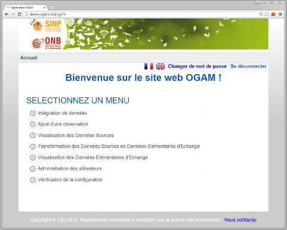

Les actions potentiellement visibles sont :

- Intégration de données ;
- Ajout d’une observation ;
- Visualisation des Données Sources ;
- Transformation des Données Sources en Données Elémentaires d’Echange ;
- Visualisation des Données Elémentaires d’Echange ;
- Administration des utilisateurs ;
- Manuel utilisateur.

## 2.Module d’import de données

Le module d’intégration (import) permet aux utilisateurs autorisés d’ajouter des données via des fichiers csv.

L’import de données se fait via la page d’accueil, en cliquant sur « intégration de données », puis « soumettre des données ».

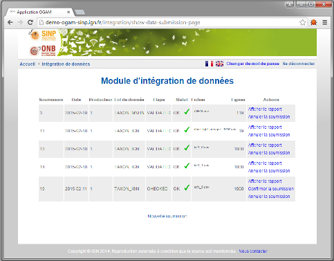

Les fichiers de données déjà importés sont alors représentés sous forme de tableau.
L’import d’un nouveau fichier est possible en cliquant sur “nouvelle soumission”, au bas de l’écran.

Il faut alors sélectionner le lot de données.

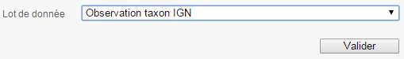

Et charger le fichier csv contenant la liste des données à importer.

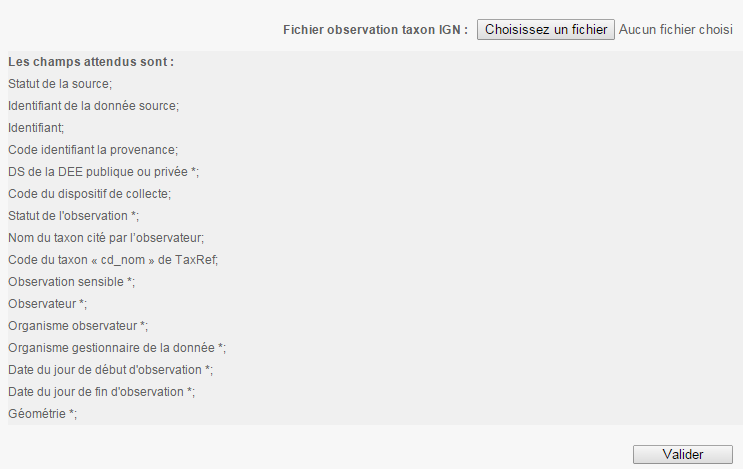

L’application indique la liste des champs attendus. Parmi ces champs, certains sont obligatoires. Ils sont repérables via le caratère __*__ après le nom du champ.

Après avoir validé, l’import des observations commence.

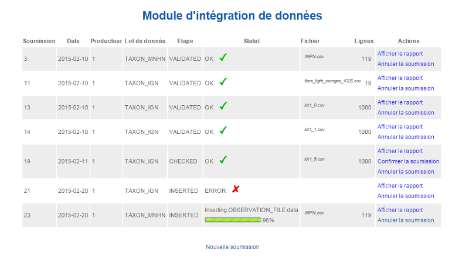

Un rapport listant les éventuelles erreurs est disponible en cliquant sur le lien « afficher le rapport » de la colonne action.

## 2.1 Contenu des fichiers .csv

Les fichiers .csv importés doivent respecter les règles suivantes : 

- Chaque nom de colonne doit être séparé par un point-virgule ";"
- Les noms de colonnes doivent être précédés d'un double-slash  "//"

	**exemple: //cle_obs;code_commune;nom_commune **
	
- Chaque attribut doit être séparés par un point-virgule ";"
- Ils ne doivent pas être entourés de guillements ni d'apostrophes

	**exemple: 15268;97134;Vieux-Habitants **

## 3. Module de consultation

Les composants du module de consultation sont les mêmes pour la consultation des Données Source et celle des Données Elémentaires d’Echange. Il est accessible via la page de menu, en cliquant sur « visualisation des Données Sources » ou « visualisation des Données Elémentaires d’Echange ».

Il est composé comme suit :

- Sur la gauche, se trouve le module de recherche (ou requêteur), utilisé pour composer une recherche.

- Au centre de la page est présenté le résultat de la recherche. Cette partie est disponible sous 2 formes correspondant aux 2 onglets : carte, résultat.
	- L’onglet carte correspond à la visualisation de la localisation des données.
	- L’onglet résultat présente les résultats sous forme de tableau de données avec leurs informations associées.

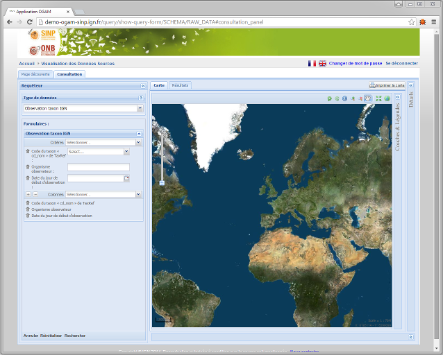

### 3.1 Sélection d’un jeu de données

La première chose à faire lorsqu’on utilise le module de recherche est de sélectionner le jeu de données avec lequel on souhaite travailler.

Cette sélection se fait via le menu déroulant nommé “Type de données”. A chaque jeu de données sont associés un ou plusieurs formulaires regroupant les critères disponibles pour une recherche sur ce jeu de données.

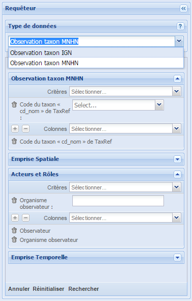

### 3.2 Ajout de critères de recherche, et des colonnes à afficher

Les formulaires permettent de sélectionner les critères sur lesquels requêter et les champs (colonnes) à afficher dans l’onglet des résultats.

Le menu déroulant nommé “Critères” de chaque formulaire permet d’ajouter des critères potentiels de recherche.

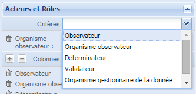

Selon le type de critère ajouté, sa forme va être différente (menu déroulant, champ texte, calendrier…)

Dans le cas d’un champ date, deux calendriers s’affichent côte à côte.

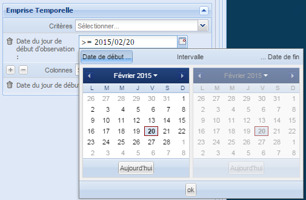

Cliquer sur “date de début” permet de définir une date à partir de laquelle les observations seront recherchées.

Cliquer sur “date de fin” permet de définir une date jusqu’à laquelle les observations seront recherchées.

Cliquer sur “intervalle” permet de définir un intervalle de dates fermé.

Chaque critère peut être ajouté plusieurs fois. Dans ce cas la recherche va sélectionner les données dont la valeur pour ce critère correspond à des valeurs sélectionnées (opération OU).

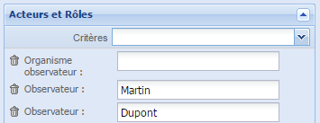

**Exemple :**

La sélection des filtres suivants :

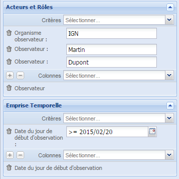

Va correspondre à une recherche des données dont le nom de l’observateur est Martin OU Dupont, ET dont l’organisme observateur est l’IGN, ET dont la date du jour de début de l’observation est le 20 février 2015.

Afin de pouvoir effectuer une requête, il faut sélectionner au moins une colonne à afficher dans l’onglet des résultats (menu déroulant « Colonnes »).
Le bouton « + » est un raccourci permettant d’ajouter tous les champs (colonnes) disponibles d’un coup.
Le bouton « - » est un raccourci permettant de supprimer tous les champs d’un coup.
Les boutons permettent de déselectionner les champs correspondant. 

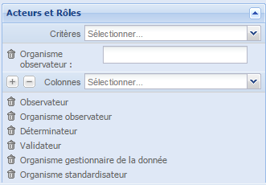  

### 3.3 Résultat de la recherche

Le bouton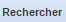  au bas du requêteur permet de lancer la recherche.

Le bouton 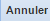  permet d’arrêter une recherche en cours. 

Enfin,   permet de recharger le requêteur par défaut.

Sur l’onglet résultat, les résultats de la recherche sont affichés sous forme de grille.

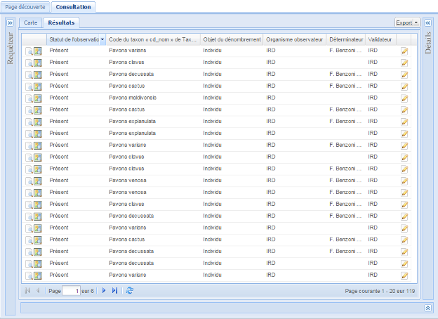

Les résultats sont présentés à raison de 20 données par page. La navigation entre les pages de résultats se fait via les flèches au bas de la grille.

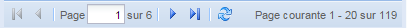

En cliquant à côté des titres des colonnes, il est possible d’ordonner l’affichage des résultats selon les valeurs de la colonne sélectionnée.

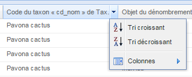

Les icones ,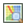 et  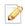  permettent respectivement d’afficher les détails, de visualiser sur la carte, ou d’éditer la donnée correspondante.

### 3.4 Affichage des données sur la carte

En cliquant sur l’onglet “carte”, on accède à la localisation des données résultant de la recherche.

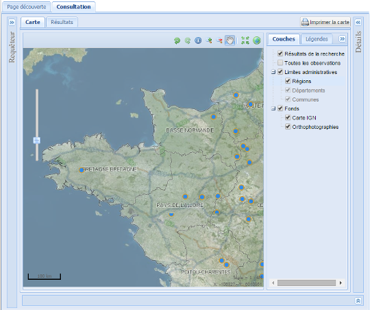

Des fonctionnalités classiques d’interaction sur la carte sont disponibles (déplacer la carte, zoomer, jouer sur les couches, …).

### 3.5 Panneau couches & légendes

Sur la droite de la carte, deux onglets permettent de jouer sur les couches à afficher sur la carte (ordre d’affichage, transparence…), et d’en visualiser la légende. La transparence des couches est accessible après un clic droit sur la couche. Selon le niveau de zoom, certaines couches s’affichent ou ne s’affichent pas.

**Modifier la recherche**

Il est possible de revenir sur le panneau de recherche en cliquant sur l’onglet requêteur (sur la droite de l’écran), ce qui va faire coulisser le panneau de requête.

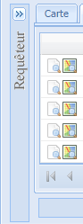

### 3.6 Panneau de détail

Le panneau « Détails » s’affiche sur la droite de la carte après avoir cliqué sur une icône . Il situe spatialement l’observation grâce à 2 vignettes centrées sur l’observation à des échelles différentes et liste les niformations saisies sur l’observation. 

## 4 Transformation des DS en DEE

L’accès à la transformation des DS en DEE se fait via la page de menu, en cliquant sur « transformation des DS en DEE », puis sur « recopier des données ».

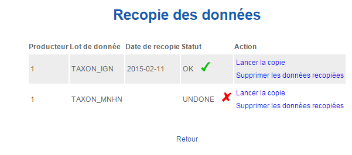.

La transformation d’un lot de données est effectué lors du clic sur l’action « lancer la copie ».
