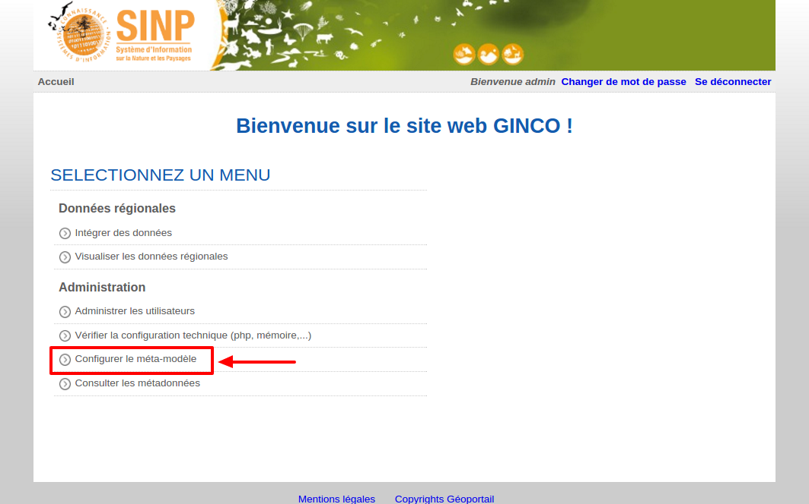

.. Accès au configurateur GINCO.

Accéder au configurateur GINCO
==============================

.. warning::
    Attention : l'accès au configurateur GINCO n'est possible qu'aux personnes disposant du rôle "Administrateur régional".

Pour accéder au configurateur, sur la page d'accueil de la plateforme GINCO, cliquez sur "Se connecter" et entrez vos
login et mot de passe. Si vous disposez du rôle d'administrateur régional, vous verrez la page d'accueil suivante :

Cliquez sur "Configurer le méta-modèle", ce qui vous emmènera sur la page d'accueil du configurateur.

