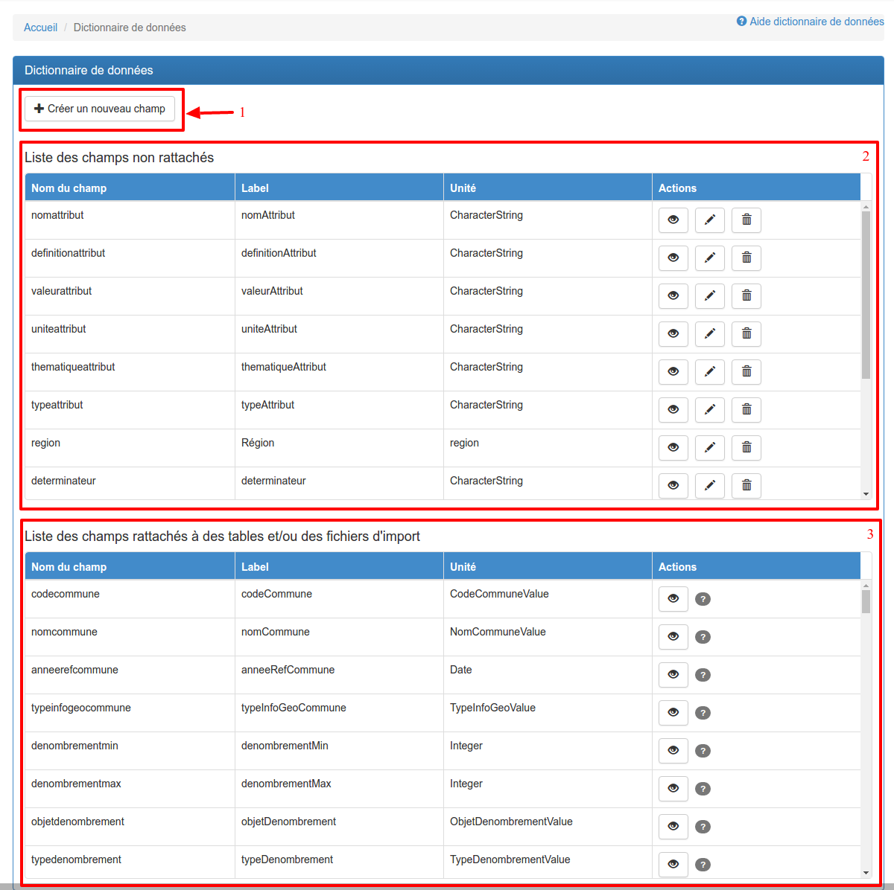
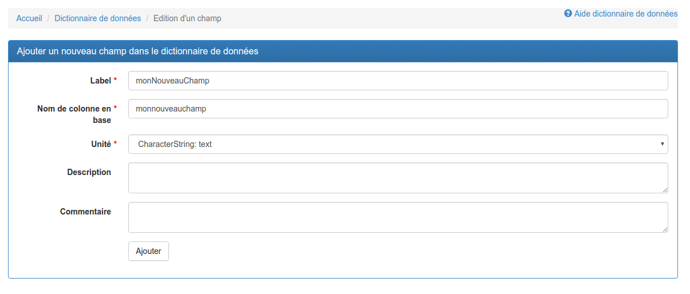
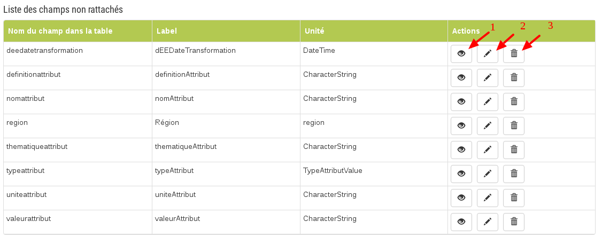
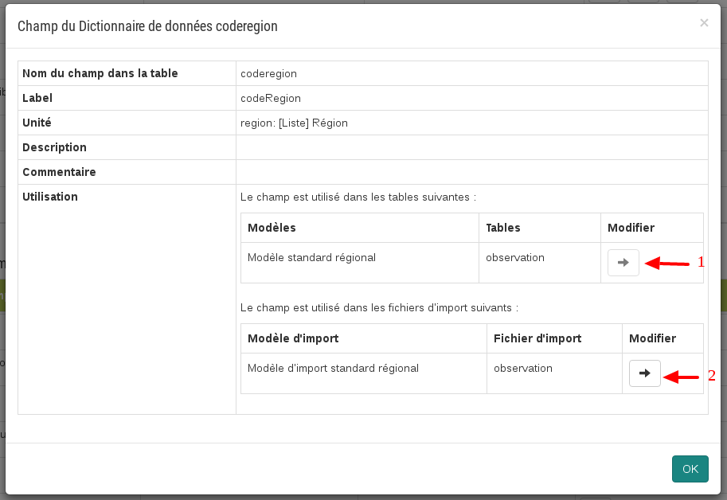

.. Le configurateur GINCO : le dictionnaire de données

Le dictionnaire de données
==========================

Principe
--------

Le dictionnaire de données regroupe tous les champs du standard DEE, du standard DSR, ainsi que les éventuels champs créés par un administrateur régional GINCO.

C'est depuis le dictionnaire de données que sont puisés tous les champs qui sont présentés dans les pages de configuration des tables des modèles de données et des fichiers des modèles d'import.

Pour accéder au dictionnaire de données, cliquez sur l'onglet "Dictionnaire de données" situé en haut de chaque page du configurateur.

La page de présentation des champs du dictionnaire de données permet de visualiser en une fois les champs qui ne sont pas encore rattachés à une table ou à un fichier d'import.
Elle comporte un bouton de création de nouveau champ et deux tableaux :

Vous pouvez créer un nouveau champ via le bouton **1**, qui vous mènera vers la page d'ajout de nouveau champ :

Les champs demandés sont :

* **Label :** C'est le label qui sera affiché dans l'application. Il n'y a pas de caractères interdits.
* **Nom de colonne en base :** Le nom du champ, utilisé en base de données : les caractères autorisés sont les lettres minuscules, chiffres et _.
* **Unité :** L'unité attendue pour le champ.
* **Description :** Texte libre.
* **Commentaire :** Texte libre.

Le tableau **2** liste les champs non rattachés ni à une table, ni à un fichier.

Vous pouvez depuis ce tableau :

* **1.** Visualiser chaque champ (nom, label, unité, description, commentaire)
* **2.** Editer un champ, via le formulaire d'édition d'un champ
* **3.** Supprimer un champ (possible car il n'est rattaché à aucune table ni à aucun fichier)

Le tableau **3** liste les champs rattachés à des tables et / ou à des fichiers d'import. Vous ne pouvez qu'y visualiser les détails d'un champ.
Pour chaque champ, un clic sur le bouton Visualiser ouvre une fenêtre modale affichant les détails du champ de la manière suivante :

Des liens (**1** et **2**) permettent d'accéder directement à une table ou à un fichier qui contient le champ. Un lien grisé signifie que le modèle de données ou le modèle d'import lié à la table ou au fichier est publié, interdisant toute modification de celui-ci.
