.. Modèle d'import

Configurer les modèles d'import
===============================

Principe
--------

Un modèle d'import est une description d'un ensemble de fichiers, de leurs attributs et des relations entre ces attributs et les attributs des tables du modèle de données associé. C'est l'étape qui suit la configuration d'un modèle de données.

Une fois un modèle d'import décrit  et configuré, il est possible de le publier. Ce modèle d'import publié est la brique de base indispensable à l'import de données d'occurences de taxons.

Chaque plateforme GINCO, régionale ou thématique, comprend nativement le modèle d'import DEE.
Les administrateurs régionaux peuvent créer un ou plusieurs modèles d'import supplémentaires, qui seront accessibles aux utilisateurs de la plateforme.

Créer un modèle d'import
------------------------

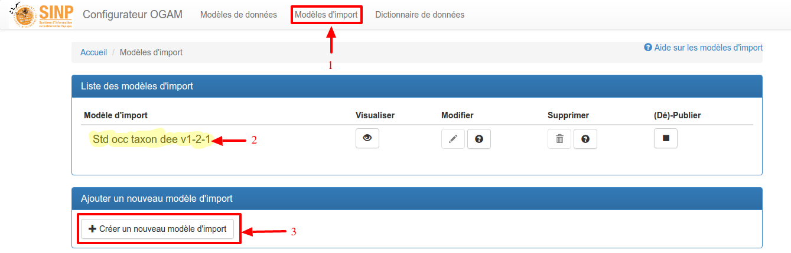

1. Cliquer sur "Modèles d'import" dans le menu du haut pour accéder à la page de gestion des modèles de d'import.
2. Initialement, un modèle est présent et configuré : le modèle standard DEE.

.. note:: Le modèle standard DEE n'est ni modifiable, ni supprimable.

3. Pour créer un nouveau modèle, cliquer sur "Créer un nouveau modèle d'import".
   Un modèle vierge, sans fichiers ni champs, sera créé.

Lors de la création, vous devez indiquer le nom de votre nouveau modèle, une description (facultative), ainsi que le modèle de données **cible** :

.. image:: ../images/configurateur/configurateur-modele-import-creation.png

Le rattachement à un modèle de donnés cible est obligatoire et permet de faire les liaisons entre les champs des tables du modèle cible et les champs des fichiers du modèle d'import.

Dans cet exemple, on voit que le modèle de données cible sélectionné est "*Modèle standard régional*". 

Votre nouveau modèle est visible sur la page de gestion des modèles de d'import (**1**) :

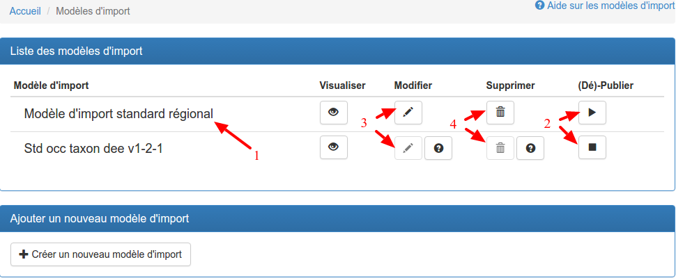

2. Le nouveau modèle n'est pas publié sur la plateforme,
    comme l'indique le bouton "Publier" présent (flèche droite, ou bouton de lecture),
    contrairement au modèle DEE, comme l'indique le bouton "Dépublier" (carré, ou bouton d'arrêt de lecture).
3. et 4. Vous pouvez donc le modifier et le supprimer (les boutons sont actifs),
    contrairement au modèle DEE (ses
    boutons sont inactifs) : en effet, il n'est possible de modifier/supprimer un modèle que s'il n'est pas publié
    sur la plateforme (voir `Publier / Dépublier un modèle d'import`_).

Configurer les fichiers et les champs d’un modèle d'import
-------------------------------------------------------------

Cliquez sur l'icône "Modifier" (**3**), sur la page de gestion des modèles d'import, pour accéder à la page de configuration de votre modèle :

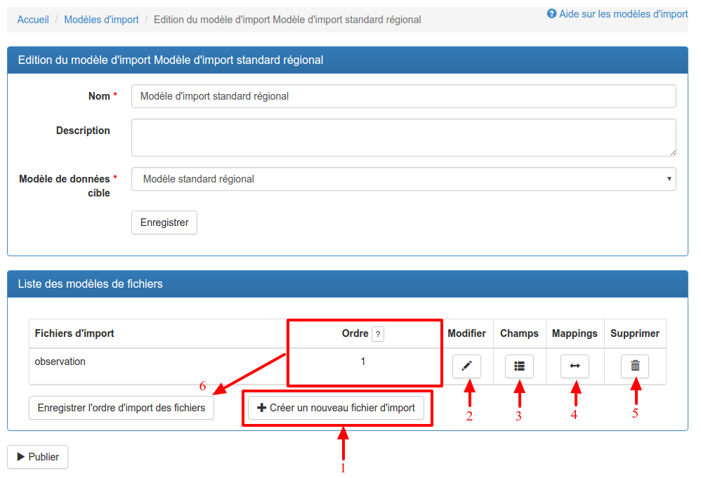

On peut y:

* `Créer et modifier des fichiers`_ (**1** et **2**)
* `Supprimer des fichiers`_ (**5**)
* `Ordonner les fichiers`_ (**6**)
* `Gérer les champs des fichiers`_ (**3**)
* `Configurer les mappings`_ (**4**)

Créer et modifier des fichiers
^^^^^^^^^^^^^^^^^^^^^^^^^^^^^^

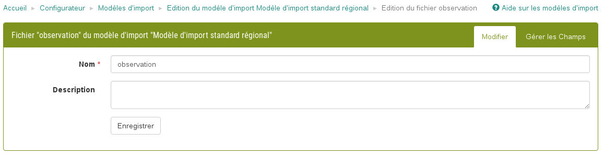

Les champs demandés sont :

* **Nom :** Nom du fichier, utilisé en base de données : tous les caractères sont autorisés, mais le nombre de caractères est limité à 36.
* **Description :** *(facultatif)* Texte libre décrivant le fichier.

La page d'édition d'un modèle de fichier est divisée en 3 onglets :

* Modifier
* Gérer les champs
* Gérer les mappings

Supprimer des fichiers
^^^^^^^^^^^^^^^^^^^^^^

Pour supprimer un fichier, il suffit de cliquer sur le bouton "Corbeille" (**5**) du fichier que vous souhaitez supprimer. Le fichier sera directement supprimé.

Ordonner les fichiers
^^^^^^^^^^^^^^^^^^^^^

Pour ordonner les fichiers, il suffit de glisser-déposer vos fichiers les uns au-dessus ou au-dessous des autres, puis de cliquer sur le bouton "Enregistrer l'ordre d'import des fichiers" (**6**).

Gérer les champs des fichiers
^^^^^^^^^^^^^^^^^^^^^^^^^^^^^

L'écran de gestion des champs du fichier permet de rajouter et supprimer des champs depuis le dictionnaire de données vers le fichier.

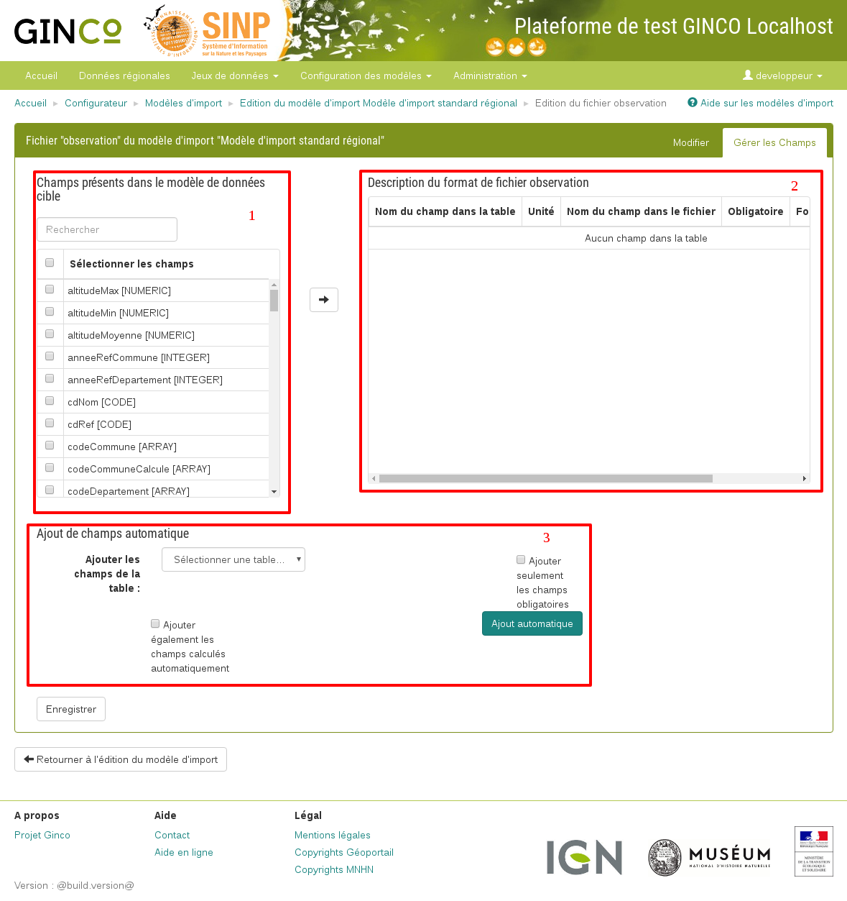

Il est divisé en 3 parties principales :

* **1** : le tableau du dictionnaire de données : il liste tous les champs disponibles dans le dictionnaire de données, c'est à dire ceux du standard DEE et des champs rajoutés par l'utilisateur.
* **2** : le tableau des champs du fichier : il liste uniquement les champs qui sont attendus dans les fichiers téléversés sur la plateforme.
* **3** : une partie sur l'ajout de champs automatique à partir d'une table du modèle de données cible. Pratique pour faire correspondre quasi-immédiatement les champs du fichier avec ceux d'une table.

Les différentes fonctionnalités de cet écran sont décrites ci-dessous.

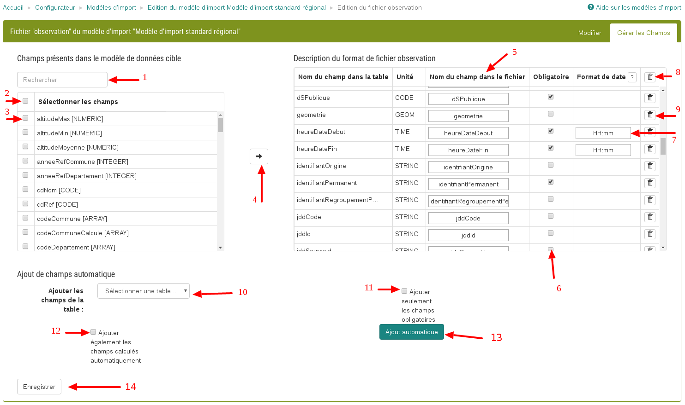

1. **Rechercher un champ** : il suffit de taper une chaîne de caractères courte pour filtrer le tableau du dictionnaire de données et ainsi faciliter la sélection de champs.

2. **Sélectionner tous les champs** en cochant la case dans la ligne de titre du tableau.

3. **Sélectionner un champ** en cochant la case qui lui correspond.

4. **Ajouter un ou plusieurs champ(s)** en cliquant sur la flèche : les champs sélectionnés seront alors ajoutés au tableau de droite.

.. note:: Une fois que vous avez ajouté un ou plusieurs champ(s), il n'est pas nécessaire d'appuyer sur l'un des deux boutons d'enregistrement (**12**).

.. note:: Un champ ne peut être présent en doublon dans un fichier.

5. **Créer un nouveau champ** : l'écran permet de décrire un nouveau champ, qui sera ajouté au dictionnaire de données ET rattaché directement au fichier. 

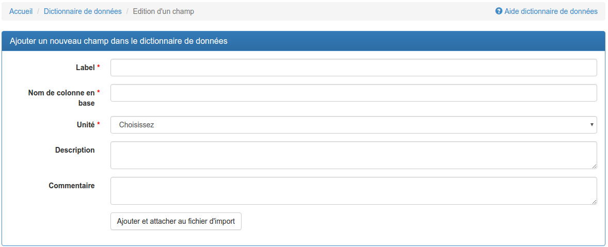

6. **Rendre un champ obligatoire** ou non en cochant la case correspondant à un champ dans le fichier.

.. note:: Il est préférable de rendre un champ obligatoire sur le modèle d'import plutôt que sur le modèle de données.

.. note:: Lorsque l'on mappe des champs d'un fichier d'un modèle d'import avec des champs obligatoires non-calculés d'une table, le champ devient obligatoire et non-modifiable dans la configuration des champs du fichier du modèle d'import. Cette contrainte a été mise en place pour éviter que certains champs obligatoires en base ne soient pas présents dans le ou les fichiers du modèle d'import, ce qui peut engendrer des erreurs lors de l'import. Les champs calculés ne sont pas pris en compte (par exemple : l'identifiant permanent SINP, les champs de sensibilité ou les champs administratifs calculés).

7. **Remplir le format de date** pour tous les champs dont l'unité est "*DATE*". Par défaut, le format de date pré-rempli est *yyyy-MM-dd*, mais vous pouvez le modifier. Vous trouverez plus de détails dans :ref:`format-des-dates`.

8. **Ordonner les champs** en "attrapant" un champ via la main sur la ligne du champ, puis en le déposant à la place voulue. L'ordre sera mis à jour dans la colonne "Ordre".
.. note:: L'ordonnancement des fichiers a son importance lors de l'import des données : il permet à l'application de déterminer dans quelle table enregistrer les données de vos fichiers selon cet ordre. De plus, dans la page d'import de données, les fichiers seront listés dans l'ordre configuré ici.

.. warning:: Pour enregistrer le caractère obligatoire, le format de date d'un champ et l'ordre des champs, il est nécessaire de cliquer sur l'un des deux boutons d'enregistrement (**12**).

9. **Supprimer tous les champs du fichier** en cliquant sur la corbeille dans la ligne de titre.

.. warning:: Attention, tous les champs du fichier seront directement supprimés. Il n'y a pas de possibilité d'annulation.

10. **Supprimer un champ du fichier** en cliquant sur la corbeille correspondant à un champ dans le fichier.

.. warning :: La suppression d'un champ est immédiate et irréversible. Pour retrouver un champ supprimé, il faut recommencer la procédure de rajout depuis le dictionnaire de données.

11. **Ajouter des champs automatiquement** depuis une table du modèle de données cible. Pour ce faire, il suffit de sélectionner une table, puis de cliquer sur "Ajout automatique". Tous les champs de la table seront alors rajoutés à la liste des champs du fichier, excepté les champs dont la valeur est calculée par l'application lors de l'import. Une fois effectué, un rapport sera affiché et vous offrira également la possibilité de configurer automatiquement les mappings en cliquant sur "Mapping automatique". Voir `Configurer les mappings`_.

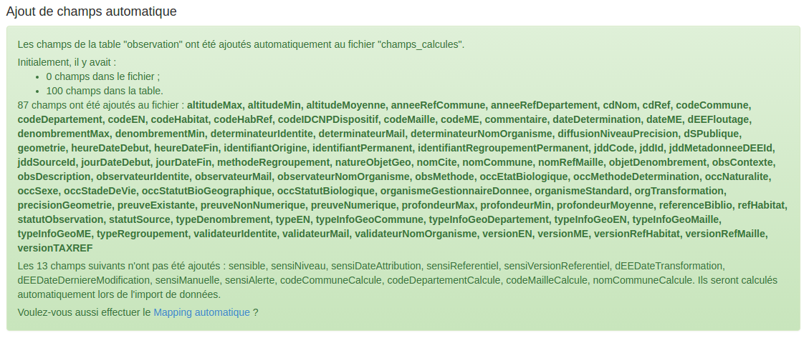

12. **Ajouter seulement les champs obligatoires** permet, lors de l'ajout automatique, de n'ajouter dans le format de fichier que les champs qui sont obligatoires dans le modèle de données.

13. **Ajouter également les champs calculés automatiquement** permet d'ajouter dans le format de fichier les champs dont les valeurs sont calculées automatiquement par GINCO lors de l'import de données. Si tous les champs du modèle DSR sont présents cette option est inutile, mais si votre modèle de données ne contient pas tous les champs du standard, il est possible que certains champs ne puissent pas être calculés automatiquement.

14. **Ajout automatique** est le bouton permettant de lancer l'ajout de champs automatique dans le format de fichier.

15. **Enregistrer** vos modifications : seules les modifications liées au caractère obligatoire d'un champ, l'ordre, ainsi que le format de date sont enregistrées à ce moment-là. Le reste (ajout de champs, suppression) est enregistré lors de chaque action effectuée.

Configurer les mappings
^^^^^^^^^^^^^^^^^^^^^^^

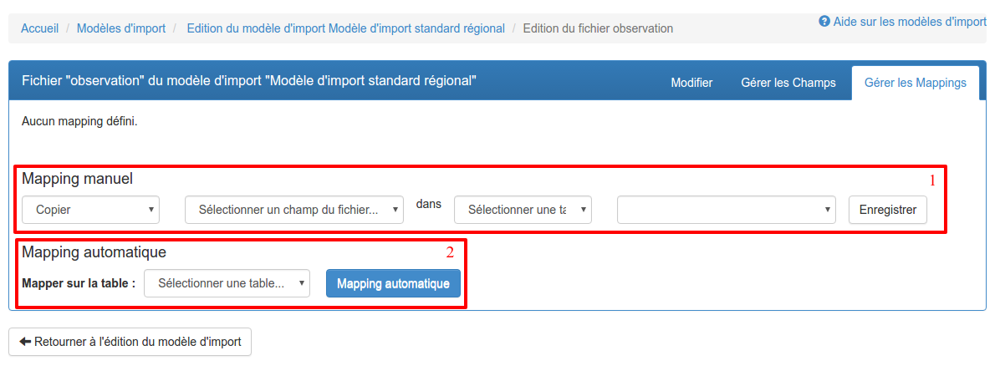

Les *mappings* servent à lier les champs d'un fichier avec les champs d'une ou plusieurs tables : cela permet à l'application d'insérer en base de données, dans la bonne table et la bonne colonne, chaque donnée contenue dans un fichier importé.

Pour configurer les mappings, plusieurs moyens d'accès sont offerts.

* cliquer sur le lien représentant une double flèche dans la liste des modèles de fichiers (**3**).
* depuis la page d'édition d'un modèle de fichier, cliquer sur l'onglet "Gérer les mappings".
* effectuer un ajout de champs automatique puis cliquer sur le lien lançant le mapping automatique.

Une fois sur la page, deux types de mapping sont disponibles :

* `Le mapping manuel`_ (**1**)
* `Le mapping automatique`_ (**2**)

Le mapping manuel
*****************

Cette fonctionnalité permet de mapper avec détail les champs spéciaux ou non-reconnus par le mapping automatique. En voici le déroulement : 

1. Dans la première liste déroulante, sélectionnez l'option "Copier".

2. Dans la deuxième liste déroulante, sélectionnez le champ du fichier que vous souhaitez mapper (par exemple, le champ "*geometrie*").
3. Dans la troisième liste déroulante, sélectionnez la table dans laquelle se trouve le champ avec lequel vous souhaitez mapper le champ "*geometrie*".
4. Dans la quatrième liste déroulante, sélectionnez le champ avec lequel mapper "*geometrie*".
5. Cliquez sur le bouton "Enregistrer".

Une fois cela fait, une nouvelle règle de mapping sera créée et affichée dans un tableau dans la page de gestion des mappings :

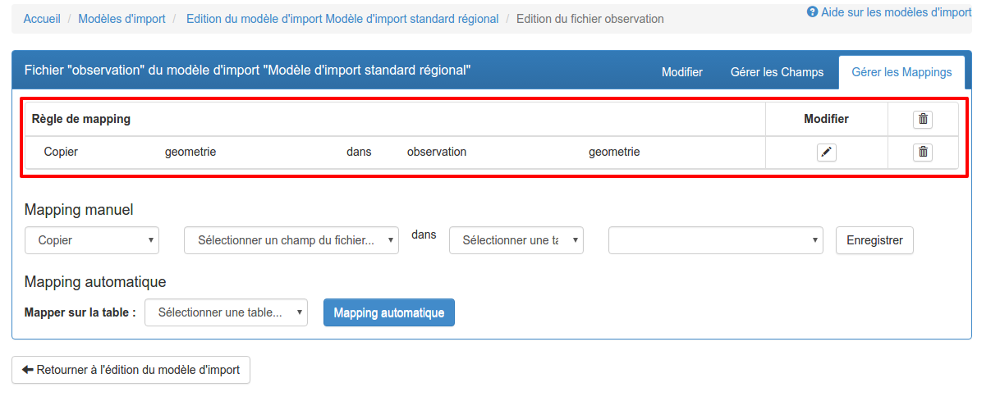

.. Note:: Notez que le mapping manuel ne s'avère nécessaire que dans certains cas particuliers (mapping de clé primaires et de clés étrangères). Pour le reste, l'utilisation du mapping automatique est fortement conseillé.

Le mapping automatique
**********************

Cette fonctionnalité permet de mapper automatiquement tous les champs similaires entre un modèle de fichier et un modèle de table sélectionné.

Par exemple, si le champ "*geometrie*" est présent dans une table "*localisation*", et que ce même champ "*geometrie*" est présent dans un fichier "*localisation*", alors une règle de mapping sera automatiquement créée entre ces deux champs. Et cela est effectué pour tous les champs du fichier.

Pour lancer le mapping automatique, il suffit de sélectionner la table avec laquelle vous souhaitez mapper votre modèle de fichier dans la liste déroulante (**2**), puis de cliquer sur "Mapping automatique".

Lorsque les règles sont créées, elles s'affichent dans le tableau des règles de mapping, et un rapport apparait dans la page pour vous indiquer :

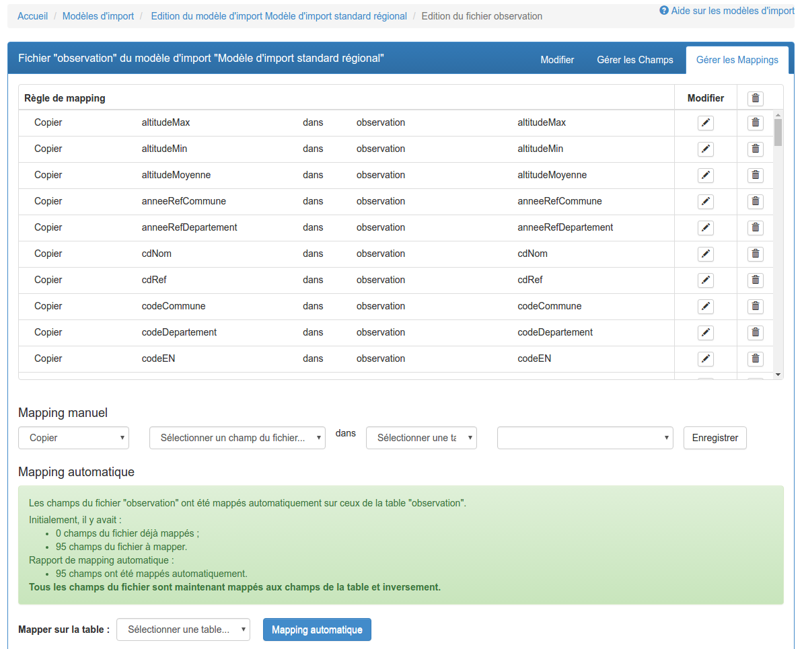

.. Note:: Les champs spéciaux "*clé primaire table x*" et "*clé étrangère table x*" ne peuvent pas être automatiquement mappés. Pour ceux-là, il faut utiliser le mapping manuel. 

.. _relation-tables-fichiers:

Cas particulier : le mapping des clés primaires et étrangères
*************************************************************

Si vous avez établi une relation hiérarchique entre deux tables du modèle de données cible, l'une étant la table **mère** et l'autre étant la table **fille**, le mapping automatique ne pourra pas déterminer les règles de mapping concernant les champs de clé primaire. Suivez les étapes suivantes pour contourner le problème :

1. Depuis la page de modification de votre modèle d'import, créez un fichier correspondant à la table **mère**. Dans la gestion des champs du fichier, comme vu plus haut, vous pouvez faire usage des fonctionnalités d'ajout automatique de champs et de mapping automatique pour le créer et le configurer.

2. Rajoutez un champ nommé **Clé primaire table mère** dans votre modèle de fichier, correspondant à votre clé primaire utilisateur.

3. Depuis la page de gestion des mappings, rajoutez manuellement un mapping entre le champ **Clé primaire table mère** et le champ **Clé primaire table mère** de la table **mère**.

4. Répétez les étapes **1** et **2** pour la table **fille**.

5. Depuis la page de gestion des mappings, rajoutez manuellement un mapping entre le champ **Clé primaire table mère** et le champ **Clé étrangère table mère** de la table **fille**.

La configuration terminée, vous pouvez publier le modèle d'import.

Publier / dépublier un modèle d'import
--------------------------------------

Lorsque vous avez terminé de configurer votre modèle d'import, et que vous souhaitez le rendre disponible pour publication, il suffit de cliquer sur le bouton de lecture dans le tableau des modèles d'import :

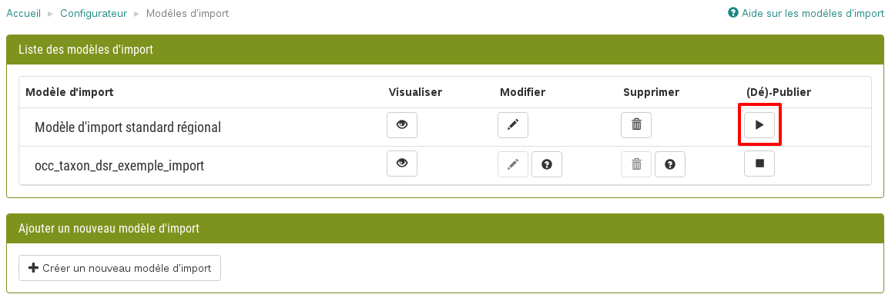

Le modèle d'import sera alors disponible en production.

**Attention** : pour qu'un modèle d'import soit publiable :

* son modèle de données cible doit être publié
* il doit comporter au moins un fichier d'import
* chacun de ses fichiers doit comporter au moins un champ
* chacun de ses fichiers doit comporter au moins un mapping

Si toutes ces conditions ne sont pas atteintes, le bouton de publication est grisé.

.. note:: Une fois publié, le modèle de d'import ne peut plus être ni supprimé ni modifié. Vous pouvez toutefois continuer à consulter sa configuration en visualisant son contenu (bouton Visualiser).

Après avoir publié votre modèle de données, la publication de votre modèle d'import de fichiers vous permettra de téléverser vos données depuis la page d'import de données de l'application.

Si vous souhaitez dépublier un modèle d'import, il suffit de cliquer sur le bouton d'arrêt de lecture dans le tableau des modèles d'import :

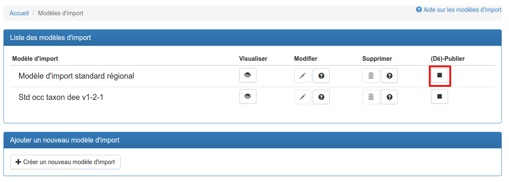

A la dépublication d'un modèle d'import, et à la différence de la dépublication d'un modèle de données, seul celui-ci est dépublié. Le modèle de données cible n'est pas impacté, vous pourrez donc toujours requêter et visualiser les données importées. Il ne vous sera par contre plus possible de téléverser des données d'observation.

.. warning:: Il n'est pas possible de dépublier un modèle d'import lorsqu'un import est en cours.
