.. Le configurateur GINCO : les modèles de données.

Configurer les modèles de données
=================================

Principe
--------

Un modèle de données est une description d'un ensemble de tables, de leurs attributs
et de leurs relations hiérarchiques. Ce modèle de données est la brique de base
pour décrire ensuite un modèle d'import, indispensable à l'import de données d'occurences
de taxons.

Chaque plateforme GINCO, régionale ou thématique, est livrée avec un modèle de données
de base. Ce modèle contient tous les champs nécessaires à l'export des données en
DEE et au fonctionnement de la plate-forme. Les administrateurs régionaux peuvent
créer de nouveaux modèles de données en copiant le modèle de base et en l'étendant
avec des champs régionaux utiles.

.. warning:: Si vous souhaitez pouvoir diffuser et analyser localement les données
  régionales, nous vous conseillons néanmoins de limiter au maximum le nombre de
  standards régionaux; les modules de requête et de visualisation GINCO ne peuvent
  s'appliquer que sur un seul modèle de données à la fois.

Créer un modèle de données
--------------------------

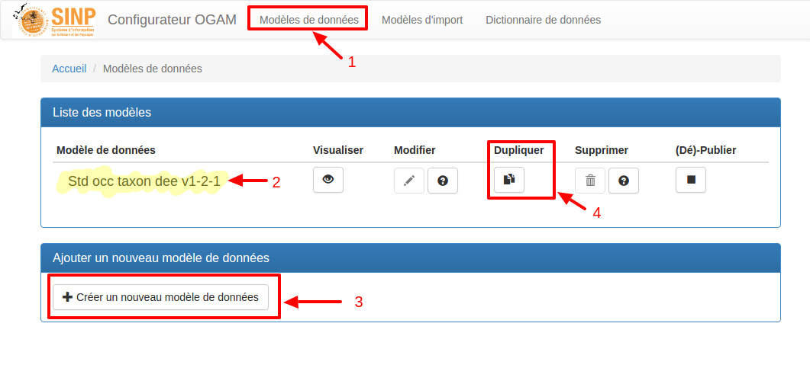

1. Cliquer sur "Modèles de données" dans le menu du haut pour accéder à la page de gestion des modèles de données.
2. GINCO propose un modèle de données de base : **Occ_Taxon_DSR_exemple**.

.. note:: Le modèle Occ_Taxon_DSR_exemple est le modèle de base. Il n'est
    possible ni de le supprimer, ni de le modifier.

Pour créer un nouveau modèle, vous devez dupliquer le modèle DSR de base ou un
modèle qui l'a étendu.

.. warning :: Il est encore possible de créer un modèle à partir de rien, mais cette méthode
  est fortement déconseillée. C'est un processus laborieux et un peu dangereux
  parce que rien de garanti que le modèle ainsi configuré permettra l'export
  correct en DEE et que tous les champs techniques nécessaires au bon fonctionnement
  de la plate-forme seront présents.

3. Pour copier un modèle existant, cliquer sur l'icône "Dupliquer" correspondante.
  Un modèle contenant les mêmes tables et champs que le modèle initial sera créé.
  Vous ne devez pas modifier ou supprimer des champs provenant du modèle DSR
  de base.

Vous pourrez alors indiquer le nom de votre nouveau modèle ainsi qu'une description
(facultative) :

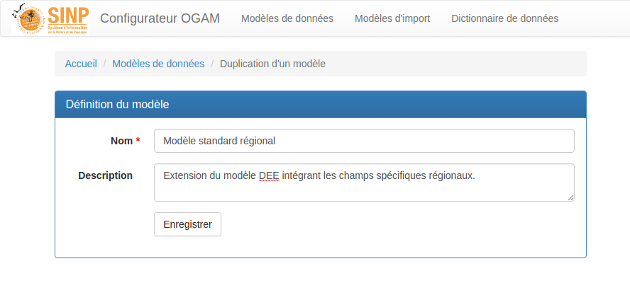

Votre nouveau modèle est visible sur la page de gestion des modèles de données (1) :

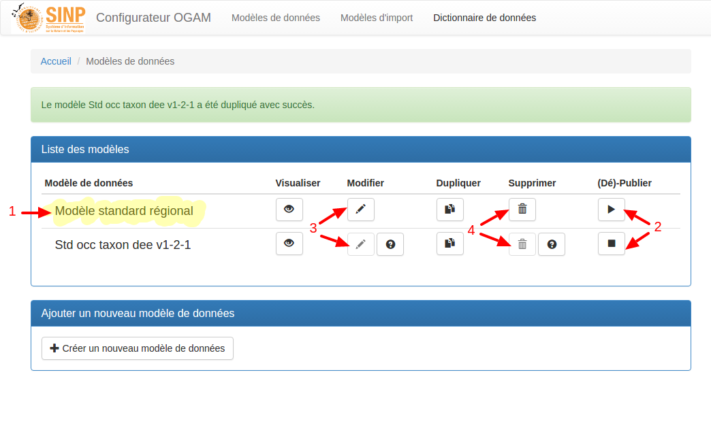

2. Le nouveau modèle n'est pas publié sur la plateforme,
    comme l'indique le bouton "Publier" présent (flèche droite, ou bouton de lecture),
    contrairement au modèle Occ_Taxon_DSR_exemple, comme l'indique le bouton "Dépublier" (carré, ou bouton d'arrêt de lecture).
3. et 4. Vous pouvez donc le modifier et le supprimer (les boutons sont actifs),
    contrairement au modèle Occ_Taxon_DSR_exemple (ses
    boutons sont inactifs) : en effet, il n'est possible de modifier/supprimer un modèle que s'il n'est pas publié
    sur la plateforme (voir `Publier / Dépublier un modèle de données`_).

.. note:: Lorsque vous souhaitez modifier un modèle de données, un message vous
  indiquera que les éventuels association de champs avec les fichiers d'import
  seront perdus. Cela s'explique par le fait qu'il est très difficile de maintenir
  la cohérence sur ces relations alors que la structure des données va être modifiée.
  Lorsque vous souhaitez modifier
  un modèle de données, les correspondances de champs entre tables et fichiers seront
  donc perdues, **même si finalement, vous n'effectuez pas de modifications**.

Configurer les tables et les champs d'un modèle de données
----------------------------------------------------------

Cliquez sur l'icône "Modifier" (**3**), sur la page de gestion des modèles de données, pour accéder à la page de
configuration de votre modèle :

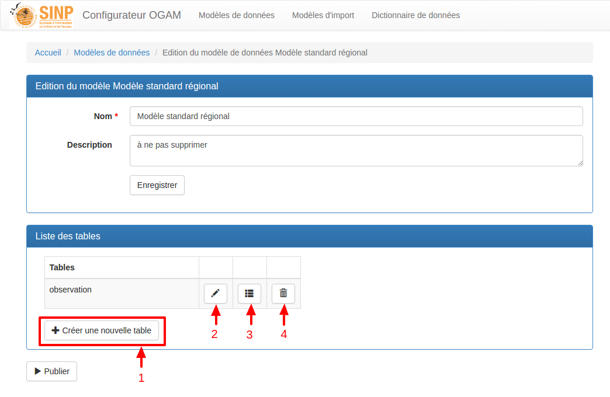

On peut :

* `Créer et modifier des tables`_ (**1** et **2**)
* `Gérer les champs des tables`_ (**3**)
* `Supprimer des tables`_ (**4**)

Créer et modifier des tables
^^^^^^^^^^^^^^^^^^^^^^^^^^^^

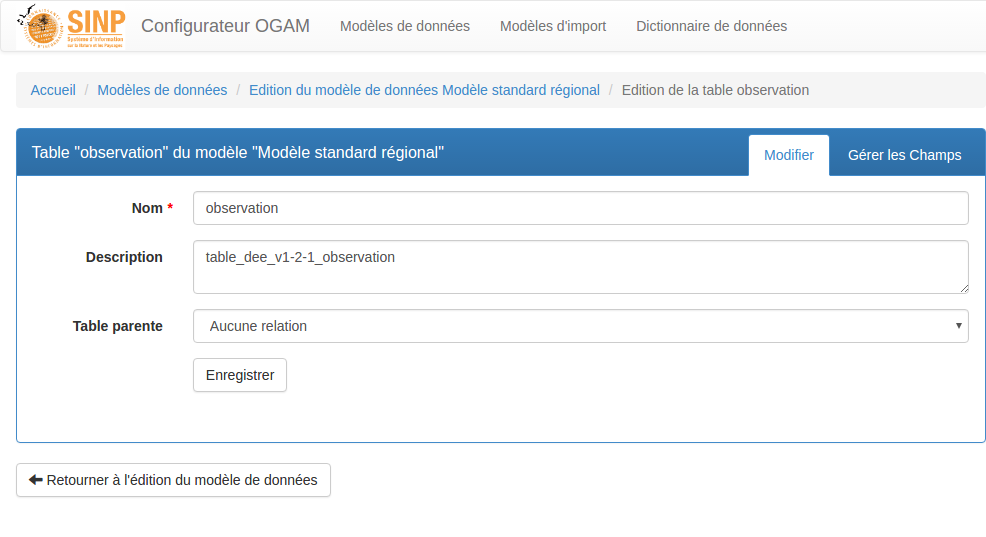

Les champs demandés sont :

* **Nom :** Nom de la table, utilisé en base de données : les caractères autorisés sont les lettres minuscules, chiffres et _.
* **Description :** Texte libre décrivant la table.
* **Table parente :** Vous pouvez spécifier des relations *hiérarchiques* entre les tables du modèle, en indiquant qu'une table est *parente*
  d'une autre. Voir le paragraphe `Relations entre les tables`_ pour plus de détails.

Gérer les champs des tables
^^^^^^^^^^^^^^^^^^^^^^^^^^^

L'écran de gestion des champs de la table permet de rajouter et supprimer des champs depuis le dictionnaire de données vers la table.

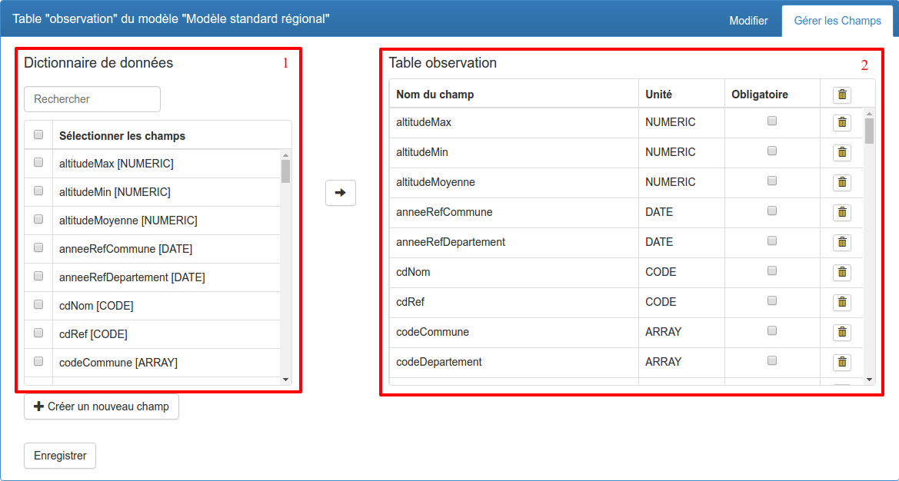

Il est divisé en 2 parties principales :

* **1** : le tableau du dictionnaire de données : il liste tous les champs disponibles dans le dictionnaire de données, c'est à dire ceux du standard DEE et des champs rajoutés par l'utilisateur.
* **2** : le tableau des champs de la table : il liste uniquement les champs qui sont présents dans la table.

Les différentes fonctionnalités de cet écran sont décrites ci-dessous.

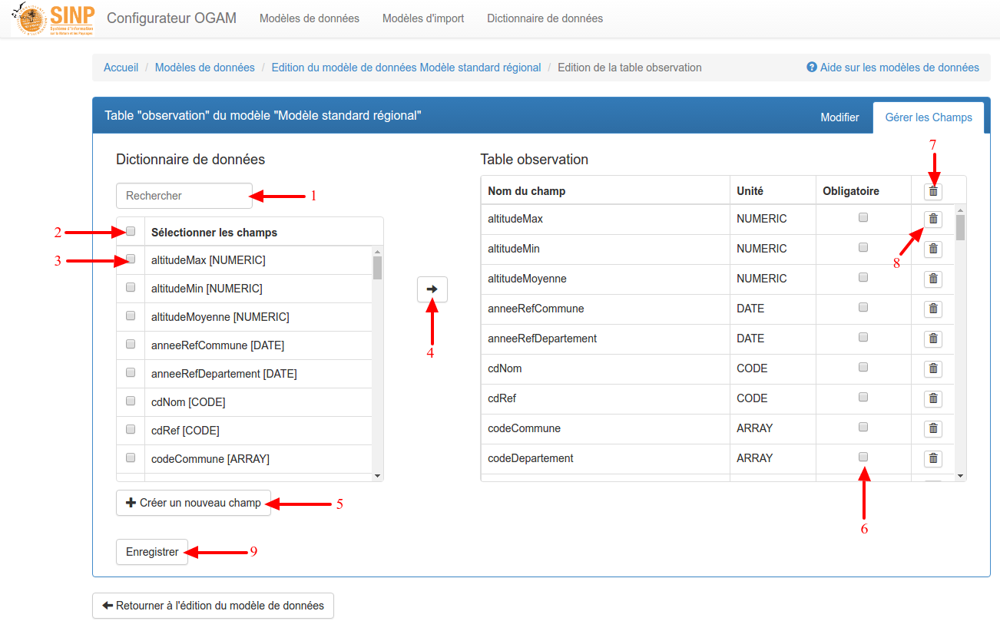

1. **Rechercher un champ** : il suffit de taper une chaîne de caractères courte pour filtrer le tableau du dictionnaire de données et ainsi faciliter la sélection de champs.

2. **Sélectionner tous les champs** en cochant la case dans la ligne de titre du tableau.

3. **Sélectionner un champ** en cochant la case qui lui correspond.

4. **Ajouter un ou plusieurs champ(s)** en cliquant sur la flèche : les champs sélectionnés seront alors ajoutés au tableau de droite.

.. note:: Une fois que vous avez ajouté un ou plusieurs champ(s), il n'est plus nécessaire d'appuyer sur le bouton enregistrer (**9**).

.. note:: Un champ ne peut être présent en doublon dans une table.

5. **Créer un nouveau champ** : l'écran permet de décrire un nouveau champ, qui sera ajouté au dictionnaire de données ET rattaché directement à la table.

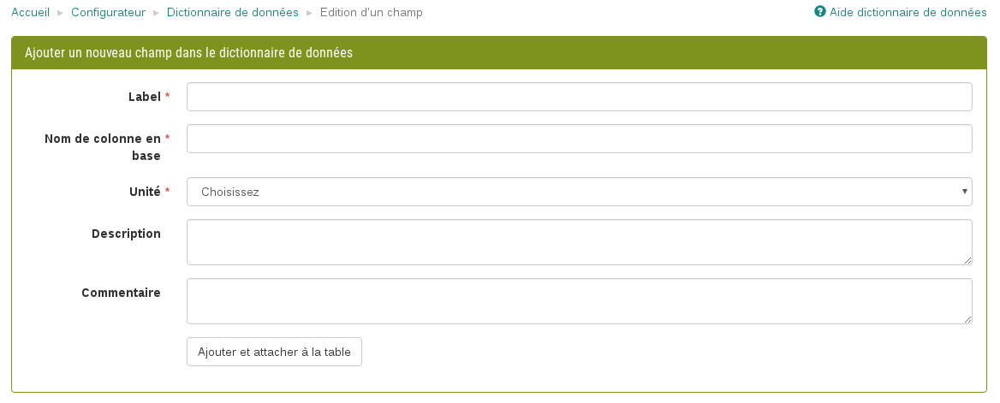

6. **Rendre un champ obligatoire** ou non en cochant la case correspondant à un champ dans la table.

.. note:: Pour enregistrer le caractère obligatoire d'un champ, il est nécessaire de cliquer sur le bouton 'Enregistrer'.

7. **Supprimer tous les champs de la table** en cliquant sur la corbeille dans la ligne de titre.

.. warning:: Attention, tous les champs de la table seront directement supprimés. Il n'y a pas de possibilité d'annulation.

8. **Supprimer un champ de la table** en cliquant sur la corbeille correspondant à un champ dans la table.

.. warning :: La suppression d'un champ est immédiate et irréversible. Pour retrouver un champ supprimé, il faut recommencer la procédure de rajout depuis le dictionnaire de données.

Dernière information : dans le cas des tables d'un modèle de données, l'ordre des champs n'a pas d'importance.

Supprimer des tables
^^^^^^^^^^^^^^^^^^^^

Pour supprimer une table, il suffit de cliquer sur le bouton "Corbeille" (**4**) de la table que vous souhaitez supprimer. La table sera directement supprimée.

Relations entre les tables
^^^^^^^^^^^^^^^^^^^^^^^^^^

Vous pouvez établir une relation hiérarchique entre deux tables lors de la définition ou de la modification d'une table.

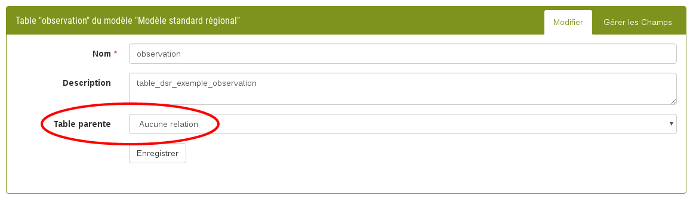

Mais celle-ci ne sera prise en compte que si vous souhaitez livrer vos données depuis deux fichiers distincts.

**Quelles en sont les conséquences ?**

Lors de la configuration de votre modèle d'import, il est donc nécessaire que vous décriviez 2 fichiers :

* un fichier "fils" dont les champs sont mappés avec la table "fille"
* un fichier "père" dont les champs sont mappés avec la table "mère"

.. note:: Le fichier "fils" doit avoir un champ mappé vers la clé primaire de la table "mère". Vous trouverez plus de détails dans le chapitre :ref:`relation-tables-fichiers`.

Publier / dépublier un modèle de données
----------------------------------------

Lorsque vous avez terminé de configurer votre modèle, et que vous souhaitez le rendre
disponible pour publication, il suffit de cliquer sur le bouton de lecture dans
le tableau des modèles de données :

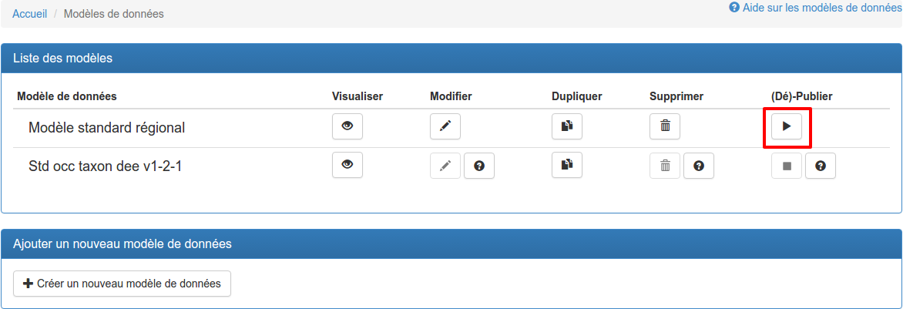

Le modèle de données sera alors disponible en production.

**Attention** : pour que le modèle soit publiable, il doit :

* comporter au moins une table
* chaque table doit comporter au moins un champ
* au moins une de ses tables doit comporter un champ géométrique

Si toutes ces conditions ne sont pas atteintes, le bouton de publication est grisé.

.. note:: Une fois publié, le modèle de données ne peut plus être ni supprimé ni
    modifié. Vous pouvez toutefois continuer à consulter sa configuration en visualisant
    son contenu (bouton Visualiser).

La publication est la première étape à effectuer dans le processus de mise à disposition
de vos données. Elle est nécessaire à la publication des modèles d'import de
fichiers qui vont alimenter ce modèle de données.

Lorsque vous publiez un modèle de données, toutes les tables qui y ont été configurées sont générées en base de données.

Si vous souhaitez dépublier un modèle de données, il suffit de cliquer sur le bouton d'arrêt de lecture dans le tableau des modèles de données :

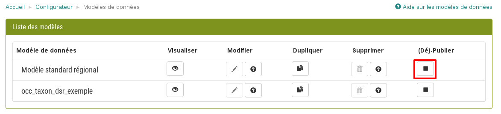

A la dépublication d'un modèle de données, tous les modèles d'import qui lui sont associés seront également dépubliés. Il ne vous sera alors plus possible de téléverser des données d'observation.

.. warning:: Il n'est pas possible de dépublier un modèle de données si des données
    ont été insérées dans les tables de ce modèle.
