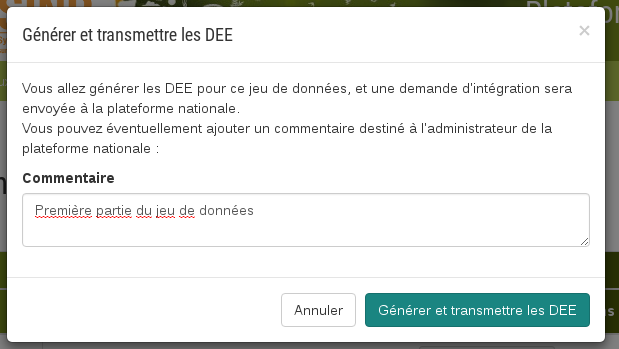

.. Exporter les jeux de données en DEE

.. _exporter_en_dee:

Export des jeux de données en DEE
=================================

Lorsqu'un jeux de données a été créé dans la plateforme, et **qu'au moins une de ses soumissions est publiée**,
l'administrateur, ou un utilisateur possédant la permission "Gérer les jeux de données", peut générer les DEE pour ce jeu de données.

.. image:: ../images/export/export-generer.png

Si vous disposez des droits nécessaires, vous verrez un bouton "Générer et transmettre les DEE"
dans la case "Transmission INPN".
En cliquant sur ce bouton, un formulaire apparaît, qui vous permet d'adresser à l'administrateur de l'INPN un commentaire sur le jeu de données que vous allez transmettre.

Lors du clic sur "Générer et transmettre les dEE", l'export commence.
Celui-ci peut passer par un stade "En cours", affichant une barre de progression, dont la longueur dépend du nombre de données dans le jeu.

.. image:: ../images/export/export-OK.png

Quand l'export est terminé, le fichier généré (au format GML) est disponible au téléchargement (**2**) pour tout utilisateur ayant la permission "Gérer les jeux de données".
Dans le cas où des données seraient modifiées, ou que des soumissions soient ajoutées au jeu de données, il est possible de regénérer l'export. 

Enfin, il est également possible de supprimer la DEE (**3**).

Sous "état DEE", s'affiche la date à laquelle la DEE a été transmise pour la dernière fois, ainsi que s'il s'agissait d'une création ou d'une modification.
   