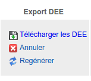

.. Exporter les jeux de données en DEE

.. _exporter_en_dee:

Export des jeux de données en DEE
=================================

Lorsqu'un jeu de données a été importé dans la plateforme, puis que ces données ont été publiées,
l'administrateur, ou un utilisateur possédant la permission "Gérer les jeux de données", peut
générer les DEE pour ce jeu de données. Les DEE se présenteront sous la forme d'un fichier à
télécharger, au format GML.

Si la colonne "Export DEE" comporte le message "Publiez les données
pour les exporter en DEE.", vous devez cliquer sur le lien "Publier les données" de la colonne "Actions".

Si les données sont publiées et que vous disposez des droits nécessaires, vous verrez un lien "Générer les DEE"
dans la case "Export DEE" :

.. image:: ../images/export/export-generer.png

Cliquez sur "Générer les DEE" pour démarrer l'export. Celui-ci peut passer par un stade "En cours",
affichant une barre de progression, dont la longueur dépend du nombre de données dans le jeu. Quand l'export
est terminé, le fichier généré est disponible au téléchargement (lien "Télécharger les DEE").

.. image:: ../images/export/export-en-cours.png

Une fois que les DEE ont été générées, le fichier est disponible directement pour tout utilisateur ayant la permission "Gérer les
jeux de données".

Il est possible de re-générer les DEE, par exemple suite à une modification d'une ou plusieurs données dans le jeu.
Dans ce cas, le fichier de DEE est effacé et remplacé par le nouveau.

.. warning:: Pour l'instant, le service d'export en DEE ne fonctionne que pour des jeux de données dont le nombre de
   données n'est pas trop élevé (quelques dizaines de milliers de lignes).
