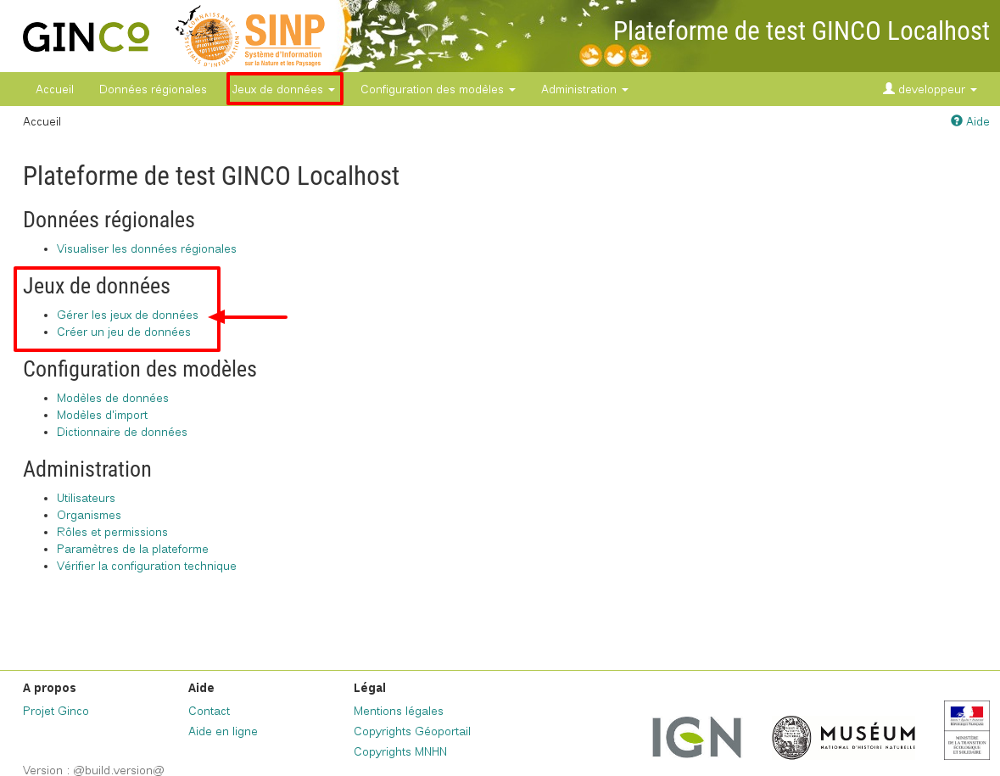

.. Accéder au module d'import - rôles autorisés à importer

Accéder au module de gestion des jeux de données
================================================

Sur la page d'accueil de la plateforme GINCO, cliquez sur "Se connecter" et entrez vos identifiants. Si vous disposez de la permission "Importer des données" , vous verrez la page d'accueil suivante :

Cliquez sur "Gérer les jeux de données", ce qui vous emmènera sur la page de gestion des jeux de données.
