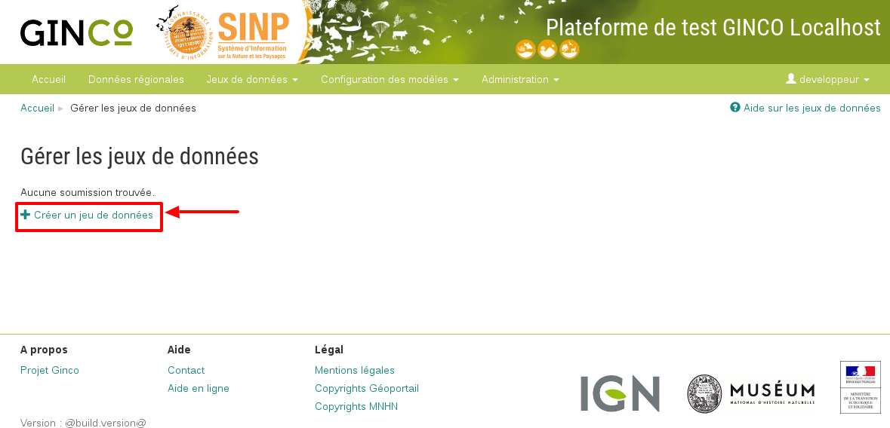
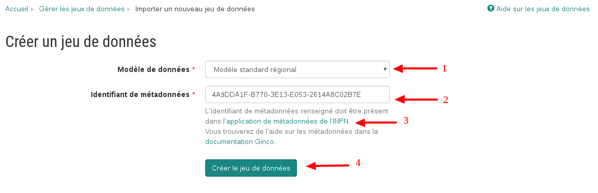
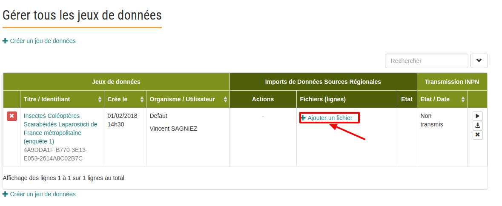
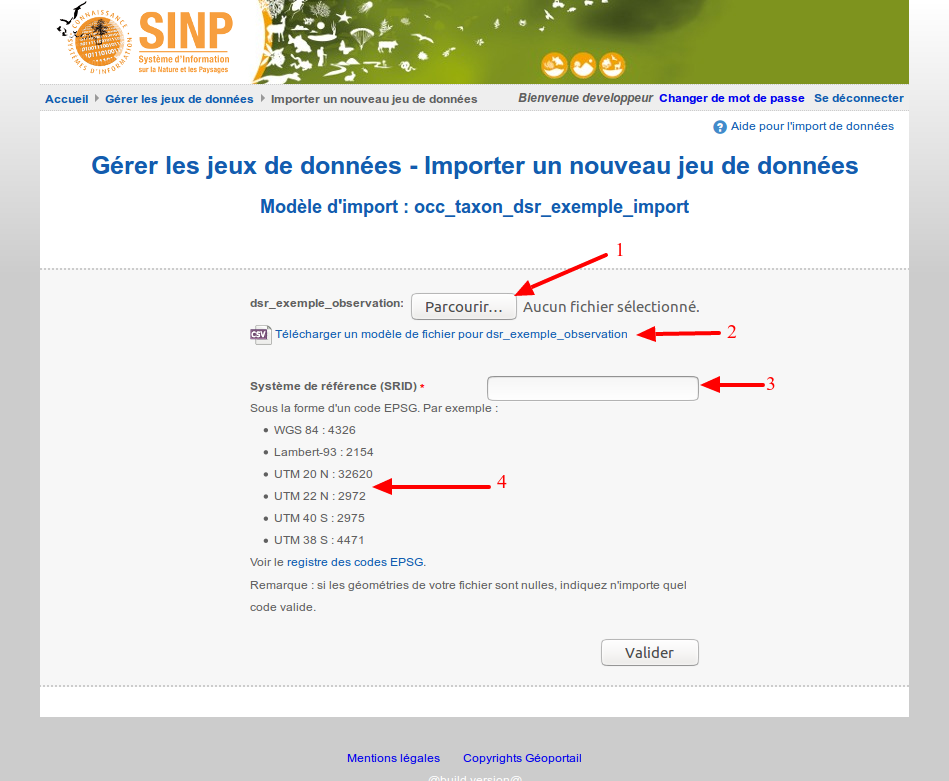
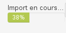
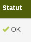
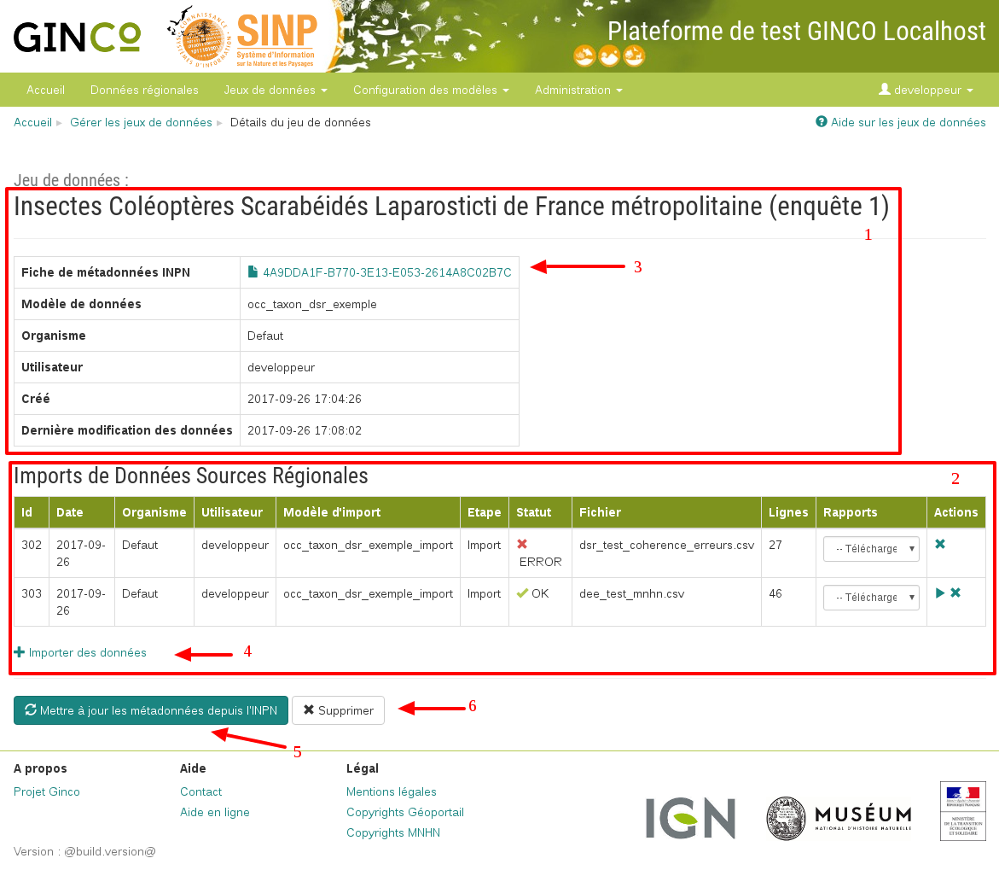

.. Importer des jeux de données et gérer les imports

Gérer les de jeux de données
====================================

Dans Ginco, un import de données est nommé **soumission**. Une soumission doit être associée à un jeu de données. Un **jeu de données** se rattache à une fiche de métadonnées. Il peut contenir plusieurs soumissions.

Créer un jeu de données
-----------------------
Pour créer un nouveau jeu de données, cliquez sur "Créer un jeu de données".

L'application vous redirige alors vers un formulaire :

Vous devez indiquer :

1. le **modèle de données** que vous souhaitez lier à votre jeu de données. Ce qui siginife que par la suite vous ne pourrez importer dans le jeu de données que des données correspondant au modèle sélectionné.

2. l'identifiant de la fiche de métadonnées correspondant au jeu de données que vous êtes en train de créer. (voir la page de documentation sur `Les métadonnées <../metadonnees/index.html>`_ ).

Pour créer une fiche de métadonnée de jeu de données, un lien vers l’application de métadonnées de l’INPN est proposé (**3**).

Valider le formulaire via le bouton "Créer le jeu de données" (**4**).

Importer des données
--------------------
L’import de données ce fait au sein d’un jeu de données déclaré dans le SINP. Il faut donc en avoir créé un dans l'application nationale de Métadonnées SINP auparavant.

Cliquez sur le lien "Ajouter un fichier" du jeu de données auquel vous souhaitez ajouter des données.

Choisissez ensuite :

1. **le modèle d'import à utiliser :** parmi ceux dont le modèle de données cible est lié au jeu de données.
Cela permet à l'application de connaître le format attendu du (des) fichier(s) csv; en particulier le nom des
champs de l'en-tête, leur caractère obligatoire et le format des dates.
Les modèles d'import sont créés par l'administrateur régional dans le configurateur Ginco.

2. **l'organisme producteur du jeu de données :** l'administrateur régional peut livrer des jeux de données
provenant d'autres organismes que le sien. Il faut pour cela avoir au préalable créé l'organisme dans Ginco
(voir :ref:`creer_un_organisme` ). Les données seront alors attribuées à l'organisme choisi.

Vous devez enfin uploader votre ou vos fichiers csv (**1**). Ceux-ci doivent peser *moins de 150 Mo*.
Vous pouvez également uploader votre ou vos fichiers au format shapefile (voir :ref:`fichier_import_shapefile`).

Vous pouvez télécharger un fichier d'exemple (**2**) pour chaque fichier demandé, contenant :

* Une ligne d'en-tête avec les noms des champs définis dans la configuration du fichier d'import,
* Une ligne commenté indiquant leur caractère obligatoire (signalé par une étoile), et le format des dates.

Renseignez le système de référence (SRID) de vos données (code EPSG des géométries des observations)(**3**).
Un encart d'information succincte est présent plus bas pour vous aider à choisir (**4**).
Les données seront automatiquement converties en WGS84 lors de l'import dans la plateforme.

Cliquez sur le bouton Valider. Après le transfert de vos fichiers, qui peut prendre un certain temps en fonction de leur taille,
vous êtes ramené sur la page d'accueil du module d'import. L'import des données dans l'application peut durer plusieurs minutes,
et se fait en arrière plan.

Une barre de progression indique le pourcentage de données traitées et importées. Le résultat de l'import est
ensuite affiché : OK ou ERROR. Dans ce cas, téléchargez le "Rapport de conformité et cohérence", qui liste les erreurs
rencontrées lors de l'import, pour vous aider à corriger le problème. Vous pouvez aussi vous reporter
à :ref:`corriger_les_erreurs_dimport`.

Liste des jeux de données
-------------------------

Pour accéder à la liste de vos jeux de données, accédez à la page en cliquant dans le menu sur "*Jeux de données / Gérer mes jeux de données*".
Cette page d'accueil de gestion des jeux de données liste l'ensemble de **vos** jeux de données ainsi que leurs actions associées.

Par ailleurs, les utilisateurs ayant les permissions "*Gérer tous les jeux de données*" et "*Importer des données*" ont accès en plus à la page de gestion de **tous** les jeux de données de la plateforme.
Sur cette page, une colonne "*Organisme / Utilisateur*" a été rajoutée pour déterminer rapidement l'origine de chaque jeu de données.
La page d'accueil de gestion des jeux de données liste l'ensemble des jeux de données ainsi que leurs actions associées.

.. image:: ../images/gestion-jdd/liste-jdd.png

Elle permet de créer un nouveau jeu de données (**1**).

Un tableau regroupe les jeux de données existants en indiquant leur titre et leur identifiant de métadonnée.
La colonne **Actions** permet de :

2. Visualiser un jeu de données en détail en cliquant sur le titre du jeu de données
3. Supprimer un jeu de données. La suppression n'est possible que si le jeu de données ne comporte aucune soumission (croix rouge). Dans le cas contraire, la croix est grisée.

Au sein d'un jeu de données, ce tableau liste les fichiers de données qui ont été soumis à l'application (**4**). Pour chaque soumission, on visualise :

* le nom du fichier
* le nombre de lignes (plus exactement le nombre de données) que comporte le fichier
* le statut de la soumission (en cours, ok, error)

Sous "Rapport" (**5**): 

On peut télécharger en cas d'erreur lors de l'import de données:

* le **Rapport de conformité et cohérence** qui est un pdf listant les éventuelles erreurs rencontrées lors de l'intégration.

On peut télécharger en cas de succès d'import de données:
 
* le **Rapport de sensibilité** qui est un csv listant les données sensibles du jeu de données (le calcul de la sensibilité
  fait partie des traitements réalisés par l'application lors de l'import). Ce rapport est téléchargeable seulement si le statut de la soumission est OK.
* le **Rapport des identifiants permanents** qui est un csv associant un identifiant permanent à chaque donnée de la soumission (plus précisément le champ identifiantOrigine). Le calcul de l’identifiant permanent est réalisé par l’application lorsque le champ du fichier est vide à l’import.. Ce rapport est téléchargeable seulement si le statut de la soumission est OK.

Enfin, sous "Actions" il est possible de :

* **Publier les données** pour les imports réussis. Cela rend les données de la soumission requêtables pour tous les utilisateurs (donc visibles sur la carte et dans le tableau de résultats), et permet de faire l'export GML.
  Tant que la soumission n'est pas publiée, les données sont visibles uniquement aux utilisateurs du même organisme que celui ayant effectué l'import, ou aux utilisateurs ayant la permission "Visualiser les données non publiées d'un autre organisme".
  Pour réaliser l'action de publication, il faut avoir la permission "Publier les données".

* **Dépublier les données** rend les données de la soumission non consultables pour les utilisateurs d'un organisme différent de celui ayant importé les données, ou ne possédant pas la permission "Visualiser les données non publiées d'un autre organisme".
  Pour réaliser l'action de dépublication, il faut avoir la permission "Publier les données".
  De même, l'export GML n'est plus réalisable.
  
.. note:: Les utilisateurs qui ne sont pas rattachés à un véritable organisme (et donc rattachés à l'organisme d'attente noté Défaut), ne peuvent pas voir les données importées non publiées avec l'organisme Défaut.
  
* **Supprimer le jeu de données** (**6**) supprime le jeu de données et les données associées, même si elles ont été publiées entre temps et ont fait l'objet d'un export vers la plateforme nationale.

Visualiser la page de détail d'un jeu de données
------------------------------------------------
Il est possible de visualiser le détail d'un jeu de données en cliquant sur l'action représentée par un oeil sur le côté gauche du tableau.

La page détaillant un jeu de données est composée de deux parties.

1. Des informations concernant la métadonnée associée au jeu de données. Il est notamment possible d'y télécharger la fiche de métadonnée (**3**).
2. Des informations concernant les soumissions effectuées dans le jeu de données.

Un lien (**4**) permet d'ajouter un nouveau fichier au jeu de données en cours de visualisation.

Il est possible de mettre à jour la fiche de métadonnée et les informations la concernant via le bouton "Mettre à jour les métadonnées depuis l'INPN" (**5**).

Enfin, si le jeu de données ne comporte pas de soumission il est possible de le supprimer (**6**).

