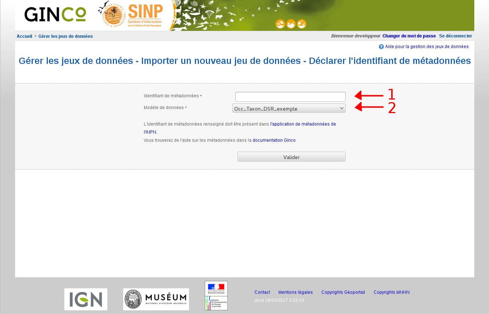

.. _gerer_jeux_de_donnees_page:

Gérer les jeux de données
=========================

Importer un nouveau jeu de données
----------------------------------

.. image:: ../images/gestion-jdd/nouveau-jdd-1.png

Sur la page d'accueil "Gérer les jeux de données", cliquez sur "Importer un nouveau jeu de données".

L'application redirige sur la page de déclaration de l'identifiant de métadonnées.

Vous devez alors renseigner :

1. **l'identifiant de métadonnées** correspondant à votre jeu de données. Pour cela il faut que vous ayez créé une métadonnée (voir :ref:`metadonnees_index` ).

2. **le modèle de données** rattaché au jeu de données

Après avoir validé, choisissez ensuite :

.. image:: ../images/gestion-jdd/nouveau-jdd-2.png

1. **le modèle d'import à utiliser :** celui-ci définit le format attendu du (des) fichier(s) csv; en particulier le nombre et l'ordre des
champs, leur caractère obligatoire, le format des dates. Les modèles d'import sont créés par l'administrateur régional
dans le configurateur Ginco.

2. **l'organisme producteur du jeu de données :** l'administrateur régional peut livrer des jeux de données
provenant d'autres organismes que le sien. Il faut pour cela avoir au préalable créé l'organisme dans Ginco
(voir :ref:`creer_un_organisme` ). Les données seront alors attribuées à l'organisme choisi.

.. image:: ../images/gestion-jdd/nouveau-jdd-3.png

Vous devez enfin uploader votre ou vos fichiers csv (**1**). Ceux-ci doivent peser *moins de 150 Mo*.

Vous pouvez télécharger un fichier d'exemple (**2**) pour chaque fichier demandé, contenant une ligne d'en-tête avec les noms
des champs, leur caractère obligatoire (indiqué par une étoile), et le format des dates.

Renseignez le système de référence (SRID) de vos données (code EPSG des géométries des observations)(**3**). Un encart d'information succincte est présent plus bas pour vous aider à choisir (**4**).
Les données seront automatiquement converties en WGS84 lors de l'import dans la plateforme.

Cliquez sur le bouton Valider. Après le transfert de vos fichiers, qui peut prendre un certain temps en fonction de leur taille,
vous êtes ramené sur la page d'accueil du module d'import. L'import des données dans l'application peut durer plusieurs minutes,
et se fait en arrière plan.

.. image:: ../images/gestion-jdd/importer-barre-progression.png
.. image:: ../images/gestion-jdd/importer-OK.png
.. image:: ../images/gestion-jdd/importer-ERROR.png

Une barre de progression indique le pourcentage de données traitées et importées. Le résultat de l'import est
ensuite affiché : le fichier contient des erreurs, ou les données ont bien été importées. Dans ce cas, téléchargez le "Rapport de conformité et cohérence", qui liste les erreurs
rencontrées lors de l'import, pour vous aider à corriger le problème. Vous pouvez aussi vous reporter
à :ref:`corriger_les_erreurs_dimport`.

Liste des jeux de données
-------------------------

La page d'accueil de gestion des jeux de données liste l'ensemble des jeux de données importés ainsi que leurs actions associées.
Pour chaque jeu de données, elle indique :

* le numéro de la soumission (utile pour identifier la livraison simplement),
* l'identifiant de la métadonnée,
* la date de la soumission,
* le titre de la métadonnée,
* l'organisme et l'utilisateur auxquels sont attribuées les données ; attention, l'utilisateur est bien celui ayant
  effectué la livraison, par contre l'organisme est l'organisme producteur de la donnée qui a été défini lors de l'import.
* le nombre de données importées,
* les actions possibles sur la DSR,
* les rapports à télécharger (conformité et cohérence, sensibilité, identifiants permanents),
* les actions possibles sur la DEE. Notamment exporter les jeux de données en DEE au format GML,
* une colonne premettant de supprimer le jeu de données.

.. image:: ../images/gestion-jdd/liste-jdd.png

Actions possibles sur les jeux de données :

* **Publier les données** rend les données de la soumission requêtables pour tous les utilisateurs (donc visibles sur la carte et dans le tableau de résultat), et permet de faire l'export GML.
  Tant que la soumission n'est pas publiée, les données sont visibles uniquement aux utilisateurs ayant la permission "Publier les données", qui sont aussi les seuls à pouvoir réaliser l'action de publication.

* **Dépublier les données** rend les données de la soumission non consultables pour les utilisateurs n'ayant pas la permission "Publier les données".
  De même, l'export GML n'est plus réalisable.
  
* **Téléverser un jeu de données** permet d'importer un autre fichier au jeu de données.

* **Supprimer la soumission** supprime les données associées, même si elles ont été éditées entre temps.
  
* **Rapport de conformité et cohérence** crée un pdf listant les éventuelles erreurs rencontrées lors de l'intégration.

* **Rapport de sensibilité** crée un csv listant les données sensibles du jeu de données (le calcul de la sensibilité
  fait partie des traitements réalisés par l'application lors de l'import).

* **Rapport identifiants permanents** crée un csv associant les identifiantOrigine et identifiantPremanent du jeu de données.

* **Télécharger les DEE** exporte les données au format GML (voir la partie :ref:`exporter_en_dee`).

* **Générer les DEE** exporte les données au format GML et notifie la platforme nationale (voir la partie :ref:`exporter_en_dee`).

* **Supprimer le jeu de données** supprime le jeu de données.
