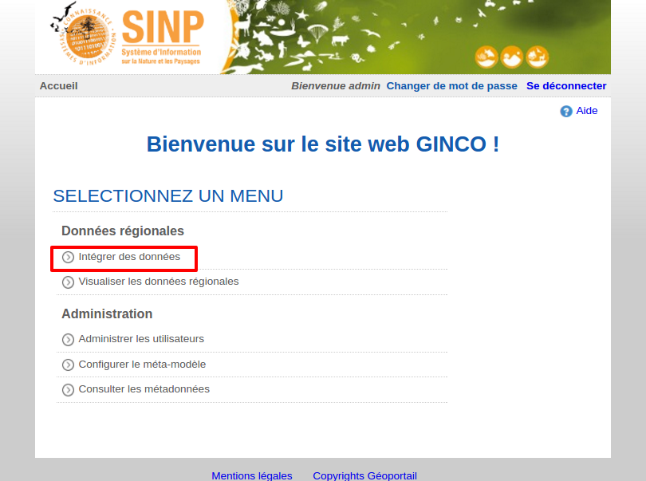

.. Accéder au module d'import - rôles autorisés à importer

Accéder au module d'import de données
=====================================

Pour accéder au module d'import de données, sur la page d'accueil de la plateforme GINCO, cliquez sur "Se connecter" et entrez vos
login et mot de passe. Si vous disposez de la permission "Importer des données" , vous verrez la page d'accueil suivante :

Cliquez sur "Intégrer des données", ce qui vous emmènera sur la page de gestion des imports de jeux de données.
