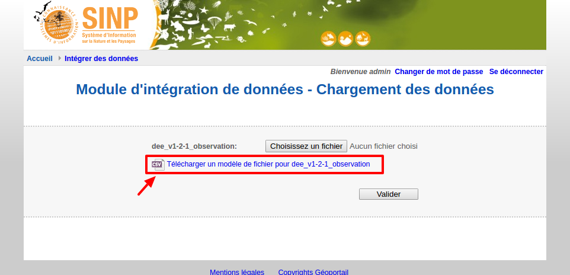

.. Format du fichier d'import et des champs

Le fichier d'import
===================

Format général du fichier
-------------------------

* Le fichier doit être un fichier csv, et posséder une extension ".csv".

* L’encodage doit être en UTF8 sans BOM.

* Les champs du fichier doivent être séparés par des points-virgules.

* Chaque fichier représente un jeu de données, et chaque ligne représente une donnée.

* Le fichier doit comporter le même nombre de champs que le modèle d'import, même si ils sont vides. Pour cela, il est
  pratique d'insérer une ligne de commentaires en début de fichier, comportant les noms des champs.

* Une ligne de commentaire spécifiant les différents champs peut être insérée en début de fichier,
  elle doit alors commencer par deux slashs. Exemple :

  ``// Champ 1; Champ 2; Champ 3``

* Les champs doivent être dans l'ordre attendu par le modèle d'import.

* Les champs obligatoires dans le modèle d'import doivent être non vides.

Pour connaitre l'ordre des champs, les champs obligatoires, ainsi que les formats des dates, vous pouvez télécharger
un fichier de modèle sur la page d'upload du fichier d'import :

Vous pouvez télécharger un :download:`fichier d'exemple CSV</downloads/dee_test.csv>`.

.. _format_des_champs:

Format des différents types de champ
------------------------------------

Types généraux
^^^^^^^^^^^^^^

* **Chaînes de caractères :**
  Chaîne alphanumérique de texte libre.
  La chaîne ne doit pas contenir de retour chariot. Elle peut contenir des 
  points virgules à condition qu'elle soit mise entre guillemets (double-quote).

* **Nombres entiers :**
  Valeur numérique sans décimale.

* **Nombres décimaux :**
  Valeur numérique avec décimale. Le séparateur décimal est un point.

* **Dates et dates/heures:**
  Le format des dates dépend de la manière dont le modèle d'import a été configuré, il est donc variable.
  Par défaut, sans configuration particulière de la part de l'administrateur, le format attendu est :

  ``yyyy-MM-dd'T'HH:mmZ``, par exemple : 2016-12-12T04:12+0100 (format ISO 8601).

  Pour connaître le format attendu pour chaque champ, téléchargez le fichier de modèle sur la page d'upload du
  fichier d'import ; le format est indiqué entre parenthèses pour chaque champ date.

  Pour plus de détails, voir la :doc:`description complète du format de dates </annexes/dates>`.

* **Booléens :**
  Les valeurs "1", "true" et "TRUE" sont équivalentes à "vrai"; toutes les autres valeurs sont équivalentes à "faux".

* **Tableaux :**
  Certains champs peuvent comporter une liste de valeurs, dont le type peut être quelconque.
  Si le champ comporte plusieurs valeurs, celles-ci doivent être séparées par des virgules. Elles peuvent facultativement
  être entourées par des accolades ou des guillemets (double-quote).
  Par exemple, pour le codedepartement : ``23,36,86,87`` ou ``{23,36,86,87}``.
  Les valeurs dans le tableau ne doivent pas comporter de virgules (rappel: le séparateur décimal est un point).

* **Géométries :**
  les géométries doivent être au format WKT et en WGS 84 (ESPG 4326). Les types de géométries acceptées sont:

  * les points et multipoints ; exemple : ``POINT(5.35 48.41)``
  * les lignes et multilignes ; exemple : ``LINESTRING(0.80 48.50,0.88 48.54,0.86 48.49,0.80 48.50)``
  * les polygones et multipolygones ; exemple : ``MULTIPOLYGON (((0.80 48.50,0.88 48.54,0.86 48.49,0.80 48.50)))``

  Elles doivent être en 2 dimensions et ne peuvent pas comporter de coordonnée Z.

* **Codes :**
  La valeur doit être choisie dans une liste de codes. Voir paragraphe suivant.

Codes et référentiels
^^^^^^^^^^^^^^^^^^^^^

La description des champs correspondant à des référentiels est disponible dans le
`Standard d'échanges d'occurrences de taxon v1.2.1  <https://inpn.mnhn.fr/docs/standard/Occurrences_de_taxon_v1_2_1_FINALE.pdf>`_.
