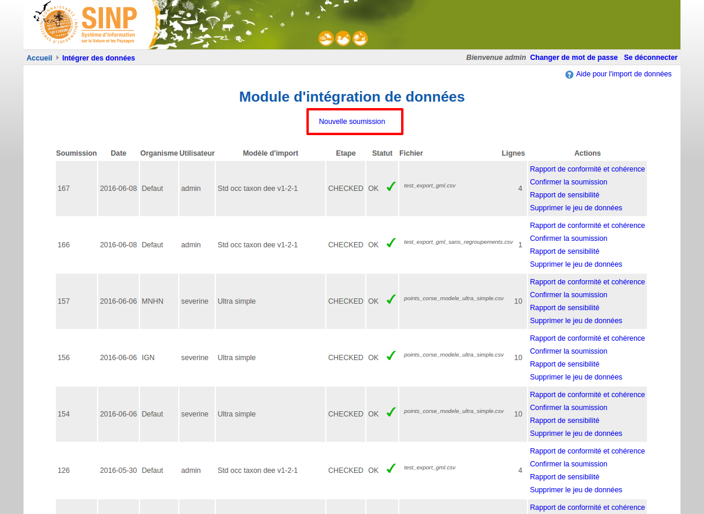
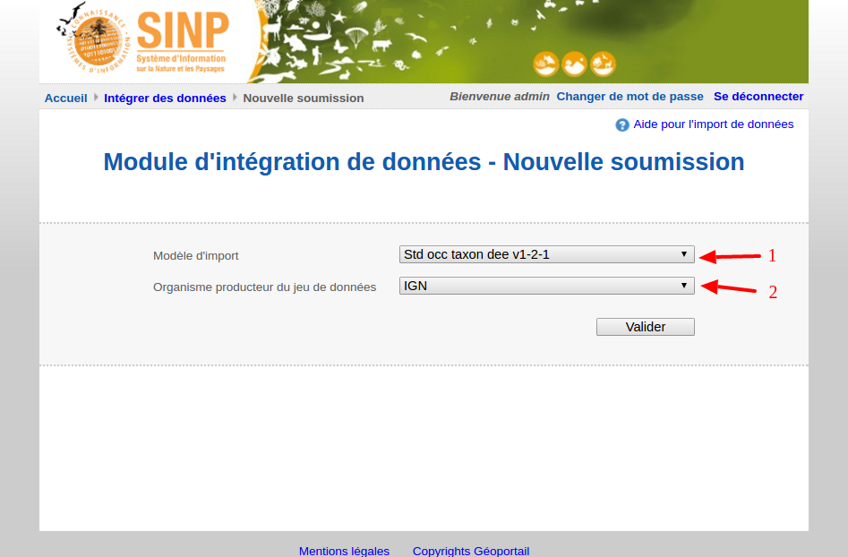
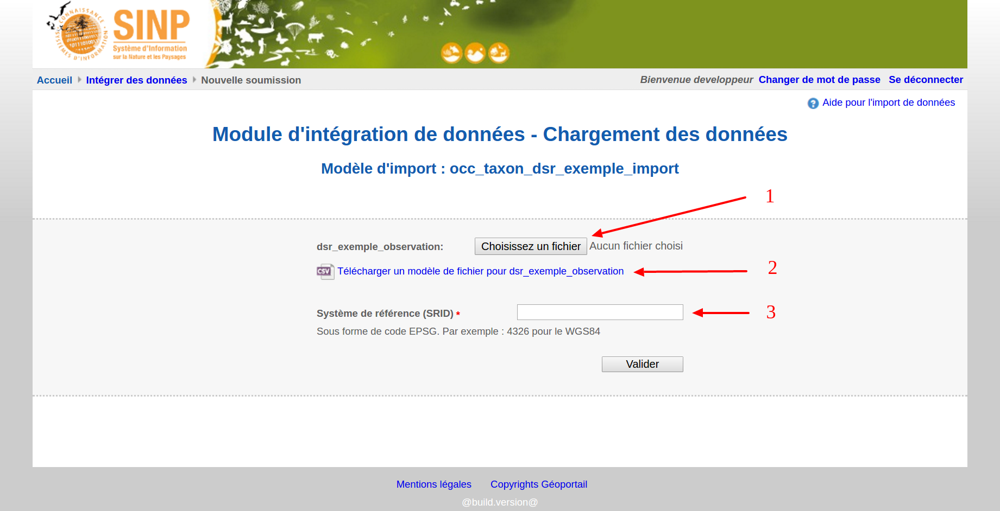
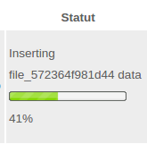
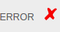
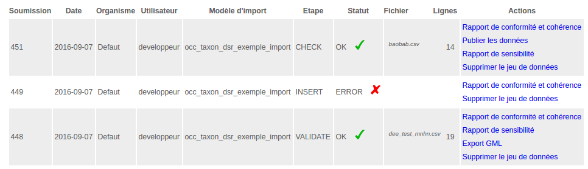

.. Importer des jeux de données et gérer les imports

Gérer les imports de jeux de données
====================================

Importer un jeu de données
--------------------------

Sur la page d'accueil du Module d'intégration de données, cliquez sur "Nouvelle soumission".

Choisissez ensuite :

1. **le modèle d'import à utiliser :** celui-ci définit le modèle de données auquel doit être rattaché
le jeu de données, mais aussi le format attendu du (des) fichier(s) csv; en particulier le nombre et l'ordre des
champs, leur caractère obligatoire, le format des dates. Les modèles d'import sont créés par l'administrateur régional
dans le configurateur Ginco.

2. **l'organisme producteur du jeu de données :** l'administrateur régional peut livrer des jeux de données
provenant d'autres organismes que le sien. Il faut pour cela avoir au préalable créé l'organisme dans Ginco
(voir :ref:`creer_un_organisme` ). Les données seront alors attribuées à l'organisme choisi.

Vous devez enfin uploader votre ou vos fichiers csv (1). Ceux-ci doivent peser *moins de 150 Mo*.

Vous pouvez télécharger un fichier d'exemple (2) pour chaque fichier demandé, contenant une ligne d'en-tête avec les noms
des champs, leur caractère obligatoire (indiqué par une étoile), et le format des dates.

Renseignez le système de référence (SRID) de vos données (code EPSG des géométries des observations)(3).
Les données seront automatiquement converties en WGS84 lors de l'import dans la plateforme.

Cliquez sur le bouton Valider. Après le transfert de vos fichiers, qui peut prendre un certain temps en fonction de leur taille,
vous êtes ramené sur la page d'accueil du module d'import. L'import des données dans l'application peut durer plusieurs minutes,
et se fait en arrière plan.

.. image:: ../images/import-importer-OK.png

Une barre de progression indique le pourcentage de données traitées et importées. Le résultat de l'import est
ensuite affiché : OK ou ERROR. Dans ce cas, téléchargez le "Rapport de conformité et cohérence", qui liste les erreurs
rencontrées lors de l'import, pour vous aider à corriger le problème. Vous pouvez aussi vous reporter
à :ref:`corriger_les_erreurs_dimport`.

Gérer les jeux de données
-------------------------

La page d'accueil du module d'import liste l'ensemble des jeux de données importés. Pour chaque jeu de données, elle
indique :

* le numéro de la soumission (utile pour identifier la livraison plus simplement qu'avec le jddid),
* la date de la soumission,
* l'organisme et l'utilisateur auxquels sont attribuées les données ; attention, l'utilisateur est bien celui ayant
  effectué la livraison, par contre l'organisme est l'organisme producteur de la donnée qui a été défini lors de l'import.
* le nom du modèle d'import utilisé,
* l'étape en cours du processus d'import, ainsi que le statut de cette étape (généralement OK ou ERROR),
* le nom du fichier livré ainsi que son nombre de lignes,
* une colonne listant les actions possibles.

Actions possibles sur les jeux de données :

* **Rapport de conformité et cohérence** crée un pdf listant les éventuelles erreurs rencontrées lors de l'intégration.

* **Publier les données** rend les données de la soumission requêtables pour tous les utilisateurs 
(donc visibles sur la carte et dans le tableau de résultat), et permet de faire l'export GML.
  Tant que la soumission n'est pas publiée, les données sont visibles uniquement aux utilisateurs ayant la permission "Publier les données",
   qui sont aussi les seuls à pouvoir réaliser l'action de publication.

  
  * **Dépublier les données** rend les données de la soumission non consultables pour les utilisateurs n'ayant pas la permission "Publier les données".
  De même, l'export GML n'est plus réalisable.
  
* **Rapport de sensibilité** crée un csv listant les données sensibles du jeu de données (le calcul de la sensibilité
  fait partie des traitements réalisés par l'application lors de l'import).

* **Supprimer le jeu de données** supprime le jeu de données et les données associées, même si elles ont été éditées
  entre temps.
