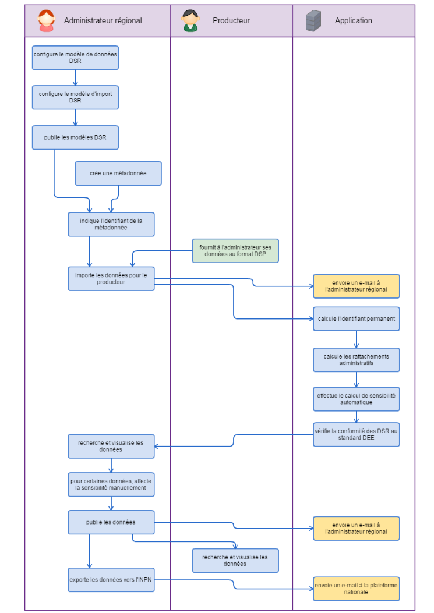

.. Fonctionnalités opérationnelles dans la plate-forme GINCO

Fonctionnalités opérationnelles dans la plate-forme GINCO
=========================================================

La plate-forme GINCO offre un certain nombre de fonctionnalités et traitements liés à la standardisation des données : 

* :ref:`Paramétrage des modèles de données et d'import <configurateur_index>`
* :ref:`Gestion des métadonnées de jeux de données SINP et DC <metadonnees_index>`
* :ref:`Import de JDD <gestion_jdd_index>`
* :ref:`Traitements de standardisation des données <traitements_index>`
* :ref:`Publication des DSR pour la consultation <gerer_jeux_de_donnees_page>`
* :ref:`Export d'un jeu de données en GML vers la plate-forme nationale <exporter_en_dee>`

Workflow des traitements dans GINCO
-----------------------------------

