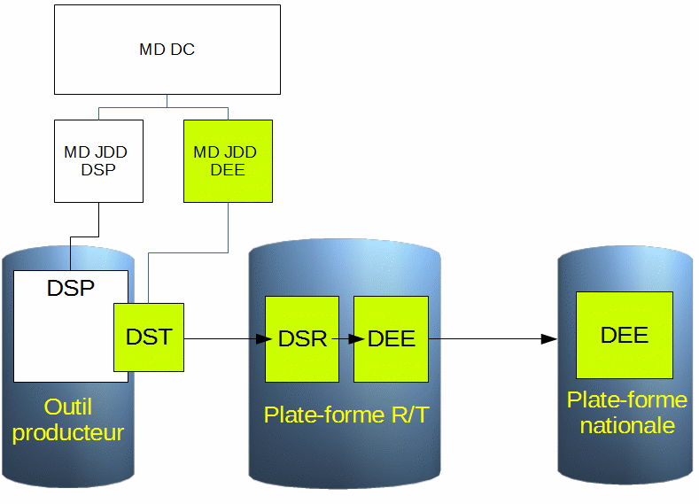

.. Rôles

Les métadonnées dans le SINP
============================
Principes
---------
Un ensemble de données d'occurrence est décrit par 2 fiches de métadonnées :

* Une fiche de métadonnées décrivant le dispositif de collecte, 
* Une fiche de métadonnées décrivant le jeu de données lui-même.

Suivant leurs traitements dans le cycle de vie des données dans le SINP, deux fiches de métadonnées distinctes seront utilisées pour décrire les jeux de données :

* La fiche de métadonnées de jeu de données sources Producteur DSP (données en dehors du SINP)
* La fiche de métadonnées de jeu de données SINP (données entrées dans le SINP)

Une même fiche de métadonnée est utilisée pour décrire un jeu de données tout au long de son cycle de vie dans le SINP (DST, DSR et DEE).

Règles fonctionnelles
---------------------

* La fiche de métadonnées d'un jeu de données de type Données Sources Producteur (DSP) n’est pas indispensable dans le cadre du SINP. Celle-ci est à la charge et sous la responsabilité du producteur qui utilisera l'outil de saisie et gestion des métadonnées de son choix.
* La fiche de métadonnées d'un jeu de données de type SINP est obligatoire. Elle peut être fournie par le producteur ou saisie par l'administrateur de la plate-forme.

.. warning:: * Dans la plate-forme GINCO, un ensemble de données d’occurrence ne peut entrer dans le SINP sans une métadonnée de jeu de données.

* Les dispositifs de collecte et les méta-dispositifs peuvent être saisis par les producteurs, les administrateurs régionaux ou l’administrateur national. Chacun est responsable à son niveau de la cohérence et de la pertinence des dispositifs.
* Une métadonnée de DEE ne peut pas être supprimée.
