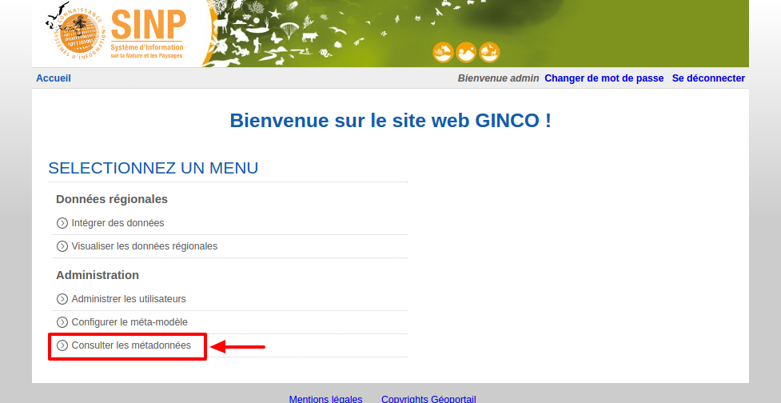
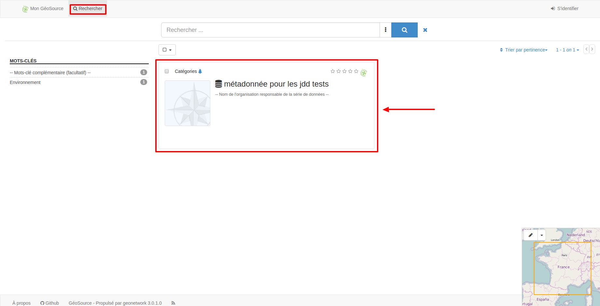

.. Accès à Geosource.

Accéder au module Geosource de GINCO
====================================

.. note:: Un module de Géosource est présent sur chaque plateforme GINCO.
  Les modules Géosource possèdent leur propre système d'authentification, qui n'est actuellement pas relié à celui de GINCO.
  Les login et mot de passe de Géosource sont indépendants de ceux de Ginco,
  il faut donc re-saisir un login/mot de passe pour se connecter à Géosource.
  L'obtention d'un compte Géosource se fait de la même façon que pour un `compte GINCO <https://ginco.ign.fr/doc/utilisateurs/administrer-gestion-ginco.html/>`_. 

Accès déconnecté
****************

Pour accéder au module Geosource, sur la page d'accueil de la plateforme GINCO, cliquez sur "Se connecter" et entrez vos
login et mot de passe. Si vous disposez des droits nécessaires, vous verrez la page d'accueil suivante :

Cliquez sur "Consulter les métadonnées", ce qui vous emmènera sur la page d'accueil de Geosource.

Il n'est pas nécessaire d'être authentifié à Géosource pour consulter et rechercher les métadonnées qui sont publiées.
Elles sont directement consultables sur la page d'accueil de Géosource et sur la page de recherche.

Accès connecté
**************

.. warning::
    Attention : la connexion au module Géosource de GINCO, permettant de gérer les métadonnées, n'est possible
    qu'aux personnes disposant du rôle "Administrateur" de geosource.

Pour vous connecter au module Géosource, cliquez sur "S'identifier" et entrez vos
login et mot de passe. Si vous disposez du rôle d'administrateur, vous verrez la page d'accueil suivante :

.. image:: ../images/homepage-connected-geosource.png
