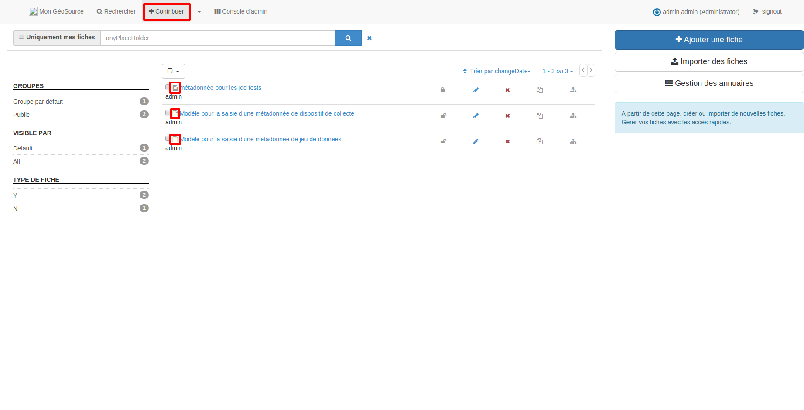

.. Geosource : ajouter une métadonnée

Contribuer
==========

Pour importer ou saisir des métadonnées il faut être connecté à Géosource.

L’onglet "Contribuer" permet de visualiser les modèles et fiches de métadonnées.

* **Un modèle de métadonnées** est repérable par une icône blanche. Ce sont des gabarits permettant de faciliter la saisie des métadonnées.
  Il en existe deux : un pour les dispositifs de collecte, l’autre pour les jeux de données.
* **Une fiche de métadonnées** est repérable par une icône grise.

