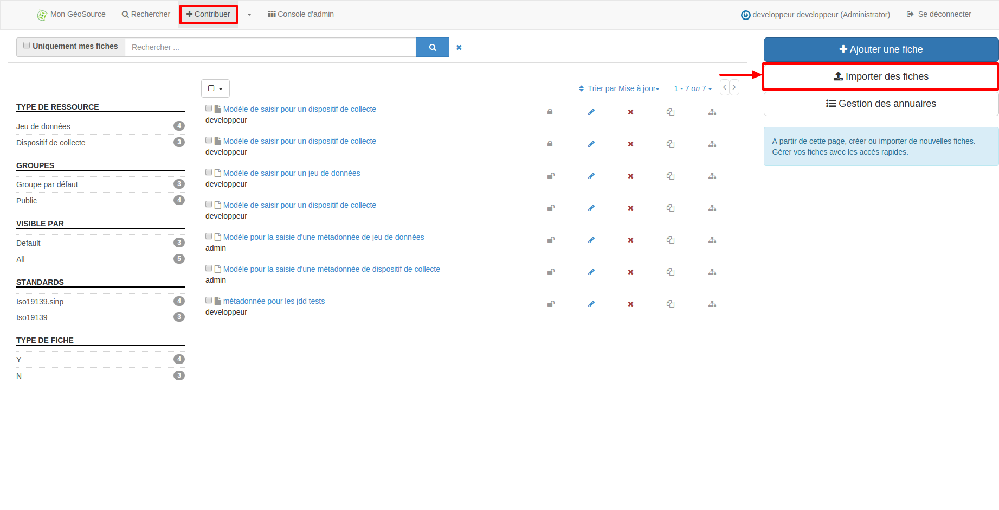
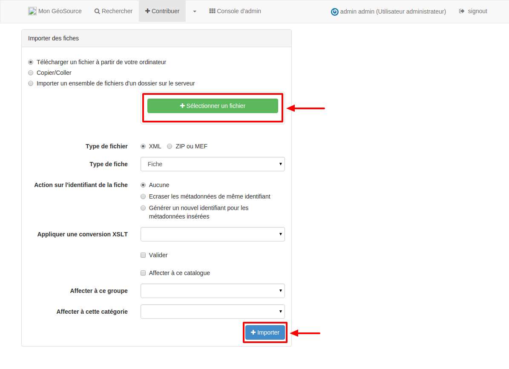

.. Geosource : importer les métadonnées

Importer
========

Pour importer une fiche de métadonnée, cliquer sur "Importer des fiches", sous l'onglet "Contribuer".

Sélectionner la fiche et cliquer sur "Importer".

