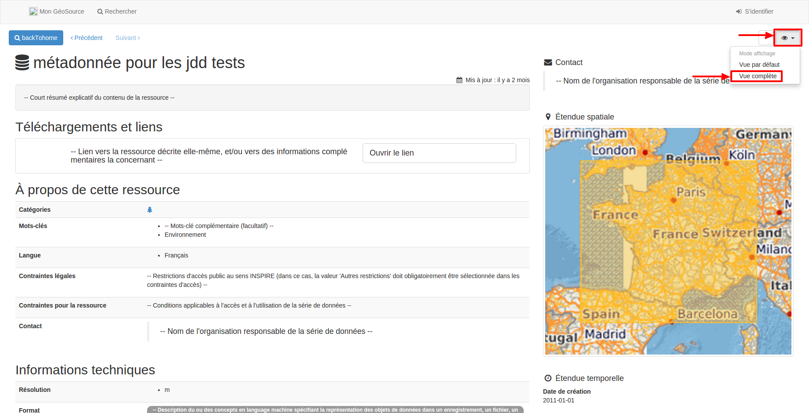

.. Le champ jddMetadonneeDEEId

Identifiant de métadonnée : jddMetadonneeDEEId
==============================================

L'import de données dans GINCO nécessite de connaître l'identifiant de la métadonnée du jeu de données importé.
En effet, le standard occurrence de taxon DEE comporte un champ obligatoire "jddMetadonneeDEEId", dont la valeur doit correspondre
à l'identifiant de la métadonnée. Si la valeur ne correspond à aucun jeu de donnée, l'import est refusé.

Depuis la page d'accueil de Géosource, ouvrir la fiche de métadonnée.
En haut à droite de la métadonnée, cliquer sur l'oeil, puis sur "Vue complète".

Dans l'onglet "Complet", l'identifiant jddMetadonneeDEEId apparaît alors,
au niveau de "Identification des données > Informations de référence > Identificateur".

.. image:: ../images/metadata-id.png

.. note:: Il est possible d'accéder à la vue complète d'une fiche de métadonnée
  en étant déconnecté de Géosource si la métadonnée est publiée.