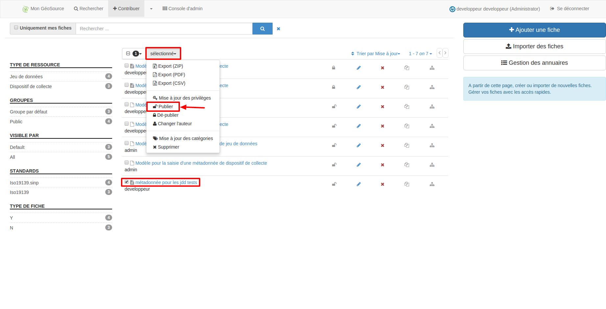

.. Geosource : publier les métadonnées

Publier
=======

Afin que la fiche de métadonnée soit visible par les utilisateurs non connectés à Géosource (les producteurs notamment), 
il faut publier la fiche de métadonnée.
Pour cela, sélectionner la métadonnée via la case à cocher correspondant puis choisir l’action « publier » dans la liste déroulante « sélectionné ».

