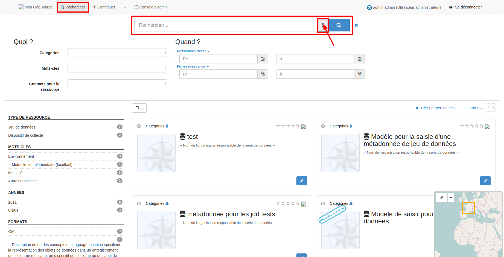

.. Geosource : rechercher les métadonnées

Rechercher
==========

L’onglet "Rechercher" permet de rechercher des fiches de métadonnées. Sans ajout de filtre, 
la recherche est faite sur l’ensemble du contenu de la métadonnée.
Si l’utilisateur est déconnecté, seules les métadonnées publiées sont visibles.
Si l’utilisateur est connecté, toutes les fiches et tous les modèles de métadonnées sont visibles.

