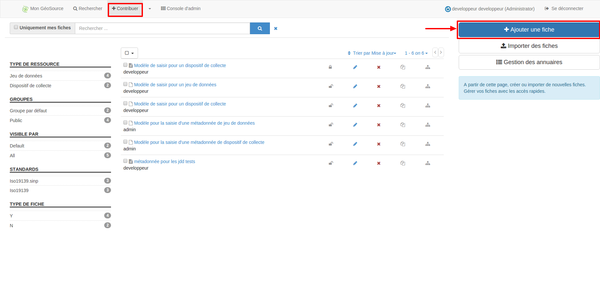
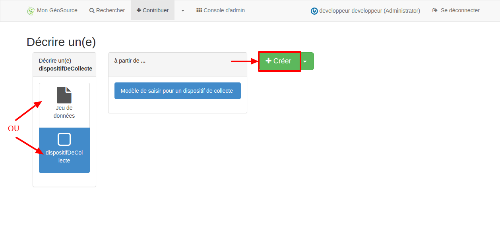
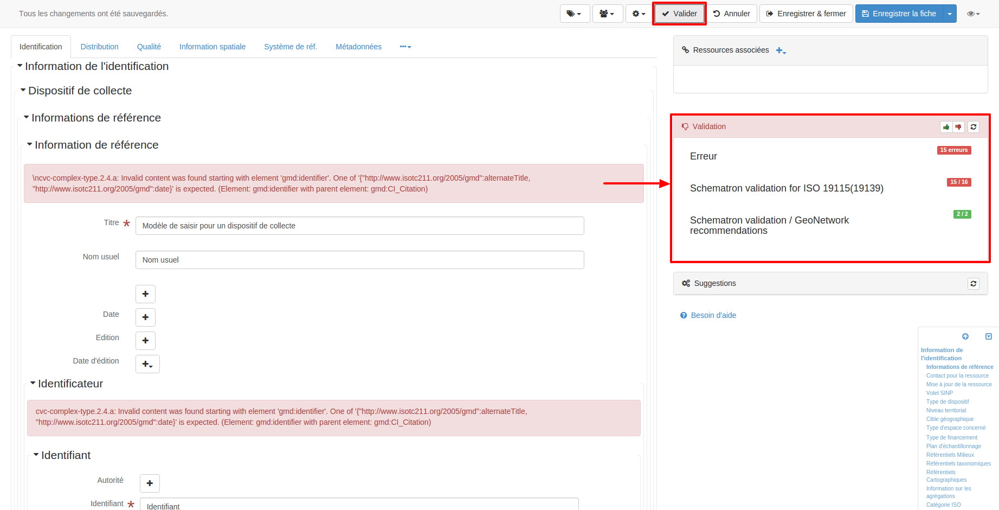
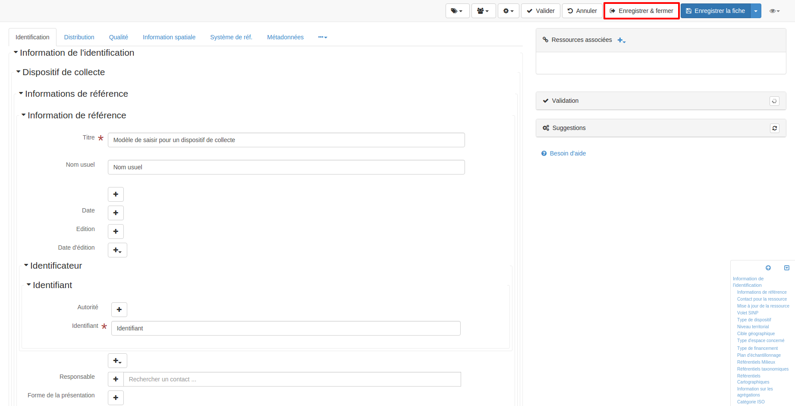

.. Geosource : saisir les métadonnées

Saisir
======

Ajouter
*******

Pour saisir une fiche de métadonnée, cliquez sur "Ajouter une fiche". 

Sélectionnez le « Modèle pour la saisie d'une métadonnée de jeu de données » ou « Modèle pour la saisie d'une métadonnée de dispositif de collecte » 
selon le type de métadonnée à créer. Puis cliquez sur "Créer".

Editer
******

Les champs de la métadonnée sont pré-remplis avec les valeurs du modèle choisi, mais la plupart sont à modifier (le titre notamment).
Afin que la métadonnée soit connue du module d’import de données GINCO, il faut générer un identifiant de métadonnée.

Pour cela, cliquez sur "Générer un identifiant" au niveau du champ « identificateur de ressource unique ».

La valeur de l’identifiant est de la forme:
``https://<nom de la plateforme>/geosource/metadata/srv/<identifiant de 36 caractères>.xml``

C’est cet identifiant qu’il faut indiquer dans le champ « jddMetadonneeDEEId » des données liées à cette fiche de métadonnée.

Valider
*******

Sauvegarder
***********

