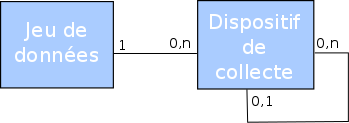
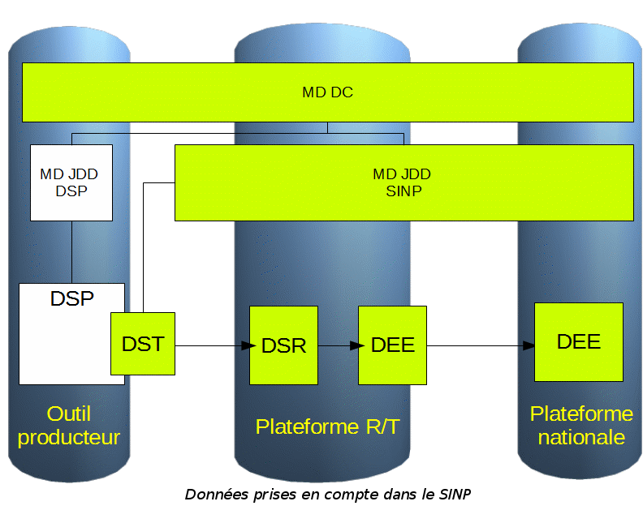

.. _metadonnees_index:

Les métadonnées
===============

Un format de métadonnées spécifique est utilisé pour les échanges entre plateformes du SINP.
Il correspond à l’implémentation du standard de métadonnées SINP pour les besoins fonctionnels des plateformes (version 1.3.3). 

Celui-ci est `disponible sur le site des standards du SINP <http://standards-sinp.mnhn.fr/metadonnees>`_.

Le standard de métadonnées se décompose en deux notions :
 - **Les métadonnées de dispositifs de collecte (DC);** Un dispositif de collecte décrit l’ensemble des moyens mis en œuvre et les ressources utilisées pour l’acquisition de données dans le cadre d’un projet défini par un maître d’ouvrage.  La conception de ce dispositif est réalisée par un ou plusieurs maîtres d’œuvre qui coordonnent son application et en assure le suivi. Un dispositif de collecte peut faire appel à plusieurs protocoles d’acquisition, plusieurs méthodes de collecte, plusieurs producteurs de données et plusieurs sources de financement différentes affectées au dispositif ou à des parties de ce dernier.  Chaque dispositif de collecte génère la collecte ou la centralisation d’un ensemble de données. Celles-ci sont généralement structurées en plusieurs jeux de données. Cette structuration est définie par un maître d’œuvre en fonction des objectifs du projet.

 - **Les métadonnées de jeux de données (JDD);** Un jeu de données est un ensemble de données d’occurrences partageant des éléments descriptifs communs, à la fois une même métadonnée de JDD et une même métadonnée de DC.

La constitution d’un jeu de données doit répondre à une volonté de structuration sémantique de l’information naturaliste. 

Pour chaque jeu de données SINP, il n’existe qu’une seule fiche de métadonnées de JDD, elle-même rattachée à une seule fiche de métadonnées de DC dans le cycle de vie du SINP.
Une fiche de métadonnées de DC peut être rattachée à une autre fiche de métadonnées de DC.

**Seules deux fiches de métadonnées sont prises en compte dans le SINP**

* Les fiches de métadonnées de dispositifs de collecte DC
* Les fiches de métadonnées de JDD décrivant les jeux de données SINP

Principe fonctionnel des métadonnées dans GINCO
***********************************************

.. note:: Les fiches de métadonnées doivent être saisies dans :mtd_url:`l'application de métadonnées de l'INPN <>`.

.. warning:: C’est l’administrateur régional qui pour l’instant saisit les métadonnées dans l’application nationale de métadonnées du SINP.

.. toctree::
    :maxdepth: 2

    acces
    jddMetadonneeDEEId
