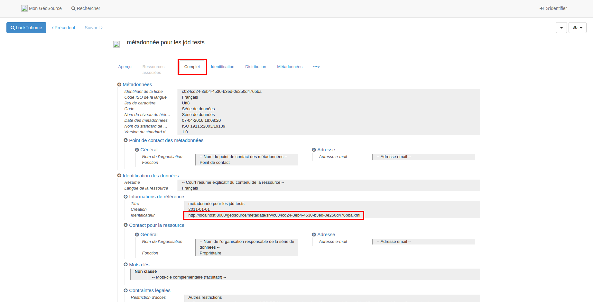

.. Le champ jddMetadonneeDEEId

Déclaration de l’identifiant de métadonnée : jddMetadonneeDEEId
===============================================================

.. note:: Une donnée importée ou saisie dans GINCO doit **obligatoirement** être rattachée à une fiche de métadonnée.

.. warning::  Celle-ci doit être saisie au préalable et déclarée lors de l’import d’un jeu de données dans GINCO.

Concrètement, cet identifiant vous sera demandé sur le formulaire d’import d’un jeu de données. L’application l’affecte automatiquement à l’ensemble des données du jeu importé.

Vous pouvez trouver l'identifiant de métadonnée sur le module dédié :

