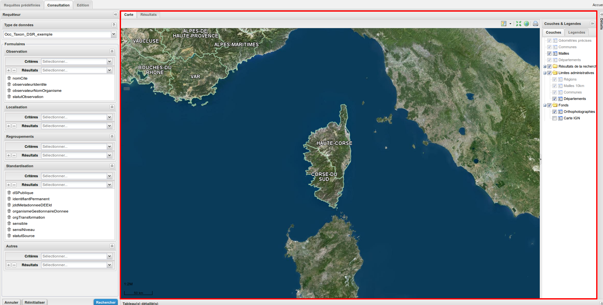
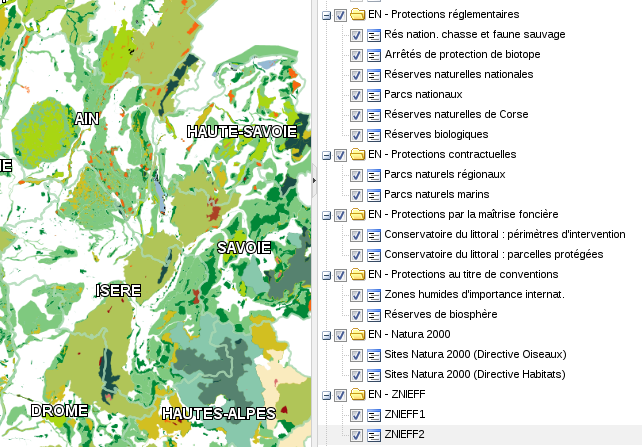
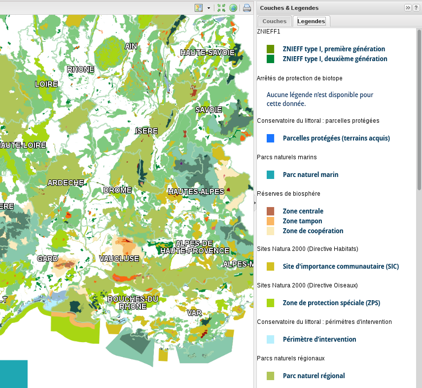
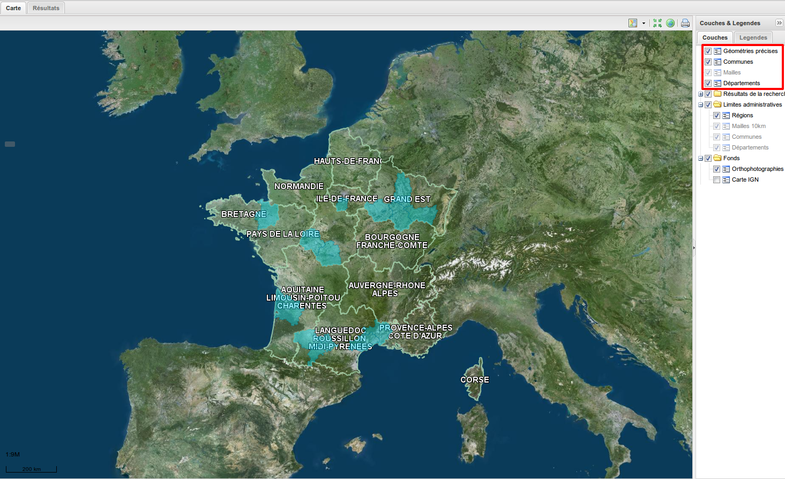
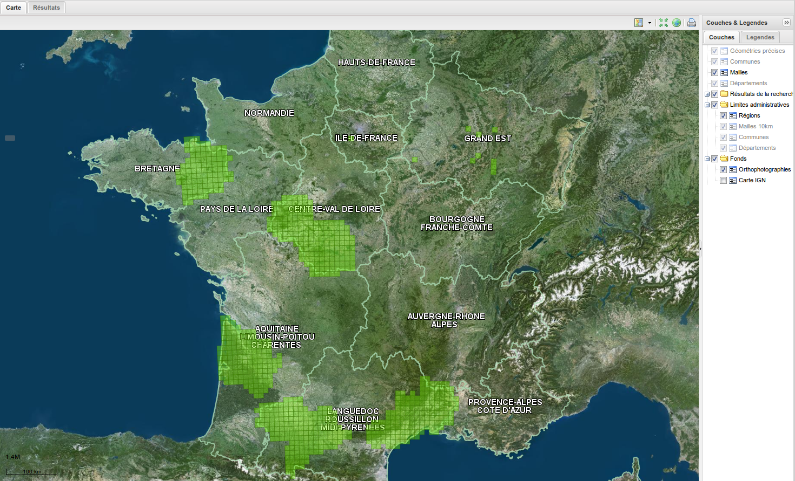
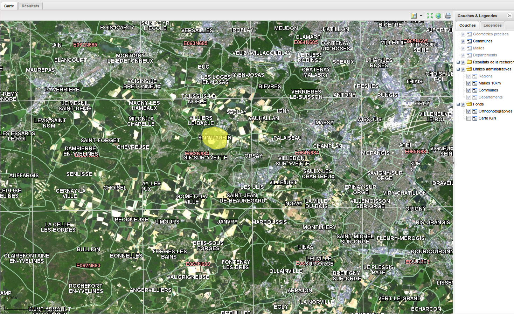
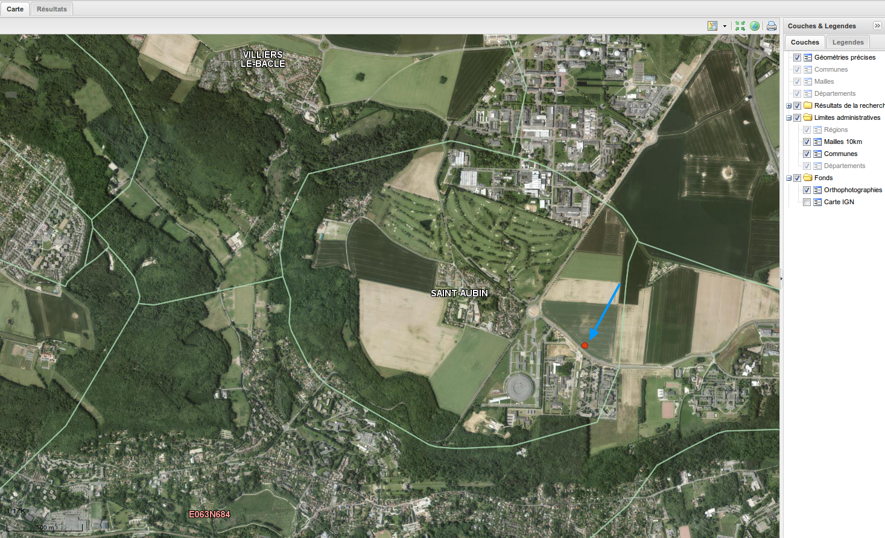
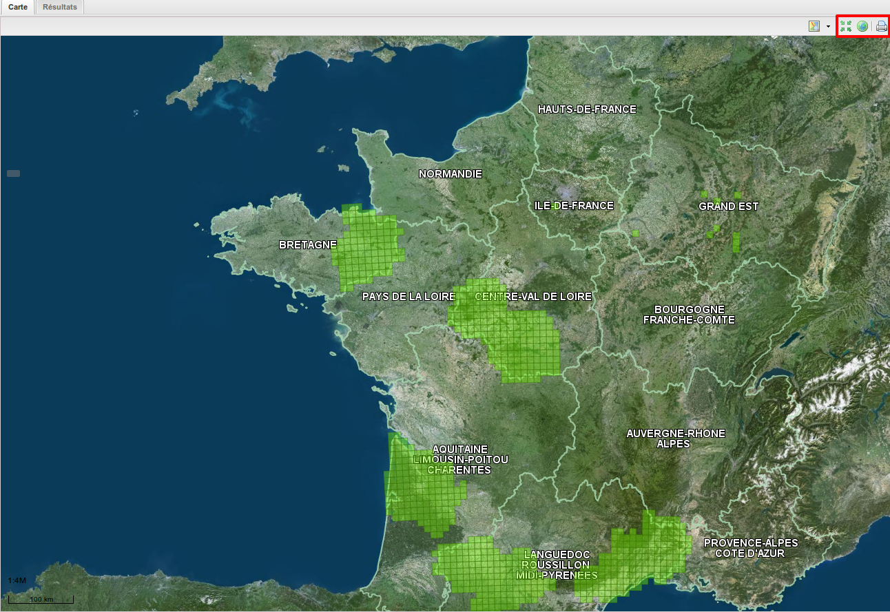
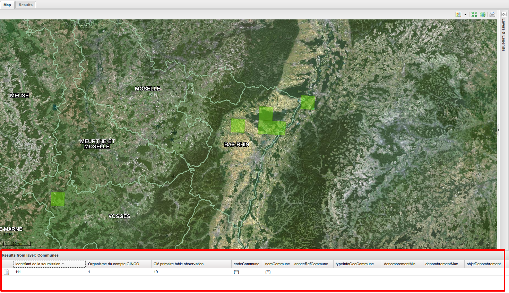
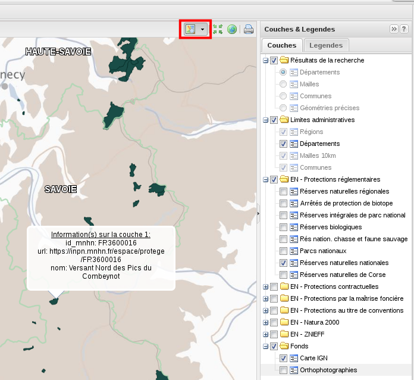

.. cartographie

Cartographie
============

Le centre de la page de visualisation des données est occupé par la cartographie (onglet "Carte"),
avec à sa droite, la liste des couches cartographiques.

.. note:: Initialement, l'emprise cartographique correspond à la région à laquelle la plateforme correspond.

Couches et légendes
-------------------

Couches
^^^^^^^

Le panneau à droite de la carte est découpé en deux onglets : "Couches" et "Légendes".

Il permet de masquer les couches que vous ne souhaitez pas afficher en les désélectionnant, et inversement.

Pour l'onglet "Couches", seules sont affichées les couches sélectionnées et activées (non grisées).

La couche "Résultats de la recherche" est activée lorsqu'une recherche est exécutée.

Les couches regroupées dans les "Limites administratives" ("Régions", "Départements", "Communes") 
s'activent selon le niveau de zoom.

Les couches correspondant à des espaces naturels (EN) sont regourpées par catégories.
Vous pouvez changer l'ordre de superposition des couches sur la carte, en effectuant un glisser-déposer des couches dans l'arbre.

Les dates d'édition des couches EN sont disponibles `ici <https://www.geoportail.gouv.fr/depot/fiches/mnhn/actualite_donnees_mnhn.pdf>`_.

L'opacité des couches est modifiable en cliquant avec le bouton droit de la souris sur l'intitulé de la couche, 
puis en déplaçant le curseur.

Légendes
^^^^^^^^

Les légendes des couches apparaissent dans l'onglet "Legendes".

Vous pouvez masquer totalement le panneau en cliquant sur le symbole représentant deux chevrons vert la droite en haut à droite du panneau.

Affichage des résultats d'une recherche sur la carte
----------------------------------------------------

Lorsqu'une recherche est effectuée, les couches Géométries précises, Communes, Mailles et Départements sont activées. Ce sont les bacs de visualisation des résultats de recherche.

Les résultats de la recherche sont affichés sur la carte en fonction de leurs géométrie précise et de leurs rattachements géo-administratifs, 
Les départements sont affichés en bleu, les mailles en vert, les communes en jaune, et les géométries précises en rouge.

Selon le niveau de zoom, du plus haut au plus bas, le résultat sera placé soit dans son ou ses département(s), puis dans sa ou ses maille(s), puis dans sa ou ses commune(s), et enfin sa géométrie précise sera affichée.

Voici une idée de la visualisation des résultats de recherche à la maille :

Un zoom supplémentaire permet de visualiser la ou les communes du résultat :

Enfin un zoom maximal affiche la géométrie précise de l'observation (ici, un polygone situé sur plusieurs communes) :

.. warning:: Attention, selon vos permissions, certaines observations sensibles et/ou privées seront floutées (*i.e* : non affichées) à partir d'une certaine échelle. Par exemple, si l'application a déterminé qu'une observation est sensible et qu'elle ne peut pas être visualisée à une échelle plus précise que celle de la maille, un zoom poussé pour voir la commune de l'observation ou sa géométrie précise n'affichera rien. Vous trouverez plus de détails sur le fonctionnement du floutage dans le chapitre :ref:`fonctionnement-floutage`.

Naviguer sur la carte
---------------------

En haut à droite de la carte, le premier bouton permet de centrer la carte sur les résultats de la recherche, le deuxième de dézoomer au maximum, et le troisième d'imprimer la carte.

Table attributaire d'une localisation
-------------------------------------

A partir d'un niveau de zoom suffisamment précis, il est possible d'afficher la table attributaire d'une localisation en cliquant dessus.
Lorsque plusieurs observations correspondent à l'endroit cliqué, elles apparaissent toutes dans la table.

Informations sur les couches
----------------------------

Le bouton "Voir les informations sur la couche sélectionnée" permet de sélectionner une couche puis d'interroger ses entités en cliquant sur la carte.

.. note:: Pour visualiser les entités sur la carte, il est recommandé de sélectionner la couche dans l'arbre des couches également.

