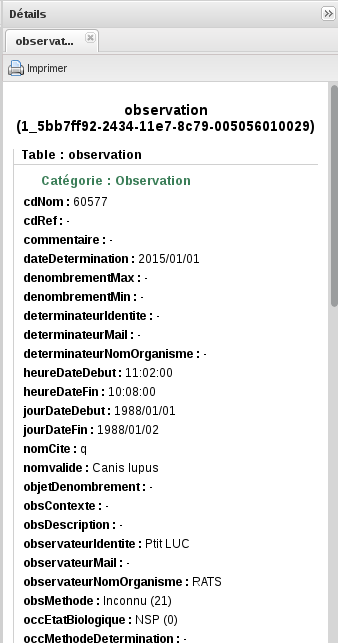
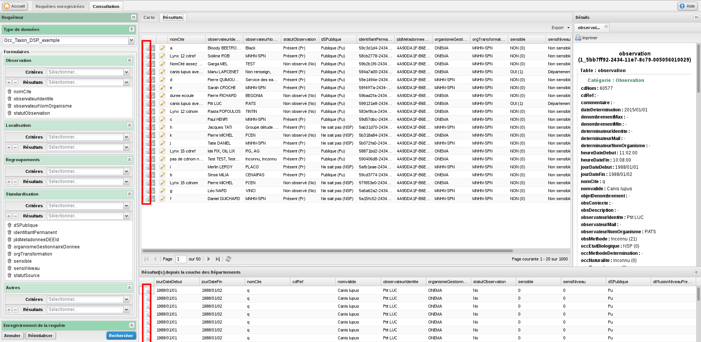

.. fiche-detail

Fiche de detail
===============

Le panneau « Détails » s’affiche sur la droite de la carte et présente les différents champs de l'observation 
ainsi que deux vignettes cartographiques correspondant au zoom communal et départemental sur l'observation.

Il est possible d'y accéder de deux façons :
 - Par la table des résultats, en cliquant sur la première icône "Voir les détails" d'une ligne.
 - Par la table attributaire en cliquant sur la première icône "Afficher les détails" d'une ligne.
 
