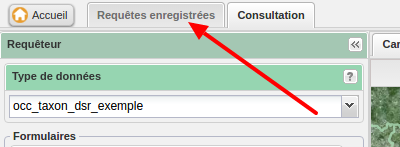
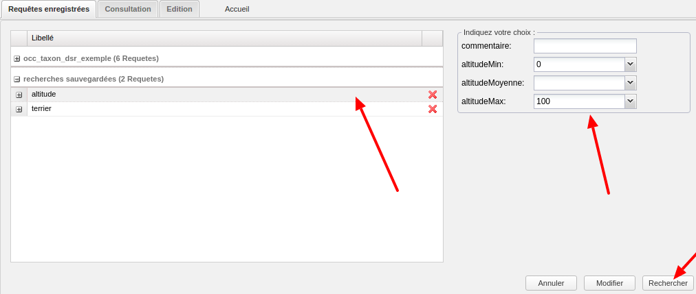

.. page-decouverte

Page découverte
===============

L'onglet "Page découverte" se situe en haut à gauche de la page, à gauche de l'onglet "Consultation".

Il permet d'accéder à quelques recherches courantes pré-enregistrées sans avoir à les construire dans le requêteur.
Une fois la recherche lancée, le module de visualisation a le même comportement que lorsque la recherche est effectuée via le requêteur.

Les requêtes de la page découverte sont les suivantes :

+------------------------------------------+----------------------------------------+
|Requête pré-enregistrée                   |    Critères                            |
+==========================================+========================================+
|Par statut bio-géographique               | -  cdNom                               |
|                                          | -  occStatutBiogeographique            |
+------------------------------------------+----------------------------------------+
|Données à sensibiliser                    | -  jddId                               |
|                                          | -  sensiAlerte                         |
+------------------------------------------+----------------------------------------+
|Critères les plus fréquents               | -  cdNom                               |
|                                          | -  occStatutBiogeographique            |
|                                          | -  nomCommune                          |
|                                          | -  organismeGestionnaireDonnee         |
|                                          | -  dateFin                             |
|                                          | -  dateDebut                           |
|                                          | -  codeDepartement                     |
|                                          | -  geometrie                           |
|                                          | -  codeEN                              |
+------------------------------------------+----------------------------------------+
|Par localisation                          | -  cdNom                               |
|                                          | -  nomCommune                          |
|                                          | -  codeDepartement                     |
|                                          | -  geometrie                           |
|                                          | -  codeEN                              |
+------------------------------------------+----------------------------------------+
|Par période d'observation                 | -  cdNom                               |
|                                          | -  dateDebut                           |
|                                          | -  dateFin                             |
+------------------------------------------+----------------------------------------+
|Par organisme producteur de données       | -  cdNom                               |
|                                          | -  organismeGestionnaireDonnee         |
+------------------------------------------+----------------------------------------+

Lorsqu'on sélectionne une requête en cliquant dessus, les critères de recherche correspondants apparaissent à droite de la page.
Il est alors possible de modifier une ou plusieurs valeurs ou de les laisser telles quelles (vides ou avec leur valeur par défaut),
puis de lancer la recherche en cliquant sur le bouton "OK".

