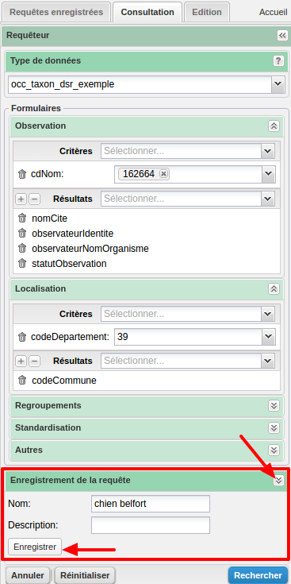
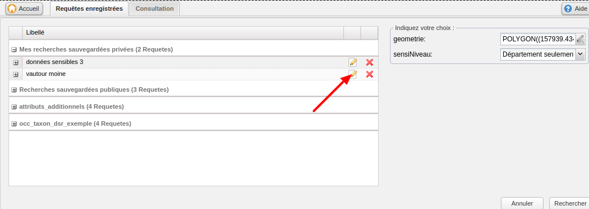
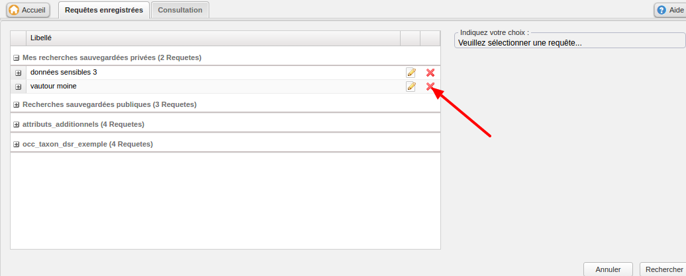

.. page-recherche-enregistrees

Requêtes enregistrées
=====================

L'onglet "Requêtes enregistrées" se situe en haut à gauche de la page, à gauche de l'onglet "Consultation".

.. image:: ../images/visu/visu-bouton-page-decouverte.png

Il permet d'accéder à :
 * Quelques recherches courantes pré-enregistrées dans l'application;
 * Les requêtes enregistrées par l'utilisateur.

Les requêtes pré-enregistrées dans l'application sont les suivantes :

+------------------------------------------+----------------------------------------+
|Requête pré-enregistrée                   |    Critères                            |
+==========================================+========================================+
|Par statut bio-géographique               | -  cdNom                               |
|                                          | -  occStatutBiogeographique            |
+------------------------------------------+----------------------------------------+
|Données à sensibiliser                    | -  jddId                               |
|                                          | -  sensiAlerte                         |
+------------------------------------------+----------------------------------------+
|Critères les plus fréquents               | -  cdNom                               |
|                                          | -  occStatutBiogeographique            |
|                                          | -  nomCommune                          |
|                                          | -  organismeGestionnaireDonnee         |
|                                          | -  dateFin                             |
|                                          | -  dateDebut                           |
|                                          | -  codeDepartement                     |
|                                          | -  geometrie                           |
|                                          | -  codeEN                              |
+------------------------------------------+----------------------------------------+
|Par localisation                          | -  cdNom                               |
|                                          | -  nomCommune                          |
|                                          | -  codeDepartement                     |
|                                          | -  geometrie                           |
|                                          | -  codeEN                              |
+------------------------------------------+----------------------------------------+
|Par période d'observation                 | -  cdNom                               |
|                                          | -  dateDebut                           |
|                                          | -  dateFin                             |
+------------------------------------------+----------------------------------------+
|Par organisme producteur de données       | -  cdNom                               |
|                                          | -  organismeGestionnaireDonnee         |
+------------------------------------------+----------------------------------------+

Rechercher en utilisant une requête enregistrée :
-------------------------------------------------

Sur l'onglet des requêtes enregistrées, lorsqu'on sélectionne une requête en cliquant dessus, les critères de recherche correspondants apparaissent à droite de la page.
Il est alors possible de modifier une ou plusieurs valeurs ou de les laisser telles quelles (vides ou avec leur valeur par défaut),
puis de lancer la recherche en cliquant sur le bouton "Recherhcer".

Une fois la recherche lancée, le module de visualisation a le même comportement que lorsque la recherche est effectuée via le requêteur.

.. image:: ../images/visu/visu-decouverte.png

Sauvegarder une recherche
-------------------------

Après avoir configuré une requête dans le requêteur (choix des critères et de leur valeur, choix des colonnes à afficher dans le tableau des résultats),
il est possible d'enregistrer cette requête.
Pour cela, il faut déplier le pannneau "Enregistrer la requête". Il permet d'indiquer :

 * le nom de la requête enregistrée,
 * sa description.

La requête est sauvegardée en cliquant sur "Enregistrer". L'application charge alors l'onglet 'Requêtes prédéfinies', et enregistre la requête dans le groupe "Recherches sauvegardées".

Modifier une recherche
----------------------

Pour modifier une recherche enregistrée, il faut se trouver sur l'onglet 'Requêtes prédéfinies'.
Sélectionner une requête, puis cliquer sur le bouton 'Modifier'.
L'application redirige alors sur l'onglet 'Consultation', et charge les paramètres de la recherche dans le requêteur.
On peut alors modifier les critères ou colonnes de recherche, ainsi que le nom et la description de la recherche via le panneau "Enregistrer la recherche".
Lorsqu'on l'on clique sur enregistrer, l'onglet 'Requêtes prédéfinies' apparaît à nouveau avec la requête mise à jour.

Supprimer une recherche
-----------------------

Pour supprimer une recherche, il  faut cliquer sur l'onglet 'Requêtes enregistrées'.
Puis cliquer sur le bouton "supprimer" d'une requête enregistrée.
L'application supprime alors la requête et rafraîchit la page.

.. note:: Lors de la dépublication d'un modèle de données, toutes les requêtes enregistrées liées à ce modèle sont supprimées.
