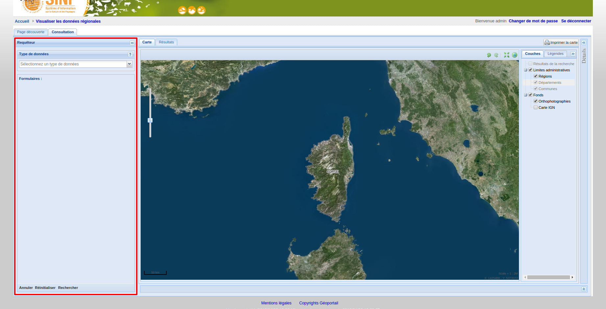
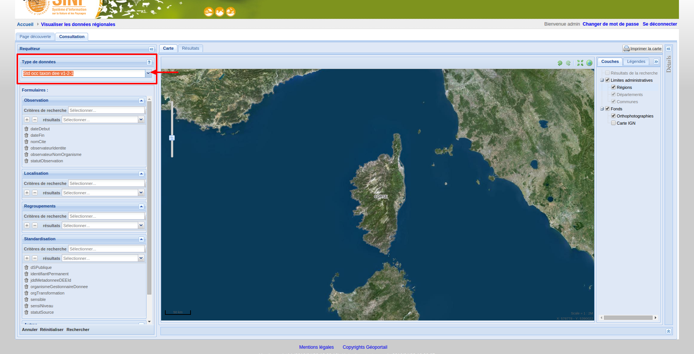
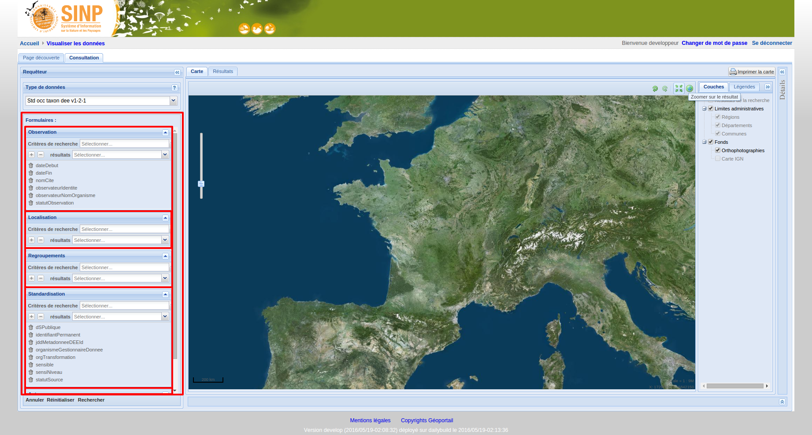
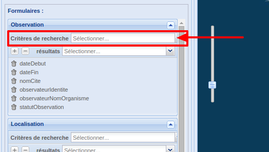
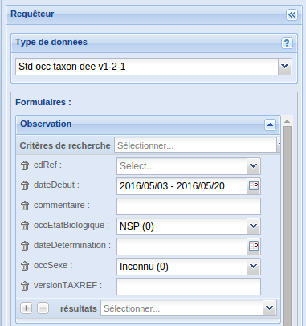
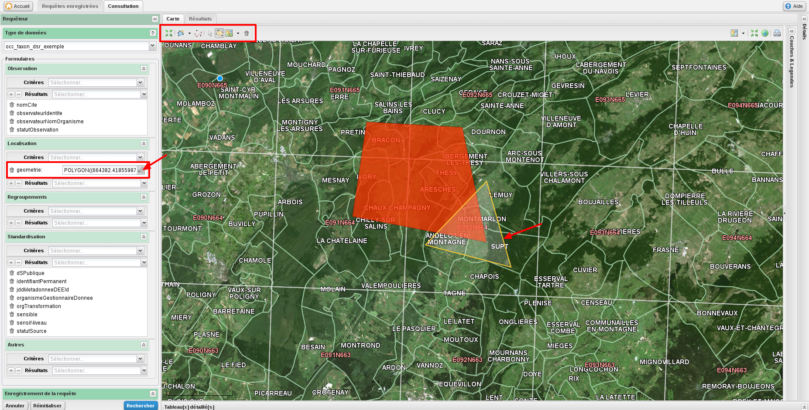
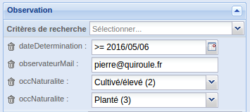
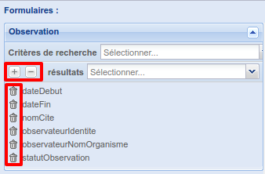
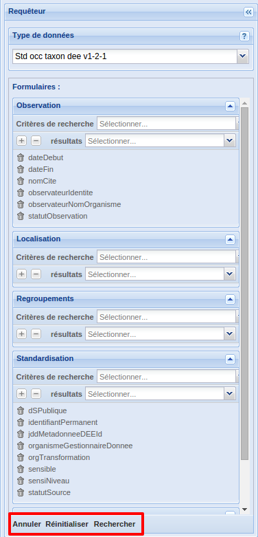

.. requêteur

Requêteur
=========

La partie gauche de la page de visualisation des données est occupée par le requêteur,
qui permet de rechercher des données.

Sélection d'un modèle de données
--------------------------------

Les données importées ou saisies dans GINCO sont stockées par modèle de données.
Afin d'effectuer une recherche, il faut donc commencer par sélectionner un modèle de données dans le sous-formulaire "Type de données".

Organisation des formulaires
----------------------------

A chaque modèle de données est associé un ou plusieurs formulaires,
regroupant les critères disponibles pour une recherche sur modèle de données.

Les formulaires regroupent les champs de façon logique.

+---------------+----------------------------------------+
|Formulaire     |    Champs                              |
+===============+========================================+
|Observation    | -  nomcite                             |
|               | -  typedenombrement                    |
|               | -  objetdenombrement                   |
|               | -  denombrementmax                     |
|               | -  denombrementmin                     |
|               | -  statutobservation                   |
|               | -  datedebut                           |
|               | -  datefin                             |
|               | -  commentaire                         |
|               | -  observateuridentite                 |
|               | -  observateurnomorganisme             |
|               | -  observateurmail                     |
|               | -  obsdescription                      |
|               | -  obsmethode                          |
|               | -  obscontexte                         |
|               | -  occmethodedetermination             |
|               | -  occstatutbiogeographique            |
|               | -  occstadedevie                       |
|               | -  occsexe                             |
|               | -  occnaturaliste                      |
|               | -  occstatutbiologique                 |
|               | -  occetatbiologique                   |
|               | -  preuvenumerique                     |
|               | -  preuvenonnumerique                  |
|               | -  preuveexistante                     |
|               | -  cdnom                               |
|               | -  cdref                               |
|               | -  versiontaxref                       |
|               | -  determinateuridentite               |
|               | -  determinateurmail                   |
|               | -  determinateurnomorganisme           |
|               | -  datedetermination                   |
+---------------+----------------------------------------+
|Localisation   | -  altitudemin                         |
|               | -  altitudemax                         |
|               | -  altitudemoyenne                     |
|               | -  profondeurmin                       |
|               | -  profondeurmax                       |
|               | -  profondeurmoyenne                   |
|               | -  refhabitat                          |
|               | -  versionrefhabitat                   |
|               | -  codehabitat                         |
|               | -  codehabref                          |
|               | -  codecommune                         |
|               | -  anneerefcommune                     |
|               | -  typeinfogeocommune                  |
|               | -  nomcommune                          |
|               | -  typeinfogeodepartement              |
|               | -  codedepartement                     |
|               | -  anneerefdepartement                 |
|               | -  typeinfogeomaille                   |
|               | -  versionrefmaille                    |
|               | -  codemaille                          |
|               | -  nomrefmaille                        |
|               | -  natureobjetgeo                      |
|               | -  codeme                              |
|               | -  precisiongeometrie                  |
|               | -  typeinfogeoen                       |
|               | -  versionen                           |
|               | -  codeen                              |
|               | -  typeen                              |
|               | -  typeinfogeome                       |
|               | -  versionme                           |
|               | -  dateme                              |
|               | -  region                              |
+---------------+----------------------------------------+
|Regroupements  | -  identifiantregroupementpermanent    |
|               | -  typeregroupement                    |
|               | -  methoderegroupement                 |
+---------------+----------------------------------------+
|Standardisation| -  identifiantpermanent                |
|               | -  validateurnomorganisme              |
|               | -  validateurmail                      |
|               | -  validateuridentite                  |
|               | -  organismestandard                   |
|               | -  deedatedernieremodification         |
|               | -  deedatetransformation               |
|               | -  jddmetadonneedeeid                  |
|               | -  orgtransformation                   |
|               | -  codeidcnpdispositif                 |
|               | -  deefloutage                         |
|               | -  sensible                            |
|               | -  sensiniveau                         |
|               | -  sensidateattribution                |
|               | -  sensireferentiel                    |
|               | -  sensiversionreferentiel             |
|               | -  dspublique                          |
|               | -  organismegestionnairedonnee         |
|               | -  statutsource                        |
|               | -  diffusionniveauprecision            |
|               | -  identifiantorigine                  |
|               | -  jddcode                             |
|               | -  jddid                               |
|               | -  jddsourceid                         |
|               | -  referencebiblio                     |
+---------------+----------------------------------------+

Au sein des formulaires, on peut sélectionner les critères sur lesquels requêter 
et les champs (colonnes) à afficher dans l’onglet des résultats.

Critères de recherche
---------------------

Le menu déroulant nommé “Critères de recherche” de chaque formulaire permet d’ajouter des critères potentiels de recherche.

Selon le type de critère ajouté, sa forme va être différente (menu déroulant, champ texte, calendrier…)

.. note:: Un critère de recherche sans valeur est équivalent à une absence du critère.

.. warning:: Attention, selon vos permissions de visualiser les données sensibles et/ou privées, il se peut que des résultats ne soient pas affichés. Cette mesure de protection permet d'éviter que des utilisateurs n'ayant pas les droits suffisants et adéquats puissent obtenir des informations de localisation plus précises que ne leur permette leur niveau d'accès.

Critère de recherche géométrique
********************************

Dans le formulaire "localisation", le critère "géométrie" permet de définir un polygone que les géométries des observations doivent intersecter pour correspondre au critère.

Pour définir un polygone, après avoir sélectionné le critère "géométrie", il faut cliquer sur l'icone représentant un crayon à côté du champ texte.
Cela active le traçage d'une géométrie via la souris sur la carte et fait apparaître une barre d'icones en haut de la carte, dont le fonctionnement est le suivant :

 * Zoomer sur la sélection : 
Lorsque l'on clique sur cette icone, l'emprise de la carte est redéfinie à celle de la géométrie de recherche si elle existe.

 * Snapping : 
Ce bouton active la saisie le long d'une autre géométrie. La liste déroulante à côté de l'icone permet de choisir la couche sur laquelle accrocher la géométrie.
Les coutours des entités de la couche séléctionnée apparaissent en bleu sur la carte, et lorsqu'on approche la souris de l'un d'eux, le point bleu correspondant à la géométrie que l'on va tracer se positionne dessus.

 * Modifier la géométrie :
Lorsque cette icone est active, la souris permet de modifier le coutour de la géométrie de recherche. Pour cela, il faut cliquer sur le contour avec la souris, puis la déplacer sans relacher le clic.

 * Sélectionner une géométrie :
Une géométrie non sélectionnée a un contour jaune. Une géométrie se sélectionne en cliquant dessus avec la souris. Une fois sélectionnée, le contour apparaît en bleu.

 * Dessiner un polygone : 
Un clic simple sur la carte ajoute un sommet au polygone, un double clic ferme le polygone en ajoutant un sommet.
Il est possible de dessiner plusieurs polygones pour un même critère de recherche.

 * Sélectionner un contour sur la couche sélectionnée :
Au lieu de dessiner un polygone à la main sur la carte, cet outil permet de sélectionner une couche dans la liste déroulante (espace naturel ou limite administrative), puis de sélectionner une entité sur la couche choisie en cliquant avec la souris sur la carte.
Pour visualiser les entités, il est préférable d'afficher également la couche sur la carte via l'arbre des couches du panneau "Couches & légendes", à gauche.

 * Effacer la géométrie :
Lorsqu'une géométrie de recherche est sélectionnée, il est possible de la supprimer en cliquant sur cette icone.

Opérations logiques entre critères
----------------------------------

Chaque critère peut être ajouté plusieurs fois. 
Dans ce cas la recherche va sélectionner les données dont la valeur pour ce critère 
correspond aux valeurs sélectionnées (opération OU).

Par contre des critères différents réduisent la recherche (opération logique ET entre les champs).

Par exemple, la recherche suivante :

va correspondre à une recherche des données dont l'e-mail de l’observateur est pierre@quiroule.fr, 
ET dont la date de détermination est supérieure ou égale au 05 juin 2016,
ET dont la valeur de occNaturalite correspond à Cultivé/élevé OU planté.

.. note:: Si aucun critère de recherche n'est sélectionné, toutes les données sont requêtées.

.. note:: Il existe 2 sortes de critères de type texte :

  * Les textes simples cherchent les motifs dans les valeurs des observations. Par exemple une recherche de "Pierre" peut donner comme résultat "Jean-Pierre", "Pierre MARTIN"...
  * Les textes de type identifiant cherchent le motif exact. Une recherche du motif "Pierre" ne peut pas donner autre chose que "Pierre".
  
  Par défaut les clés primaires sont de type texte identifiant.
  
.. note:: Astuce: Pour sélectionner une heure entre 20:00 et 5:00 du matin il 
  faut utiliser deux fois le critère de recherche sur l'heure. La première fois 
  entre 20:00 et 23:59 et la seconde fois entre 00:00 et 5:00.

Résultats à afficher
--------------------

Il est possible de filtrer les colonnes de résultats.
Pour ce faire, plusieurs moyens sont disponibles :

* De la même façon que pour ajouter un critère, on ajoute une colonne au tableau des résultats en le sélectionnant dans la liste déroulante "Résultats".
* Le bouton "+" est un raccourci permettant d’ajouter tous les champs (colonnes) disponibles d’un coup.
* Le bouton "-" est un raccourci permettant de supprimer tous les champs d’un coup.
* Chaque bouton "corbeille" permet de déselectionner le champ correspondant.

Par défaut, certains champs de résultats sont sélectionnés.
Il s'agit des champs obligatoires du standard occurrence de taxon.

.. warning:: Afin de pouvoir effectuer une requête, il faut sélectionner au moins une colonne à afficher dans l’onglet des résultats 
  (menu déroulant « résultats »).

Exécuter une recherche
----------------------

Le bouton "Rechercher" au bas du requêteur permet de lancer la recherche.
Le bouton "Annuler" permet d’arrêter une recherche en cours.
Enfin, "Réinitialiser" permet de recharger le requêteur par défaut.

Les résultats de la recherche sont visibles au centre de la page de visualisation, sous forme cartographique dans l'onglet "Carte", 
et sous forme tabulaire dans l'onglet "Résultats".

.. note:: Lorsqu'une plateforme contient un nombre important de données, une recherche imprécise peut prendre jusqu'à plusieurs minutes à s'éxécuter.
