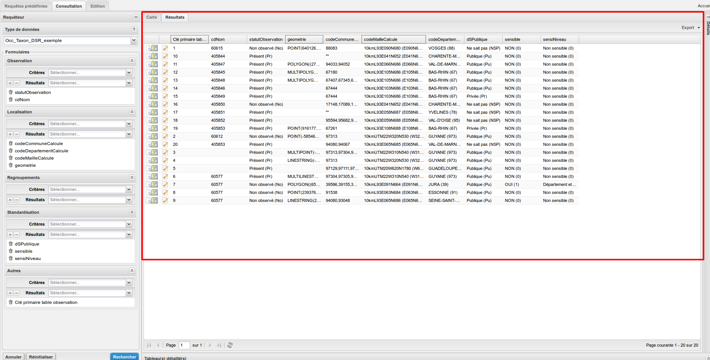
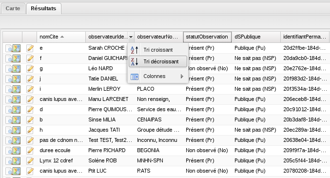
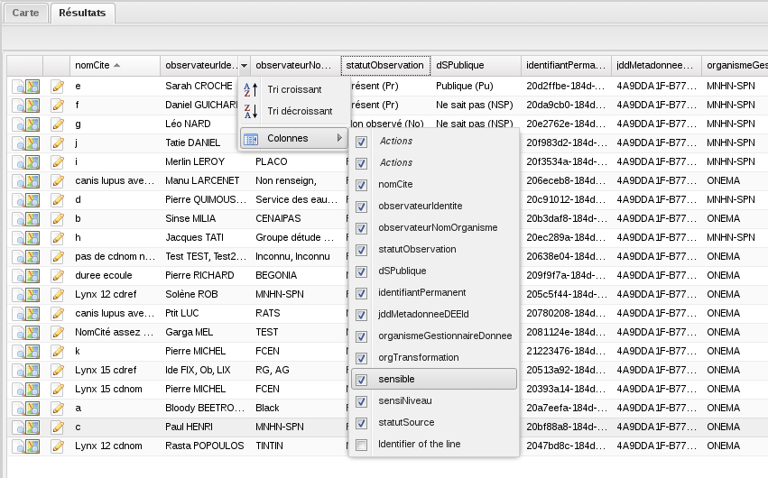
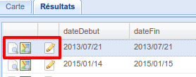

.. tableau-resultat

Tableau des résultats
=====================

Sous l’onglet Résultats, les résultats de la recherche sont affichés sous forme de grille.

La liste des résultats est paginée, à raison de 20 lignes par page.
La navigation entre les pages de résultats se fait via les flèches au bas de la grille.

En cliquant à côté des titres des colonnes, il est possible d’ordonner l’affichage des résultats selon les valeurs de la colonne sélectionnée.

Il est aussi possible de masquer des colonnes en les décochant.

Vous pouvez déplacer les colonnes si vous le souhaitez en les glissant/déposant.

Les icones en début de ligne permettent d’afficher les détails, de visualiser sur la carte, ou d’éditer la donnée correspondante.
Selon les droits de l'utilisateur, elles ne sont pas toujours toutes disponibles.

.. note:: Il est possible qu'une donnée ne comporte pas de géométrie, dans ce cas l'icone "Voir sur la carte" est grisée et inactive.

.. warning:: *Attention*, selon vos permissions, certaines valeurs de champs géométriques d'observations sensibles et/ou privées seront floutées (*i.e* : cachées). Par exemple, si l'application a déterminé qu'une observation est sensible et qu'elle ne peut pas être visualisée à une échelle plus précise que celle de la maille, les champs *codeCommune*, *codeCommuneCalcule*, *nomCommune*, *nomCommuneCalcule*, et *geometrie* afficheront une constante cachant l'information réelle. Vous trouverez plus de détails sur le fonctionnement du floutage dans le chapitre :ref:`fonctionnement-floutage`.

Export des résultats
--------------------

En haut à droite du tableau, un menu déroulant permet d'exporter les résultats aux formats

 .. image:: ../images/visu/export-tableau-resultats.png

 * CSV : Les données sont sous forme tabulaire, les valeurs sont séparées par des ";";
 * KML : Format utilisant des balises, basé sur le XML pour les données géospatiales;
 * GeoJSON : Format utilisant la norme JSON, pour les données géospatiales.
 
 .. note:: Les géométries seront exportées dans la projection définies dans la configuration de la plateforme.
