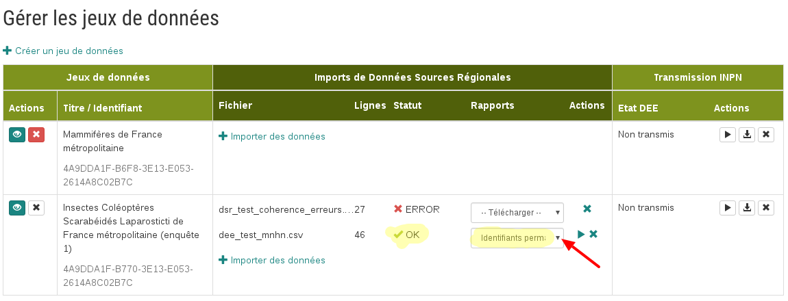

.. idperm

Calcul de l'identifiant permanent
=================================

Si celui-ci n'est pas fourni, un identifiant permanent est généré pour chaque donnée.

Il est de la forme :
``https://[url-de-la-plateforme]/occtax/[uuid]`` où l'uuid est normalisé par l'ISO/IEC 9834-8:2008.

La forme de l'identifiant permanent est définie dans le document 
`Identifiant permanent de la DEE <http://www.naturefrance.fr/sites/default/files/fichiers/ressources/pdf/sinp_identifiantpermanent.pdf/>`_.

Rapport sur les identifiants permanents
=======================================

Un rapport sur les identifiants permanents est disponible pour chaque soumission réussie à partir du tableau des jeux de données.

Dans la colonne "Actions", le lien "Identifiants permanents" permet de charger un tableur liant les identifiants permanent à l'identifiantOrigine de chaque données.