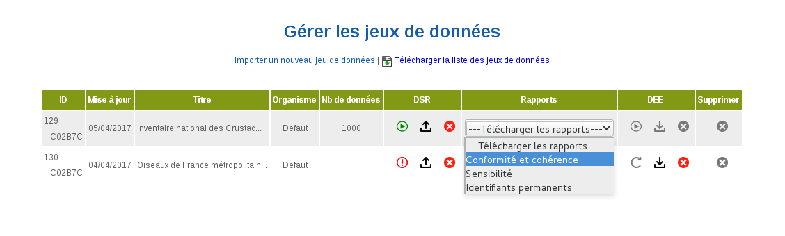
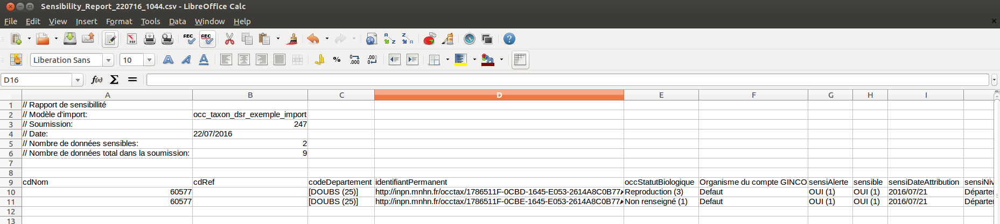
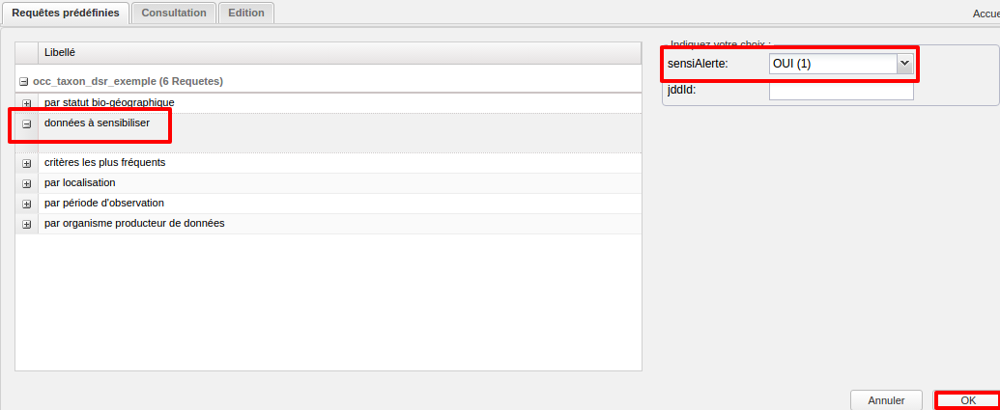
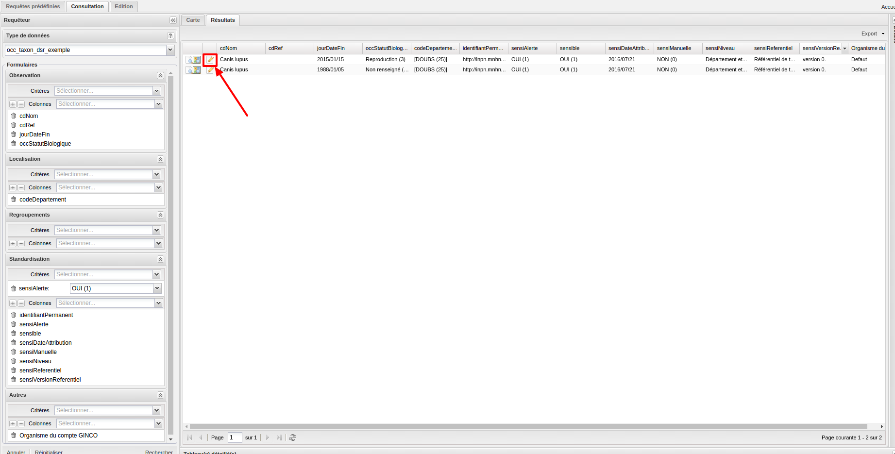

.. sensibilité

Calcul de la sensibilité
========================

.. note:: Le calcul de sensibilité ne concerne que les données rattachées au standard des occurences de taxon. Pour le standard des occurences d'habitat, la sensibilité est déclarative.

La sensibilité est calculée à partir d'un référentiel de sensibilité.
Un référentiel liste des croisements de taxons, localisations (départements), durées de sensibilité.
Il permet de définir au niveau de la donnée un indice de sensibilité (entre 0 et 4)
qui influe sur la visibilité de l'observation au sein de l'application.

Le référentiel de sensibilité
-----------------------------

Le référentiel de sensibilité fourni à GINCO est constitué des informations suivantes :

* CD_DEPT : code INSEE du département.
* CD_NOM : code du taxon valide.
* NOM_CITE : nom du taxon cité dans la liste
* DUREE : durée d'application de la sensibilité en année.
* CODAGE : code de sensibilité.
* AUTRE : commentaire sur l'application de la sensibilité.
* CD_SL : identifiant de la liste de sensibilité.
* CD_OCC_STATUT_BIOLOGIQUE : code du statut biologique pour lequel s'applique la sensibilité.

Auxquelles s'ajoutent des informations sur les listes de sensibilités utilisées dans ce référentiel :

* short_citation : Auteur de la liste de sensibilité régionale.
* cd_insee_reg : le code Insee de la région sur laquelle la liste s'applique.
* date_liste : la date de la constitution de la liste.
* full_citation : Le référence de la liste.
* url : le lien vers la liste au format numérique.
* cd_doc : l'identifiant de la liste.
* cd_sl identifiant de la liste de sensibilité.

Le référentiel est fourni  à GINCO par la plateforme nationale (INPN).
Les codes de taxons fournis à GINCO sont ceux de la version en vigueur de TAXREF lors de la fourniture du référentiel à GINCO.
La sensibilité ne s'applique pas pour les données marines.
Lorsqu'une liste régionale existe, cette liste remplace la liste nationale pour la région concernée.

Calcul automatique de la sensibilité
------------------------------------

Lors de l'import de données, un calcul de la sensibilité des observations est effectué automatiquement par l'application.

Pour chaque observation, l'application identifie les lignes du référentiel de sensibilité correspondant au taxon 
dans le département de l'observation. Lorsqu'une liste de sensiblité régionale a été transmise au MNHN, c'est elle qui s'applique. Sinon, c'est la liste nationale.
Si aucune règle ne correpond, l'observation n'est pas sensible.
Sinon l'application applique la règle avec le codage le plus élevé, en prenant en priorité une règle sans commentaire.

Lorsque l'observation comporte un commentaire, le calcul automatique n'est pas suffisant et la sensibilité doit être vérifiée manuellement.
Le champ sensiAlerte est alors mis à "OUI".

Rapport de sensibilité
----------------------

Un rapport de sensibilité est disponible pour chaque soumission importée à partir du tableau des jeux de données.

Dans la colonne "Actions", le lien "Rapport de sensibilité" permet de charger un tableur listant les données sensibles
du jeu de données (c'est-à-dire telles que sensiNiveau > 0).

Attribution manuelle de la sensibilité
--------------------------------------

Requêter les données à sensibiliser
^^^^^^^^^^^^^^^^^^^^^^^^^^^^^^^^^^^

Les données à sensibiliser manuellement ont la valeur "OUI" pour le champ "sensiAlerte".
Le requêteur permet donc de les identifier en choisissant comme critère de recherche le champ "sensiAlerte" avec la valeur "OUI".
La requête prédéfinie "données à sensibiliser" permet également de rechercher les données à sensibiliser manuellement.

Attribution de la sensibilité manuellement
^^^^^^^^^^^^^^^^^^^^^^^^^^^^^^^^^^^^^^^^^^

Pour attribuer manuellement une sensibilité à une donnée, il faut l'éditer.

Lorsque la sensibilité manuelle est enregistrée, et si un des champs sensiManuelle ou sensiNiveau a été modifié,
 les champs suivants sont automatiquement mis à jour, avec comme valeurs :

* sensiDateSensibilite = date du jour
* alerteSensibilite = NON 
* sensibiliteManuelle = OUI

De plus, le champ dEEDateDerniereModification est alors mis à la date du jour.

.. warning:: Si lors de l'édition d'une donnée, un des champs entrant en compte dans le calcul de la sensibilité est modifié
              (cdNom, cdRef ou jourDateFin), alors le calcul automatique est à nouveau effectué.

.. note:: La mise à jour du champ sensiNiveau à la fin de la durée de sensibilité n'est pas encore effective.
