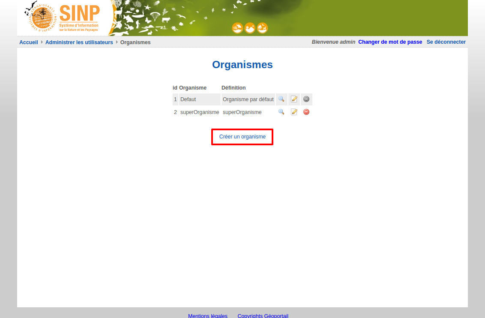

.. Administrer les organismes

Administrer les organismes
==========================

Un organisme, dans les plateformes Ginco, désigne une personne morale auquelle peuvent être rattachés les
utilisateurs. Il peut s'agir d'associations, d'entreprises, de services de l'Etat...

Les plateformes Ginco utilisent l'annuaire d'organismes du SINP ; ainsi les organismes présents dans chaque plateforme Ginco
sont un sous-ensemble de cet annuaire. Ils correspondent à l'ensemble des organismes des utilisateurs enregistrés sur la plateforme, ainsi que
ceux que l'administrateur a choisi de rajouter manuellement.

Chaque utilisateur peut appartenir à un organisme au maximum. Les organismes jouent un rôle dans la gestion des
permissions ; en effet certaines permissions d'accès se situent au niveau de l'organisme des utilisateurs, par exemple :
"Voir/Modifier" les "données/jeux de données" de mon organisme.

Visualiser les organismes
-------------------------

Pour visualiser les organismes, cliquer sur le lien de menu "Administration > Organismes". Vous accédez à l'ensemble des organismes
SINP présents dans la plateforme.

 .. image:: ../images/administration-organisme.png

Consulter les utilisateurs, soumissions et données d'un organisme
-----------------------------------------------------------------

Pour consulter les éléments liés à un organisme, 
cliquez sur l'icône "Oeil" à droite du tableau.

Vous accédez aux informations issues de l'annuaire INPN, que vous pouvez actualiser grâce au lien "Actualiser ces données depuis l'INPN".

Vous accédez ensuite à :

* la liste des utilisateurs associés à cet organisme ;
* la liste des jeux de données associés à cet organisme ;
* la liste des soumissions (fichiers de données) associées à cet organisme.
* la liste des jeux de données utilisés par cet organisme

Vous ne pouvez supprimer un organisme de la plateforme que si ces trois listes sont vides.

.. _creer_un_organisme:

Ajouter un organisme
--------------------

.. note:: Lorsqu'un nouvel utilisateur se connecte à la plateforme,
	l'organisme auquel est rattaché son compte INPN n'est pas pris en compte dans Ginco. Il faut donc le renseigner à nouveau.

Vous pouvez ajouter manuellement un organisme, à partir de la page de visualisation des organismes,
en cliquant sur le lien "Ajouter un organisme".

Recherchez l'organisme à ajouter par son nom ou son identifiant INPN si vous le connaissez ; puis sélectionnez-le et
cliquez sur "Ajouter".

Si l'organisme que vous souhaitez ajouter n'est pas présent dans l'annuaire INPN, vous devez d'abord l'y ajouter. (Lien ??)

Supprimer un organisme
----------------------

Pour supprimer un organisme, à partir de la page de visualisation des organismes, 
cliquez sur l'icône de suppression à droite de l'organisme à supprimer.

.. note:: Lorsque l'icône de suppression est grisée,
	l'organisme ne peut pas être supprimé car des utilisateurs ou des données y sont rattachés.
	Il faut supprimer les données (soumissions et/ou jeux de données) et utilisateurs afin de supprimer l'organisme.
