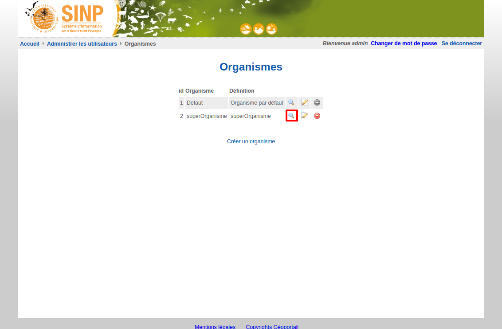
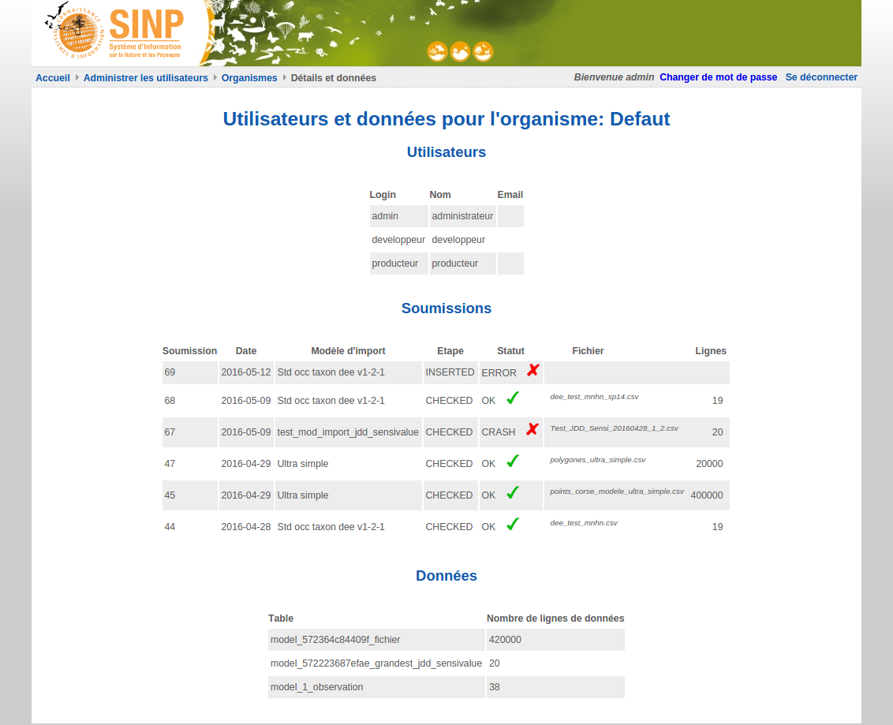
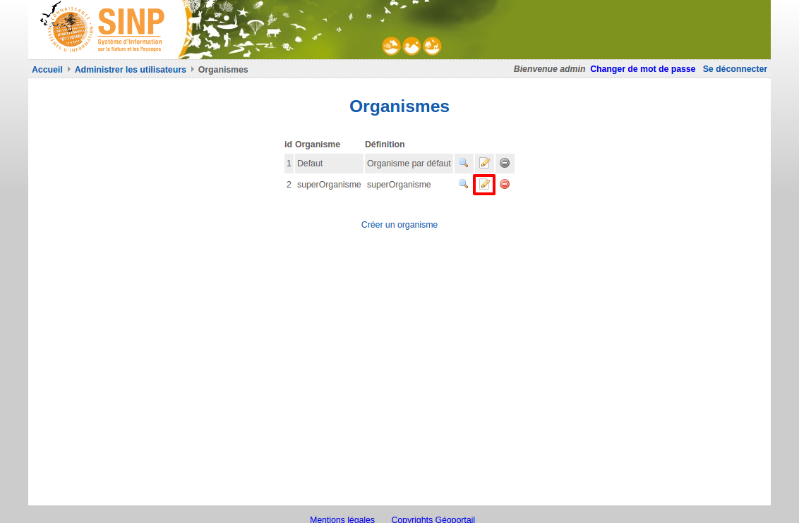
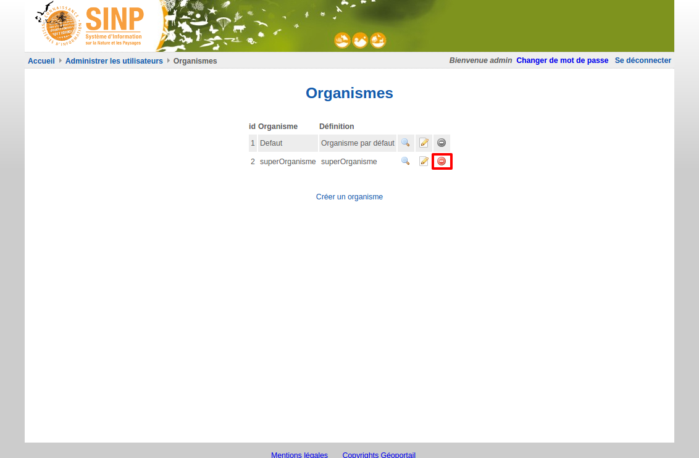

.. Administrer les organismes

Administrer les organismes
==========================

Visualiser les organismes
-------------------------

Pour visualiser les organismes, cliquer sur le lien "Afficher les organismes".

 .. image:: ../images/administration-organisme.png

Consulter les utilisateurs, soumissions et données d'un organisme
-----------------------------------------------------------------

Pour consulter les éléments liés à un organisme, 
cliquez sur la première icône à droite de l'organisme.

Le premier tableau liste les utilisateurs associés à cet organisme.
Le deuxième tableau liste les soumissions de données effectuées avec cet organisme.
Le troisième tableau liste le nombre de données importées ou saisies par cet organisme et les tables de base de données associées.

.. _creer_un_organisme:

Ajouter un organisme
--------------------

Pour ajouter un organisme, à partir de la page de visualisation des organismes, 
cliquez sur le lien "Créer un organisme".

.. image:: ../images/administration-organisme-visu-creer.png

Renseignez son libellé et sa définition, puis cliquez sur "Valider".

Modifier un organisme
---------------------

Pour modifier un organisme, à partir de la page de visualisation des organismes, 
cliquez sur la deuxième icône à droite de l'organisme à modifier.

Vous pouvez alors modifier le libellé et la définition de l'organisme.

Supprimer un organisme
----------------------

Pour supprimer un organisme, à partir de la page de visualisation des organismes, 
cliquez sur la troisième icône à droite de l'organisme à supprimer.

.. note:: Lorsque l'icône de suppression est grisée,
	l'organisme ne peut pas être supprimé car des utilisateurs ou des données y sont rattachés.
	Il faut supprimer les données et utilisateurs afin de supprimer l'organisme.