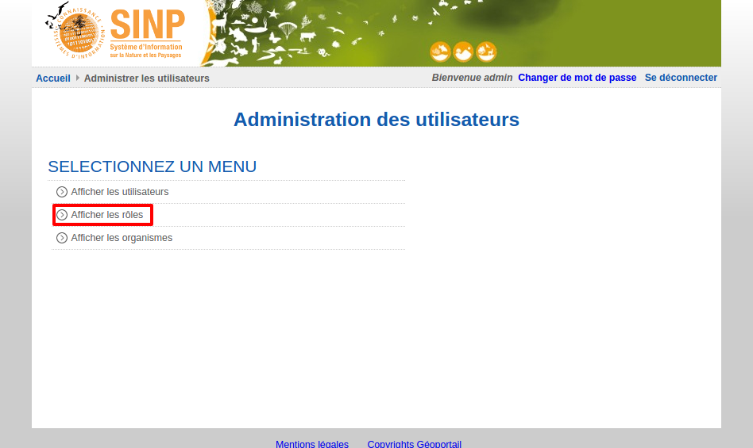
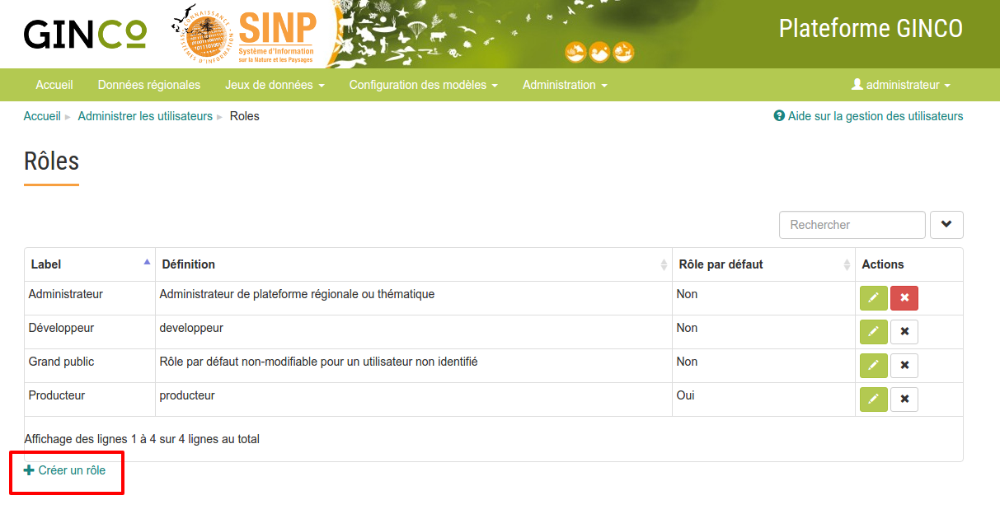
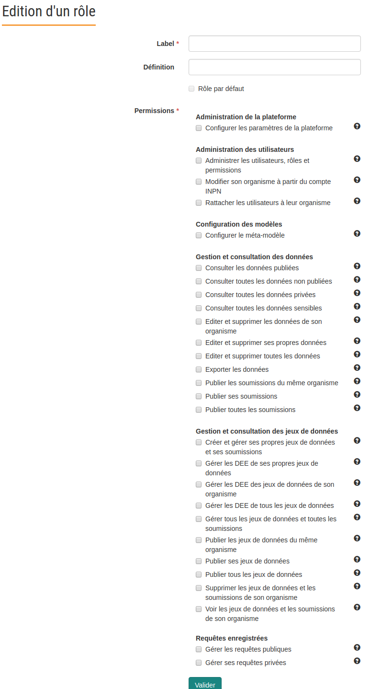
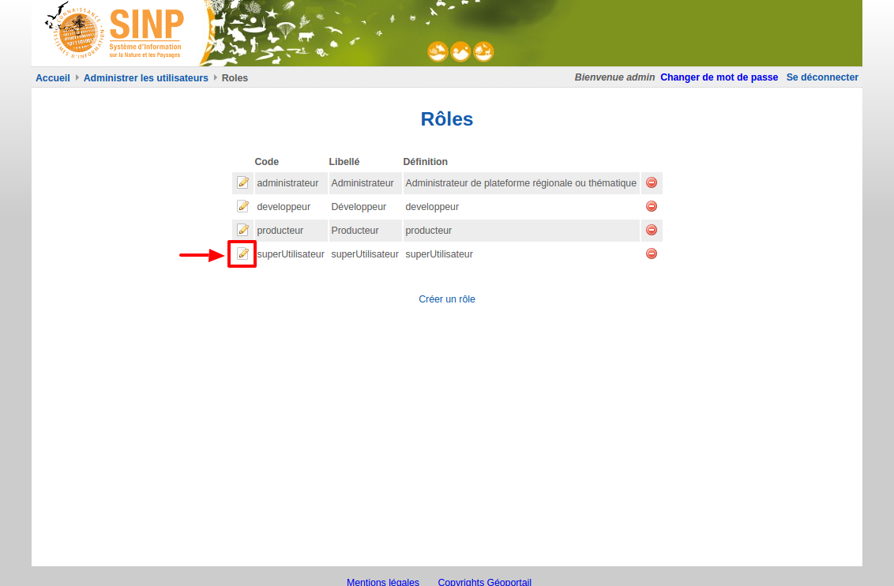
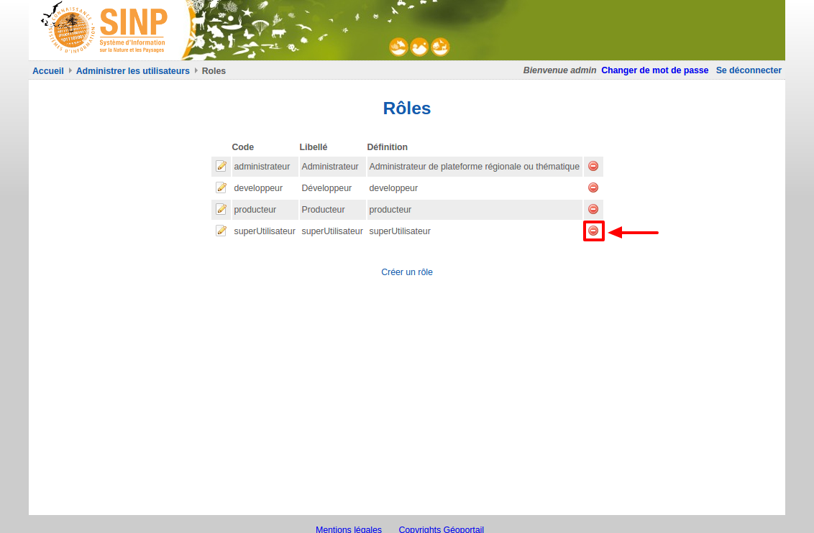

.. Administrer les rôles

Administrer les rôles
=====================

Plusieurs rôles GINCO par défaut ont été définis :

 * Administrateur
 * Producteur
 * Grand Public

Auxquels s'ajoute le rôle *Développeur*, réservé à l'équipe de maintenance, et qu'il ne faut pas modifier ou supprimer.

.. note:: Le rôle *Grand Public* est un rôle technique non-modifiable, attribué par défaut aux utilisateurs non authentifiés, qui ont par défaut accès au module de visualisation de la plateforme régionale.

Visualiser les rôles
--------------------

Pour visualiser les rôles, cliquer sur le lien "Afficher les rôles".

Ajouter un rôle
---------------

Pour ajouter un rôle, cliquez sur le lien "Créer un rôle"

 
Après avoir indiqué le code, le libellé et la définition du rôle, il faut sélectionner les droits (permissions) à attacher à ce rôle.
Une case indique si le rôle est le rôle par défaut.
Enfin, cliquez sur "Valider".

.. note:: Le rôle par défaut ne peut pas être supprimé. Par ailleurs, il ne peut y avoir qu'un seul rôle par défaut sur la plateforme. Vous pouvez choisir le rôle par défaut sur la page de configuration de la plateforme.
 

Les rôles par défaut ont les permissions suivantes :

========================================================  ==============  ==========  ========
Permissions                                               administrateur  producteur  visiteur
========================================================  ==============  ==========  ========
Administrer les utilisateurs                                 **Oui**          Non        Non
Importer des données                                         **Oui**          Non        Non
Visualiser les données régionales                            **Oui**        **Oui**    **Oui**
Visualiser les données d'un autre fournisseur                **Oui**          Non      **Oui**
Exporter les données (au format CSV, GeoJson, kml...)        **Oui**        **Oui**      Non
Editer les données                                           **Oui**          Non        Non
Editer les données d'un autre fournisseur                    **Oui**          Non        Non
Annuler une soumission de données validées                   **Oui**          Non        Non
Annuler une soumission de données d'un autre fournisseur     **Oui**          Non        Non
Vérifier la configuration technique (PHP, mémoire,...)         Non            Non        Non
Configurer le méta-modèle                                    **Oui**          Non        Non
Visualiser les données sensibles                             **Oui**          Non        Non
Consulter les métadonnées                                    **Oui**        **Oui**      Non
Exporter les jeux de données au format DEE                   **Oui**          Non        Non
Gérer les jeux de données de tous les utilisateurs           **Oui**          Non        Non
Visualiser les données privées                               **Oui**          Non        Non
Publier les données                                          **Oui**          Non        Non
Gérer les requêtes publiques                                 **Oui**          Non        Non
Gérer ses requêtes privées                                   **Oui**        **Oui**      Non
========================================================  ==============  ==========  ========

.. note:: La permission *Consulter les métadonnées* ne permet pas d'en saisir ou d'en importer.
	Il s'agit juste de visualiser les métadonnées publiées.

Modifier un rôle
----------------

Pour modifier un rôle, à partir de la page de visualisation des rôles, cliquez sur l'icône à gauche du rôle à modifier.

Vous pouvez alors modifier les code, libellé, définition et permissions du rôle.

Supprimer un rôle
-----------------

Pour supprimer un rôle, à partir de la page de visualisation des rôles, cliquez sur l'icône à droite du rôle à supprimer.

