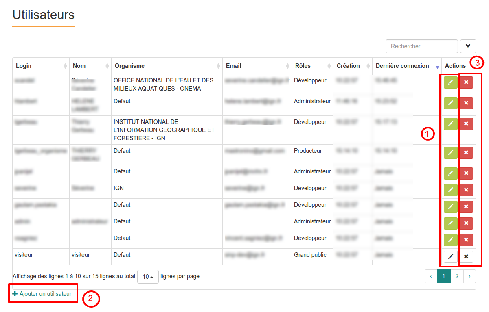

.. Administrer les utilisateurs

Administrer les utilisateurs
============================

Les plateformes Ginco utilisent l'annuaire du SINP ; ainsi les utilisateurs présents dans chaque plateforme Ginco
sont un sous-ensemble de cet annuaire. Ils correspondent à l'ensemble des utilisateurs s'étant connecté au moins une fois
sur la plateforme, ainsi que ceux que l'administrateur a rajoutés manuellement.

Visualiser les utilisateurs
---------------------------

Pour visualiser les utilisateurs, cliquer sur le lien "Administration > Utilisateurs" du menu.
Vous avez accès à la liste des utilisateurs s'étant connecté au moins une fois à la plateforme, ou bien ayant été
rajoutés manuellement.

Modifier les rôles (permissions) d'un utilisateur
-------------------------------------------------

Pour changer le ou les rôles attribués à un utilisateur, à partir de la page de visualisation des utilisateurs,
cliquez sur la première icône à droite (1) de l'utilisateur à modifier.

Vous pouvez alors modifier le ou les rôles de l'utilisateur.

Vous pouvez également actualiser ses informations personnelles à partir de son compte INPN.

Modifier l'organisme Ginco d'un utilisateur
-------------------------------------------

Pour changer l'organisme d'un utilisateur, à partir de la page de visualisation des utilisateurs,
cliquez sur la première icône à droite (1) de l'utilisateur à modifier.

Vous pouvez alors modifier son organisme via la barre de recherche qui interroge l'annuaire des organismes de l'INPN. 

Ajouter un utilisateur
----------------------

Pour ajouter un utilisateur, cliquez sur le lien "Ajouter un utilisateur" (2).

Vous pouvez rechercher un utilisateur présent dans l'annuaire INPN, et l'ajouter manuellement à la liste des utilisateurs de
la plateforme régionale. L'intérêt de l'opération est que vous pourrez ensuite lui attribuer directement le rôle
que vous souhaitez, sans avoir à attendre que cette personne se connecte une première fois à la plateforme.

Attention : la recherche se fait par **l'identifiant exact** dans l'annuaire INPN. Si vous ne le connaissez pas,
merci de vous rapprocher de la personne concernée.

.. note:: Initialmement, un utilisateur n'a pas d'organisme. Il faut donc en déclarer un, afin qu'il puisse profiter pleinement des fonctionnalités liées à son organisme.

Supprimer un utilisateur
------------------------

Pour supprimer un utilisateur de la plateforme, à partir de la page de visualisation des utilisateurs,
cliquez sur l'icône "Supprimer" (3) à droite de l'utilisateur à supprimer.

Cette opération ne supprimera pas son compte INPN, mais enlèvera l'utilisateur de la liste des utilisateurs
de la plateforme.