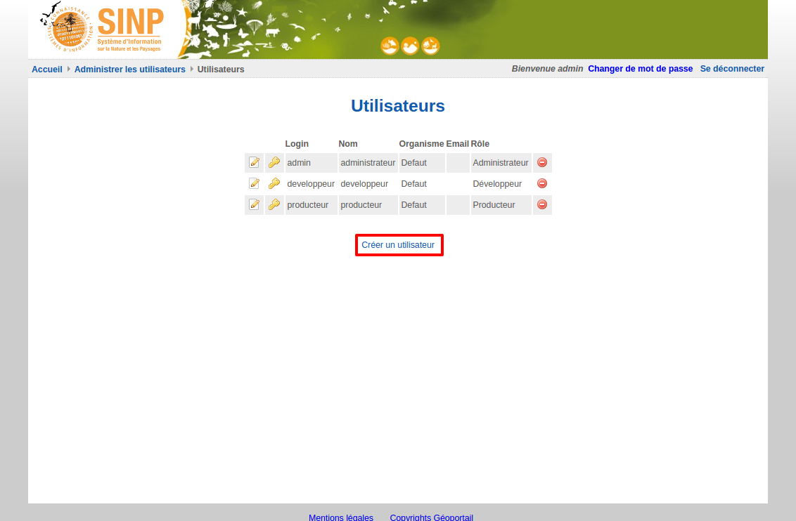
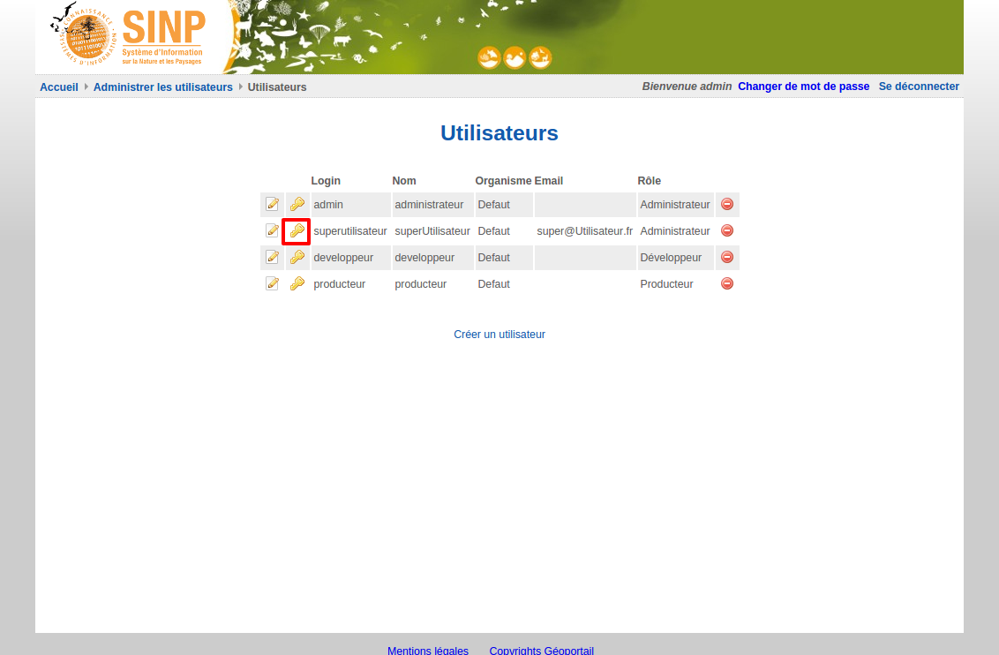

.. Administrer les utilisateurs

Administrer les utilisateurs
============================

Visualiser les utilisateurs
---------------------------

Pour visualiser les utilisateurs, cliquer sur le lien "Afficher les utilisateurs".

 .. image:: ../images/administration-utilisateur.png
 
Ajouter un utilisateur
----------------------

Pour ajouter un utilisateur, cliquez sur le lien "Créer un utilisateur"

 
La page suivante permet alors d'indiquer l'identifiant, le mot de passe (à saisir deux fois), le nom et l'e-mail de l'utilisateur.
L'organisme et le rôle sont à sélectionner dans les listes déroulantes.
Enfin cliquez sur "Valider".
 
.. image:: ../images/administration-role-ajouter.png

.. note:: Il faut créer l'organisme et le rôle avant l'utilisateur.

Modifier un utilisateur
-----------------------

Pour modifier un utilisateur, à partir de la page de visualisation des utilisateurs, 
cliquez sur la première icône à gauche de l'utilisateur à modifier.

Vous pouvez alors modifier les code, libellé définition et permissions du rôle.

Changer le mot de passe d'un utilisateur
----------------------------------------

Pour changer le mot de passe d'un utilisateur, à partir de la page de visualisation des utilisateurs, cliquez sur l'icône à gauche de l'utilisateur.

Vous pouvez alors saisir un nouveau mot de passe (deux fois). Pour l'enregistrer, cliquez sur "Valider".

.. image:: ../images/administration-utilisateur-enregistrer-mdp.png

.. note:: Il est fortement conseillé d'utiliser un mot de passe robuste.

Supprimer un utilisateur
------------------------

Pour supprimer un utilisateur, à partir de la page de visualisation des utilisateurs, cliquez sur l'icône à droite de l'utilisateur à supprimer.

.. image:: ../images/administration-role-visu-supprimer.png